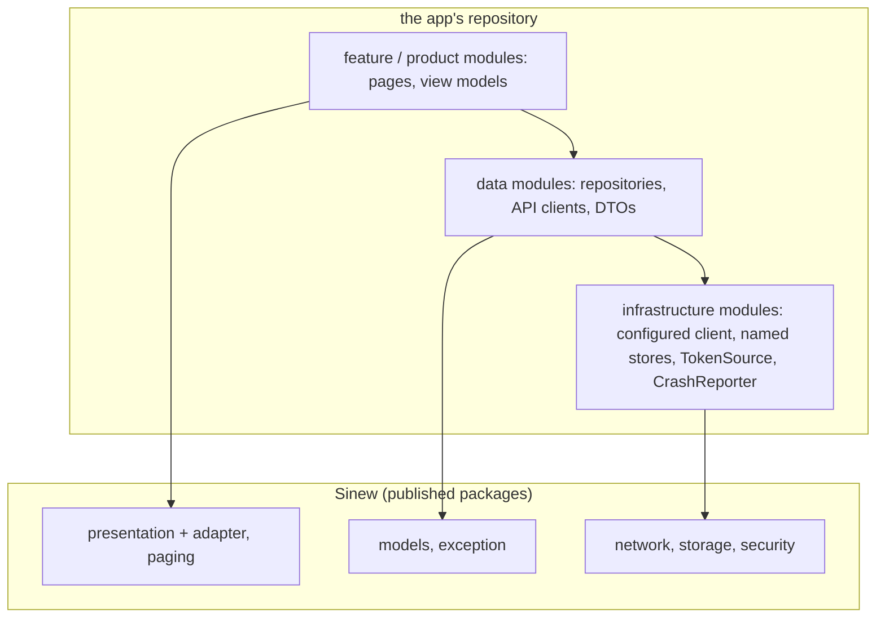
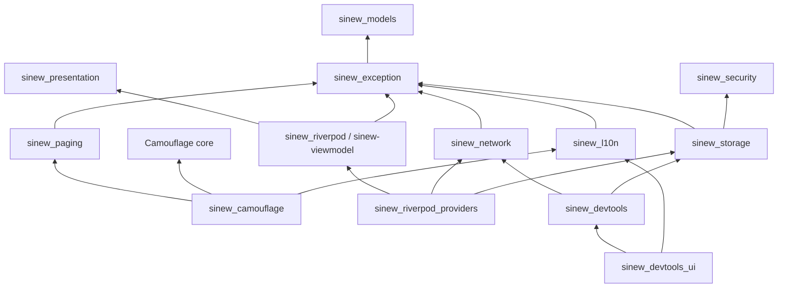

{/* Generated by docs/internal/scripts/sync_vault.py from the Sinew design notes. Edit the notes and re-run the script; changes made here are overwritten. */}

# 01 - Architecture

## Concept {#concept}

### 1. Why

An app built in layers rewrites the same plumbing every time:
- turning API payloads into domain models;
- a result type and an error hierarchy;
- paging;
- an HTTP client that refreshes tokens;
- secure storage.

None of that is business logic, and none of it changes between apps. Only its **configuration** does: base URLs, where tokens live, which errors a module reports. Sinew draws that line. It ships each mechanism once, as a small library, and leaves every app-specific value to the app.

This note covers:
- where Sinew sits in an app;
- how its packages depend on each other;
- what the app has to supply;
- how the packages are wired, published and versioned.

### 2. Shape

#### Where Sinew sits in an app

A layered app has three kinds of modules below its screens. Sinew replaces the reusable part of the bottom two:

| App module kind | Owns | What Sinew provides to it |
|---|---|---|
| **Feature / product modules** | Pages, view models, page state | `sinew_presentation` (+ an adapter), `sinew_paging` |
| **Data modules** (one per business capability) | Repositories, API clients, DTOs, local sources | `sinew_models` (envelopes, `Remote`, `Entity`), the guards from `sinew_network` and `sinew_storage` |
| **Infrastructure modules** (app-specific setup) | The configured HTTP client(s), named stores, the session's token source, the crash reporter | The mechanisms: `SinewHttp`, `SecureStore`, `KeyValueStore`, `FieldCipher`, `BiometricVault`, the `CrashReporter` contract |
| **Library modules** (app-agnostic) | Code reusable in another project | Sinew itself sits here, as published packages instead of in-repo modules |



The app never forks Sinew to configure it. Anything app-specific goes in through a constructor parameter or one of the small interfaces in the next section.

#### How the packages depend on each other



| Rule | Why |
|---|---|
| No cycles. `sinew_models` is the leaf. | Any package can be taken alone, with only what it stands on |
| `sinew_l10n` is the only package that touches a localization framework | Apps with their own translations of the error keys can skip it |
| `sinew_presentation` and `sinew_security` depend on no other Sinew package | Presentation is useful in an app that keeps its own data layer. Security is useful anywhere. |
| Only `sinew_camouflage` knows Camouflage, and Camouflage never knows Sinew | Either library can be used without the other |
| `sinew_testing` is a test-only dependency | Fakes never reach production code |
| Network and storage expose hook points (`SinewHttpHooks`, `InspectableStore`) that do nothing until devtools pass real hooks. `sinew_devtools` depends on network and storage to provide those hooks; network and storage never depend on devtools. | Production code paths don't change when devtools are absent, and devtools are an opt-in dependency |
| The adapters depend on exception (`toViewState` creates `UnexpectedException`); the glue depends on l10n (its convenience overload reads Sinew's localizer); `sinew_riverpod_providers` reaches security through storage | Every edge used in code is in this graph, so the CI graph check can enforce it |

#### Mechanism vs. configuration

| Sinew ships (mechanism) | The app supplies (configuration) | Through |
|---|---|---|
| `Envelope<R>` and four abstract envelope bases that map payloads | DTOs, and its own envelopes: fields, JSON keys, page metadata | subclassing `Remote<D>` and the envelope bases |
| The guards and their handler lists | a module code and a function code per call | the guard's parameters |
| The HTTP client factory and its layers | base URL, timeouts, logging switch, anonymous paths, the current locale | `SinewConfig` |
| The auth layer (single-flight refresh, replay, reset) | where tokens live and how to refresh them | `TokenSource` |
| Several clients | one client per backend, registered under a name in the app's DI | calling the factory once per backend |
| `SecureStore`, `KeyValueStore` | typed, named stores with their keys (`OrderPreferences`) | wrapping the interfaces |
| `FieldCipher`, `BiometricVault` | which fields are encrypted, when biometrics are offered | calling them from the data and domain layers |
| The `CrashReporter` contract, no-op by default | the real reporter | passing an implementation at startup |
| Adapters for Riverpod and AndroidX ViewModel | the app's own DI wiring | the app's composition root |

```
// the three configuration interfaces (pseudocode)
SinewConfig(baseUrl, connectTimeout, readTimeout = 30s, writeTimeout = 60s, logHttp = false, anonymousPaths: Set<String>,
            locale: () -> String)   // sent as Accept-Language on every request, read per request

interface TokenSource {
    accessToken(): String?          // in memory
    refresh(): RefreshOutcome       // Refreshed | Rejected (session over) | Unavailable(cause) (offline or backend down: session kept)
    clear()                         // sign-out
}

interface CrashReporter {
    recordNonFatal(error: AppException, stackTrace)
    companion: none                 // the default: records nothing
}
```

#### Wiring

- **Plain constructors and factories.** Every package exposes them, e.g. `SinewHttp.client(config, tokenSource)` or `NetworkChecker()`. No package registers itself in a DI container or reads a global, with **one documented exception**: the crash reporter, installed once at startup with `CrashReporter.install(reporter)` because guards are plain functions called from every repository ([Error Model](/guide/foundations/error-model)).
- **The app's composition root wires everything** in the app's own DI: GetIt or Riverpod on Flutter, Koin (or manual) on Kotlin.
- **Adapters are optional.** They only bundle that wiring for one framework. `sinew_riverpod` provides the notifier mixins and hooks, `sinew_riverpod_providers` the ready providers, and `sinew-viewmodel` the ViewModel base classes. Koin needs no adapter: the Kotlin note shows the ten lines of wiring.

```
// app composition root (pseudocode)
crashReporter = MyCrashReporter()
tokenSource   = SessionTokenSource(secureStore)
mainClient    = SinewHttp.client(SinewConfig(baseUrl = env.mainApi, anonymousPaths = {"/auth/login", "/auth/refresh"}), tokenSource)
mediaClient   = SinewHttp.client(SinewConfig(baseUrl = env.mediaApi), tokenSource)
register(mainClient, name = "main")
register(mediaClient, name = "media")
```

#### Publishing and versions

| Rule | Detail |
|---|---|
| Every package is published on its own | pub.dev: `sinew_*`. Maven Central: `com.srctool.sinew:sinew-*`. |
| Lockstep versions | All packages are released together with the same version number, so any set of Sinew packages at one version fits together |
| A BOM on Kotlin | `com.srctool.sinew:sinew-bom` lets an app write the version once. Flutter has no BOM; lockstep plays that role. |
| No umbrella package | It would pull an HTTP client, a crypto library and secure storage into an app that only wants paging |
| Transitive dependencies | Kotlin: Sinew types an app sees are `api` dependencies, so they arrive with the package. Flutter: pub resolves them, but an app adds a **direct** dependency on any package whose types it imports (Dart's `depend_on_referenced_packages` lint). In practice that's `sinew_models`, plus `dio` and `retrofit` for API clients. |
| The HTTP client is exposed on purpose | API clients are written directly on Dio (Flutter) or Ktor (Kotlin). Hiding them would mean a second HTTP API to learn. |
| Native setup stays with the app | Keychain entitlements, Android `minSdk`, biometric usage descriptions, backup rules. Each platform package note has a **Platform setup** checklist. |

#### Platform specifics

| Topic | Kotlin | Flutter |
|---|---|---|
| Targets | Kotlin Multiplatform (`commonMain`): Android, iOS, JVM desktop, wasmJs. Usable from a plain Android app. | Flutter's six platforms, where the underlying plugin supports them. On an unsupported platform a package compiles and throws `UnsupportedError` with a clear message; each package note has a **Platforms** row. |
| Results | Sinew's own sealed `Result<T>` (not `kotlin.Result`) | Sinew's own sealed `Result<T>` |
| Sealed types | hand-written `sealed` classes | hand-written Dart 3 `sealed` classes |
| Code generation | none | none in Sinew's code, except `sinew_l10n`, whose localizations are generated by `gen-l10n` and **committed**, so consumers never run a generator (an app may still use `json_serializable` and `retrofit` for its DTOs and clients) |
| Cancellation | guards rethrow `CancellationException`, so coroutines cancel normally | cancellation becomes `CancelException`, which view models and the pager ignore |
| HTTP client | Ktor | Dio |

### 3. API

This note defines no classes of its own. The cross-package contracts it introduces are:

| Name | Signature (pseudocode) | Package | For |
|---|---|---|---|
| `SinewConfig` | `SinewConfig(baseUrl, connectTimeout, readTimeout = 30s, writeTimeout = 60s, logHttp = false, anonymousPaths, locale)` | network | per-client configuration |
| `TokenSource` | `accessToken(): String?`, `refresh(): RefreshOutcome`, `clear()` | network | where tokens live and how they refresh |
| `CrashReporter` | `recordNonFatal(error: AppException, stackTrace)`, `CrashReporter.none` | exception | where unexpected and parse errors are reported |
| `SinewHttp` | `SinewHttp.client(config, tokenSource, …)` (Kotlin) / `SinewHttp.dio(config, tokenSource, …)` (Flutter) | network | building one configured client |

Each package's own API is in its note under `02 - Packages/`.

### 4. Build steps

1. Create the umbrella repo `srctool/sinew` with two submodules, `sinew-kotlin` and `sinew-dart`, plus Docusaurus docs.
2. Create one empty module or package per v1 package, with the dependency edges from the graph above and nothing else.
3. Add a CI check that fails on any dependency edge not in the graph (a module-graph assertion on Kotlin, a script over each `pubspec.yaml` on Flutter).
4. Make every empty package compile on every target (Kotlin: Android, iOS, JVM, wasmJs. Flutter: the platforms each package supports).
5. Publish nothing yet. Publishing is milestone S6.

**Done when**
- [ ] Every v1 package exists on both platforms, compiles on every supported target, and depends only on the packages the graph allows.
- [ ] CI fails if a package gains a dependency the graph doesn't allow (shown by adding one on purpose).
- [ ] No package registers itself in a DI container or reads a global, except `CrashReporter.install`.

### 5. Edge cases

| Case | Decided behavior |
|---|---|
| An app takes only `sinew_paging` | It gets `sinew_models` and `sinew_exception` with it, and nothing else. No HTTP client, no storage. |
| An app uses a DI framework Sinew has no adapter for | It calls the constructors and factories directly. Adapters only save typing. |
| Two Sinew versions in one dependency graph | Lockstep releases mean any one version is a consistent set. On Kotlin the BOM aligns them. On Flutter, version constraints with the same caret range keep them together. |
| A Flutter plugin's native code in release builds | Flutter links every plugin's native code into release builds, even when Dart never calls it. So any Sinew feature that needs a native plugin and is not needed in production (devtools EXIF, camera, map inspectors) lives in its own optional package. |
| An app with several backends | One client per backend, each built from its own `SinewConfig`, registered under a name. They can share one `TokenSource` or use separate ones. |
| An app that already has its own result type | It can use Sinew's packages that don't expose `Result` (presentation, security), or adapt at its data boundary. Mixing two result types inside one layer is not supported. |

## Implementation {#implementation}

<KotlinOnly>

### 1. Why {#kotlin-1-why}

The base note fixes the package graph and the line between mechanism and configuration. On Kotlin that becomes two concrete questions:
- which dependencies a consumer sees (`api`) and which stay hidden (`implementation`);
- how an app wires Sinew into its own DI.

This note answers both, with the real Gradle and Koin code.

### 2. Shape {#kotlin-2-shape}

#### `api` vs `implementation` {#kotlin-api-vs-implementation}

A Sinew type an app sees in a public signature is an `api` dependency, so it arrives with the module. A library Sinew only uses inside is `implementation`, so it never leaks onto the app's classpath.

| Module | `api` | `implementation` |
|---|---|---|
| `sinew-exception` | `sinew-models` | |
| `sinew-paging` | `sinew-models`, `sinew-exception` | coroutines |
| `sinew-viewmodel` | `sinew-presentation`, `sinew-models`, `lifecycle-viewmodel` | `lifecycle-runtime-compose` |
| `sinew-network` | `sinew-exception`, **`ktor-client-core`** (exposed on purpose: apps write API clients on it) | engines, content-negotiation, serialization |
| `sinew-storage` | `sinew-exception`, `sinew-security` | DataStore |
| `sinew-security` | | Tink, cryptography-kotlin, Biometric |
| `sinew-camouflage` | `sinew-paging`, `camouflage-core` | |

An app's data module that returns `PagingDomain` or fails with an `AppException` declares `sinew-paging` or `sinew-exception` as `api` too, so its own consumers get them.

#### Wiring with Koin {#kotlin-wiring-with-koin}

There's no Koin adapter package (base review). The wiring is about ten lines in the app's composition root:

```kotlin
val sinewModule = module {
    single<TokenSource> { SessionTokenSource(store = SecureRefreshTokenStore(get()), call = AuthRefreshCall(get(named("refresh")))) }   // Sinew's epoch-guarded source; the app supplies the call
    single(named("main")) { SinewHttp.client(SinewConfig(baseUrl = Env.mainApi, locale = { currentLocaleTag() }, anonymousPaths = setOf("/auth/login", "/auth/refresh")), get()) }
    single(named("media")) { SinewHttp.client(SinewConfig(baseUrl = Env.mediaApi, locale = { currentLocaleTag() }), get()) }
    single { SecureStore.create(get()) }                                      // platform context comes from a platformModule
    single { KeyValueStore.create(get()) }
    single { FieldCipher.create(get()) }
    single { NetworkChecker.create(get()) }
}

fun initSinew(reporter: CrashReporter) = CrashReporter.install(reporter)    // once, before startKoin
```

`get()` for the platform context: on Android the `Context` from `androidContext()`; on iOS, desktop and web a no-argument `PlatformContext` from a `platformModule`. Sinew's factories take a `PlatformContext` so the same line compiles in `commonMain`.

#### Platform context {#kotlin-platform-context}

```kotlin
public expect class PlatformContext            // in sinew-models, the leaf
// androidMain: public actual class PlatformContext(public val context: Context)
// iosMain, jvmMain, wasmJsMain: public actual class PlatformContext()   (no state)
```

It's the single `expect` class in the public API. Every factory that needs the platform takes it.

### 3. API {#kotlin-3-api}

| Name | Kotlin signature |
|---|---|
| `PlatformContext` | `public expect class PlatformContext` |
| `SinewConfig` | `public data class SinewConfig(val baseUrl: String, val connectTimeout: Duration = 15.seconds, val readTimeout: Duration = 30.seconds, val writeTimeout: Duration = 60.seconds, val logHttp: Boolean = false, val anonymousPaths: Set<String> = emptySet(), val locale: () -> String, val defaultHeaders: () -> Map<String, String> = { emptyMap() }, val errorBodyReader: ErrorBodyReader = ErrorBodyReader.Default)` |
| `TokenSource` | `public interface TokenSource { public fun accessToken(): String?; public suspend fun refresh(): RefreshOutcome; public suspend fun clear() }` |
| `CrashReporter` | `public fun interface CrashReporter { public fun recordNonFatal(error: AppException) }` + `companion object { None; install(r); val current }` |

The stack trace is the exception's own on Kotlin, so `recordNonFatal` takes only the exception.

### 4. Build steps {#kotlin-4-build-steps}

1. `PlatformContext` in `sinew-models`, with its four `actual`s.
2. The `api`/`implementation` split in every module's build file, from the table above.
3. A sample Koin module in `:sample:shared`, wiring two clients, the stores and the cipher, with `CrashReporter.install` before `startKoin`.
4. A test (`./gradlew :sample:androidApp:dependencies`) asserting that `tink-android` isn't on the app's compile classpath, while `ktor-client-core` is.

**Done when**
- [ ] An app compiles against `sinew-network` and writes an API client on `HttpClient` without declaring Ktor itself.
- [ ] Tink, DataStore and the engines never appear on an app's compile classpath.
- [ ] The Koin sample runs on all four targets.

### 5. Edge cases {#kotlin-5-edge-cases}

| Case | Decided behavior |
|---|---|
| An app uses Hilt instead of Koin | It calls the same factories from its Hilt modules. Nothing in Sinew depends on a DI framework. |
| An app without DI | It creates the objects once in its `Application` (or `main`) and passes them down. |
| Two Sinew versions resolved in one build | The BOM aligns them. Without the BOM, Gradle's conflict resolution picks the highest, and lockstep releases keep that consistent. |
| A Kotlin-only (non-Compose) Android app | It can use every module except the four Compose ones. `ObserveEffects` is replaced by its own `repeatOnLifecycle` collection. |

:::info[Decided by default (revisit during implementation)]

- **`PlatformContext` in `sinew-models`** as the one public `expect` class, so every factory has the same shape in `commonMain`.
- **`CrashReporter.recordNonFatal(error)` without a stack-trace parameter** on Kotlin, because a `Throwable` carries its own.

:::

</KotlinOnly>

<DartOnly>

### 1. Why {#dart-1-why}

On Flutter, the base graph raises two practical questions:
- which packages an app must list in its own `pubspec.yaml` (pub resolves the rest);
- how Sinew is wired into the app's GetIt and Riverpod setup.

### 2. Shape {#dart-2-shape}

#### What an app lists {#dart-what-an-app-lists}

pub resolves transitive dependencies, but Dart's `depend_on_referenced_packages` lint requires a **direct** dependency for every package whose types a file imports.

| An app that… | Lists |
|---|---|
| writes DTOs and envelopes | `sinew_models`, `json_annotation` (+ `json_serializable` as a dev dependency) |
| writes API clients | `sinew_network`, `dio`, `retrofit` (+ `retrofit_generator`) |
| catches or creates `AppException`s (use cases, domain exceptions) | `sinew_exception` |
| has paged lists | `sinew_paging` |
| uses Riverpod notifiers | `sinew_riverpod` (and `sinew_riverpod_providers` for ready providers) |

#### Wiring with GetIt {#dart-wiring-with-getit}

```dart
Future<void> initSinew(GetIt getIt, AppConfig env) async {
  CrashReporter.install(AppCrashReporter());                       // once, first
  getIt
    ..registerSingleton<SecureStore>(await SecureStore.create())
    ..registerSingleton<KeyValueStore>(await KeyValueStore.create())
    ..registerSingleton<FieldCipher>(await FieldCipher.create())                        // keeps its own key in platform secure storage
    ..registerSingleton<TokenSource>(SessionTokenSource(SecureRefreshTokenStore(getIt<SecureStore>()), AuthRefreshCall(refreshDio)))
    ..registerSingleton<Dio>(SinewHttp.dio(SinewConfig(baseUrl: env.mainApi, locale: currentLocaleTag, anonymousPaths: {'/auth/login', '/auth/refresh'}), getIt<TokenSource>()), instanceName: 'main')
    ..registerSingleton<Dio>(SinewHttp.dio(SinewConfig(baseUrl: env.mediaApi, locale: currentLocaleTag), getIt<TokenSource>()), instanceName: 'media')
    ..registerSingleton<NetworkChecker>(NetworkChecker());
}
```

#### Wiring with Riverpod {#dart-wiring-with-riverpod}

`sinew_riverpod_providers` builds the same objects as providers. The app overrides two of them once:

```dart
ProviderScope(
  overrides: [
    sinewConfigProvider.overrideWithValue(SinewConfig(baseUrl: env.mainApi, locale: currentLocaleTag)),
    refreshCallProvider.overrideWith((ref) => AuthRefreshCall(ref.watch(refreshDioProvider))),     // the app's backend call
    // tokenSourceProvider then builds SessionTokenSource from refreshCallProvider and secureStoreProvider.requireValue,
    // after the app awaits ref.read(secureStoreProvider.future) during startup
  ],
  child: const App(),
)
```

An app picks one style. Notifiers then read repositories from GetIt or from providers, never both for the same object.

### 3. API {#dart-3-api}

| Name | Dart |
|---|---|
| `SinewConfig` | `class SinewConfig { const SinewConfig({required String baseUrl, Duration connectTimeout = const Duration(seconds: 15), Duration readTimeout = const Duration(seconds: 30), Duration writeTimeout = const Duration(seconds: 60), bool logHttp = false, Set<String> anonymousPaths = const {}, required String Function() locale, Map<String, String> Function()? defaultHeaders, ErrorBodyReader errorBodyReader = ErrorBodyReader.standard}); }` |
| `TokenSource` | `abstract interface class TokenSource { String? accessToken(); Future<RefreshOutcome> refresh(); Future<void> clear(); }` |
| `CrashReporter` | `abstract interface class CrashReporter { void recordNonFatal(AppException error, StackTrace stackTrace); static const none = …; static void install(CrashReporter r); static CrashReporter get current; }` |

Unlike Kotlin, Dart keeps the stack trace separate from the exception, so `recordNonFatal` takes both.

### 4. Build steps {#dart-4-build-steps}

1. `SinewConfig`, `TokenSource`, `CrashReporter` in their packages.
2. The example app wired once with GetIt (in `example/`) and once with Riverpod (in a second entry point), both running the sample list.

**Done when**
- [ ] Both wiring styles run the example on every platform.
- [ ] `depend_on_referenced_packages` passes in the example with only the listed direct dependencies.

### 5. Edge cases {#dart-5-edge-cases}

| Case | Decided behavior |
|---|---|
| An app mixes GetIt and Riverpod for the same object | Not supported: two instances of one client means two auth queues. One style per object. |
| `CrashReporter.install` after the first guard ran | Earlier reports went to `none`. Install first, as in the GetIt example. |

:::info[Decided by default (revisit during implementation)]

- **Async factories** (`SecureStore.create()`, `FieldCipher.create()`), because opening platform storage is asynchronous on Flutter.

:::

</DartOnly>
