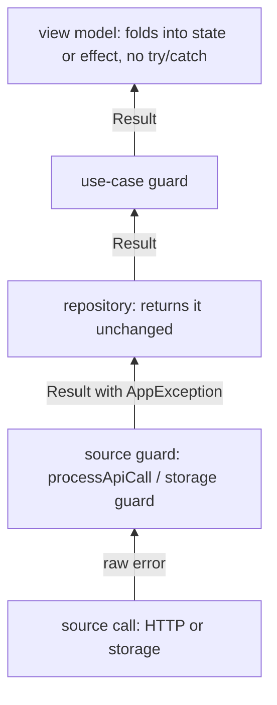

{/* Generated by docs/internal/scripts/sync_vault.py from the Sinew design notes. Edit the notes and re-run the script; changes made here are overwritten. */}

# 02 - Error Model

## Concept {#concept}

### 1. Why

When errors are handled ad hoc, they end up in three bad places:
- **Raw library errors leak upward.** A Dio or Ktor exception reaches a page, and the page shows "SocketException: Failed host lookup".
- **Failures get swallowed.** A `catch` returns an empty list, and the bug never shows up.
- **Support can't trace a failure.** A user reports "it says something went wrong", and nobody knows which call failed.

Sinew's error model fixes all three with four rules:
1. Every failure is **translated once, where it happens**, into a small typed hierarchy (`AppException`).
2. Every `AppException` carries a **code** that names the module, layer, function and kind of failure: `ORD-R-GO-NIC`. Support can search for it, and the user can read it out.
3. Each layer **hands a `Result` upward, never an exception**. The view model folds results into state and effects and never needs a `try`/`catch`.
4. Bugs (unexpected and parse errors) are **reported as non-fatal crashes** as well as returned, so they're visible without taking the app down.

### 2. Shape

#### Classification

What kind of failure it is decides who can do something about it: the user (retry, fix input), the developer (a bug), or nobody (the backend is down).

| Source | Becomes (code) | Retryable | Typical UI |
|---|---|---|---|
| No connection, DNS failure, no route | `NoInternetConnectionException` (NIC) | yes | "You're offline", retry button |
| Connect, send or receive timeout | `RequestTimeOutException` (RTO) | yes, if the request was idempotent | retry button |
| Request cancelled | Kotlin: `CancellationException` rethrown, never a failure. Flutter: `CancelException` (CNL). | no | **nothing**: cancelling isn't a failure |
| 400 / 422 with field errors | `ValidationException` (VAL), with `field → messages` | no | errors next to fields |
| 401 after the refresh attempt failed | `UnauthorizedException` (UNA) | no | the session ends, back to sign-in |
| 403 | `ForbiddenException` (FOR) | no | "You don't have access" |
| 404 on a read that expects the item | `NotFoundException` (NTF) | no | "No longer exists" |
| 409 | `ConflictException` (CFL) | no | "Changed by someone else", reload |
| 429 | `RateLimitedException` (RTL), with `retryAfter` when the backend sends it | later | "Try again in a moment" |
| 500, 502 | `ServerException` (SRV) | no | generic error |
| 503, 504 | `ServiceUnavailableException` (SUN) | yes | generic error, retry |
| A 2xx envelope whose `failure()` is set, or an error body with a readable message | `ApiErrorException` (AE), with the backend's message | no | the backend's message |
| A non-2xx response whose body can't be read | `UndefinedErrorResponseException` (UER) | no | generic error |
| JSON that doesn't fit the DTO, or a mapping error in `toDomain()` | `ParseException` (DF) | no | generic error, **reported**: the contract broke |
| Local storage can't be read or decoded | `LocalStorageCorruptionException` (LSC) | no | treat the cached data as absent |
| The device is out of space | `StorageFullException` (SF) | no | "Your device is full" |
| A storage read or write fails for another reason | `StorageReadException` (SR) / `StorageWriteException` (SW) | yes, once | generic error |
| A polling helper gives up | `PollingTimeOutException` (PTO) | yes | "Still processing", check later |
| A retry helper gives up | the **last** failure, unchanged (for example `NoInternetConnectionException`) | as that failure | as that failure |
| Anything no handler matches | `UnexpectedException` (GEN) | no | generic error, **reported** |

The type codes are short on purpose: they appear in messages users read out.

#### The code

```
<module>-<layer>-<function>-<type>
  ORD   -  R    -   GO     - NIC
```

| Part | Who sets it | Values |
|---|---|---|
| module | the app, per data or feature module | 2–4 uppercase letters, unique in the app: `ORD`, `AUTH`, `PAY` |
| layer | the guard | `R` repository (data), `UC` use case (domain), `VM` view model, `UT` utility (retry, polling) |
| function | the app, per guarded call | 2–4 uppercase letters, unique in the module: `GO` get orders, `CO` cancel order |
| type | the exception class | the codes in the table above, or an app's own for domain exceptions |

A failure while loading orders without a connection becomes `NoInternetConnectionException` with code `ORD-R-GO-NIC`. The message shown to the user ends with the code, so a support report points straight at the failing call.

#### Each layer catches its own failures



| Layer | Guard | Catches | Hands upward |
|---|---|---|---|
| **Source** (one HTTP or storage call) | `processApiCall`, `processOptionalApiCall`, the storage guard | library errors, non-2xx statuses, envelope failures, parse and mapping errors | `Result` with a typed `AppException` |
| **Data** (repository) | none of its own; every step it runs is already guarded | nothing new | the source guard's `Result`, unchanged |
| **Domain** (use case, only when one exists) | the use-case guard | its own rule failures (domain exceptions) and bugs in its own code | `Result` |
| **Presentation** (view model) | **none** | nothing: nothing below it throws | state and effects |

#### Handlers: predicate + transform, first match wins

A guard runs its block. On failure it walks an ordered **list of handlers**. Each handler is a predicate ("is this a timeout?") and a transform ("make a `RequestTimeOutException` for this module and function"). The first match wins, so handlers go from specific to general. Each package contributes its own list: network brings the HTTP handlers, storage the storage handlers.

#### Rules

| Rule | Why |
|---|---|
| **An `AppException` from a lower layer passes through every guard unchanged** | The code keeps pointing at where the failure really happened |
| Translate at the source guard. Nothing above the data layer sees a Dio, Ktor, JSON or storage error. | Low-level errors never leak upward |
| The source guard runs `toDomain()` **inside** its `try` | A mapping bug becomes a failure of that one call, not a crash of the app |
| **Cancellation is never a failure.** Kotlin guards rethrow `CancellationException` before anything else. Flutter guards return `CancelException`, which view models and the pager ignore. | A superseded search must not show an error, and a cancelled coroutine must stop |
| `UnexpectedException` and `ParseException` are reported to `CrashReporter` **and** returned | Bugs are visible to developers without taking the app down |
| The original error is kept as `cause`, with its stack trace | Context for crash reports |
| The user-facing `message` is safe to show: the backend's text, or a local key with an English fallback. Technical detail stays in `cause`. | Users never see stack traces, payloads or tokens |
| A message never contains tokens, passwords, full payloads, SQL or stack traces | Error text ends up in screenshots and support tickets |
| Validation errors keep their `field → messages` map | Forms can show each message beside its field |

#### Domain exceptions

A **domain exception** is an expected business outcome, not a technical error: "this order can't be cancelled any more". The app defines it as a subclass of `AppException`, with its own type code, named in business language, carrying the data the page needs.

```
class OrderNotCancellableException(module, function, reason: CancelBlockReason) : AppException(module, UseCase, function) {
    typeCode = "ONC"
    message  = Local(key = "orders.error.notCancellable", fallback = "This order can no longer be cancelled.")
}
// code: ORD-UC-CO-ONC
```

| Rule | Why |
|---|---|
| One domain exception type per outcome the page treats differently | The view model maps each one to its own state or effect |
| Carry structured data (`reason`, `field`, `limit`), not only text | The page can show a precise, localized message |
| Translate a data exception only when the domain adds meaning (a 409 during cancel → `OrderNotCancellableException(alreadyCancelled)`) | A `NoInternetConnectionException` is already clear |

#### Reporting

```
CrashReporter.install(reporter)      // once, at the app's composition root
                                     // default: CrashReporter.none (records nothing)
```

The guards are plain functions called from every repository and use case. Passing a reporter into each call would add a parameter to hundreds of call sites, so the reporter is installed **once, process-wide**. This is the one global in Sinew (see the open question below).

### 3. API

Full signatures are in [Exception](/guide/packages/exception). The model-level contract:

| Name | Signature (pseudocode) | For |
|---|---|---|
| `ExceptionLayer` | `enum { ViewModel("VM"), UseCase("UC"), Repository("R"), Utility("UT") }` | the layer part of the code |
| `AppException` | `abstract class AppException(module: String, layer: ExceptionLayer, function: String, cause: Throwable? = null)` with `typeCode: String`, `message: ErrorMessage`, `retryable: Boolean = false`, `code = "$module-${layer.code}-$function-$typeCode"` | the base of every Sinew and app exception |
| `ExceptionHandler` | `ExceptionHandler(matches: (Throwable) -> Boolean, transform: (Throwable) -> AppException)` | one entry in a guard's handler list |
| shared guard core | `processCall(module, function, layer, handlers, block): Result<T>` | the logic every guard shares (public, so apps can guard their own calls) |
| use-case guard | Flutter `processUseCase(module, function, block)`, Kotlin `processResult(module, function, layer = UseCase, block)` | guards a use case |
| `CrashReporter` | `interface { recordNonFatal(error: AppException, stackTrace) }`, `CrashReporter.none`, `CrashReporter.install(reporter)` | where bugs are reported |
| `ErrorMessage`, `Localizer`, `displayMessage` | `Server(text) \| Local(key, args, fallback)`; `Localizer.resolve(key, args)`; `error.displayMessage(localizer)` | who provides the text, and how a page renders it (see Exception) |

The shared guard core, in pseudocode:

```
processCall(module, function, layer, handlers, block): Result<T> =
    try
        Result.success(block())
    catch CancellationException (Kotlin only)
        rethrow                                            // never a failure
    catch AppException e
        Result.failure(e)                                  // already translated below: pass through
    catch Throwable e
        mapped = handlers.first { it.matches(e) }?.transform(e)
                 ?: UnexpectedException(module, layer, function, cause = e)
        if mapped is UnexpectedException or ParseException: CrashReporter.current.recordNonFatal(mapped, stackTrace)
        Result.failure(mapped)
```

### 4. Build steps

1. `ExceptionLayer`, `AppException` with `code`, `typeCode`, `message` and `retryable`.
2. The built-in exception types from the classification table, each with its type code and message (local key with English fallback, or the backend's text).
3. `ExceptionHandler` and the shared guard core, with tests:
   - success;
   - a lower-layer `AppException` passes through with its original code;
   - a matched error is transformed;
   - an unmatched error becomes `UnexpectedException` and is reported;
   - a `ParseException` is reported;
   - Kotlin: `CancellationException` is rethrown, not returned.
4. `CrashReporter` with `none` and `install`, and a test that a reporter installed in one test doesn't leak into the next (reset in teardown).
5. The use-case guard, tested with a domain exception (passes through) and a bug in the body (becomes `UnexpectedException` with layer `UC`).

**Done when**
- [ ] Every row of the classification table has a type and a code, and a test proves its handler produces it (the HTTP rows are tested in Network, the storage rows in Storage).
- [ ] A failure two layers down keeps its original code at the view model.
- [ ] Cancelling a running request produces no failure, no crash report and no state change.
- [ ] No guard returns a raw library error.

### 5. Edge cases

| Case | Decided behavior |
|---|---|
| A user leaves the page mid-request, or a new search supersedes a request | Kotlin: the guard rethrows `CancellationException`, the coroutine stops, nothing is reported. Flutter: the guard returns `CancelException`; view models and the pager drop it silently. No failed state, no snackbar. |
| `toDomain()` throws (a bug in the mapper) | The source guard catches it inside its `try`: `ParseException` for the call, reported once. Other calls are unaffected. |
| A handler's predicate or transform throws | The guard treats it as unmatched: `UnexpectedException` with the original error as `cause`, reported. A broken handler never crashes the app. |
| An app defines its own `AppException` subclass | Supported: it passes through every guard unchanged, like a built-in one. Its type code must not collide with a built-in code (the built-in codes are listed in Exception). |
| Two modules use the same module code | Their codes become ambiguous. The app keeps module codes in one list; a debug-build check at startup can assert uniqueness. |
| A non-Exception error (Kotlin `Error`, Dart `Error` such as a `StateError`) | Caught like any other throwable and turned into `UnexpectedException`, except Kotlin's `CancellationException`. A real `OutOfMemoryError` is not something to recover from; it's caught only because there's no safe way to exclude it portably. |
| An error message would include a token or payload | Never: a local message is a fixed key with fixed fallback text, and server text is the backend's own. Technical detail goes in `cause`, which only reaches the crash reporter. |

## Implementation {#implementation}

<KotlinOnly>

### 1. Why {#kotlin-1-why}

The base error model has two Kotlin-specific traps:
- **`kotlin.Result` can hold any `Throwable` and has no message field.** So Sinew has its own `Result`, whose failure is typed `AppException` and whose success carries the envelope's message.
- **Coroutine cancellation is an exception.** A guard that catches `Throwable` without care swallows `CancellationException`, and a cancelled search then shows an error or keeps running.

This note shows how the Kotlin guards keep both promises.

### 2. Shape {#kotlin-2-shape}

#### Sinew's `Result` {#kotlin-sinews-result}

```kotlin
public sealed interface Result<out T> {
    public data class Success<out T>(val data: T, val message: String = "") : Result<T>
    public data class Failure(val error: AppException) : Result<Nothing>
}

public val Result<*>.isSuccess: Boolean
public val <T> Result<T>.dataOrNull: T?
public val Result<*>.errorOrNull: AppException?
public inline fun <T, R> Result<T>.fold(onSuccess: (T) -> R, onFailure: (AppException) -> R): R
public inline fun <T> Result<T>.onSuccess(action: (T) -> Unit): Result<T>
public inline fun <T> Result<T>.onFailure(action: (AppException) -> Unit): Result<T>
public inline fun <T, R> Result<T>.map(transform: (T) -> R): Result<R>      // keeps message
public fun <T> Result<T>.getOrThrow(): T                                      // throws the AppException
```

| Rule | Why |
|---|---|
| Repositories, use cases and guards return Sinew's `Result<T>` | One result type, the same shape as Flutter's |
| `Failure.error` is typed `AppException` | No `as AppException` casts anywhere |
| `Success.message` is the envelope's `message()`, or `""` | A success message from the backend reaches the view model, which sends it as an effect |
| **Never `runCatching`** around suspend calls | It catches `CancellationException` and breaks cancellation |
| User-facing error text comes from `error.displayMessage(localizer)` | The message stays a key until the page renders it |

The names `fold`, `onSuccess`, `onFailure`, `map` and `getOrThrow` match `kotlin.Result`, so code reads the same.

#### Cancellation comes first {#kotlin-cancellation-comes-first}

```kotlin
public suspend fun <T> processCall(
    module: String, function: String, layer: ExceptionLayer,
    handlers: List<ExceptionHandler>, block: suspend () -> T,
): Result<T> = try {
    Result.Success(block())
} catch (e: CancellationException) {
    currentCoroutineContext().ensureActive()                   // the caller was cancelled: this throws, and cancellation propagates
    classify(e)                                                // the caller is still active: an engine-wrapped timeout, classified below
} catch (e: AppException) {
    Result.Failure(e)                                          // already translated below
} catch (e: Throwable) {
    classify(e)
}
// classify(e) = runHandlers(handlers, e) ?: UnexpectedException(…, cause = e), reported if unexpected or parse, as Result.Failure
```

| Rule | Why |
|---|---|
| A `CancellationException` is rethrown **when the caller itself was cancelled** (`ensureActive()` throws) | Structured concurrency stays intact: a cancelled job really stops |
| A `CancellationException` while the caller is still active is classified like any failure | Some engines wrap a timeout in a `CancellationException`. Rethrowing it would make a timeout silently vanish; classifying it lets the network handlers turn it into `RequestTimeOutException`. |
| `runHandlers` catches anything a handler throws and treats it as unmatched | A broken handler never crashes the app |
| `reportSafely` catches anything the reporter throws | Reporting never turns a handled failure into a crash |

#### iOS errors {#kotlin-ios-errors}

On iOS, Ktor's Darwin engine surfaces network failures as `DarwinHttpRequestException` wrapping an `NSError`. The network handlers read the `NSError` domain and code (`NSURLErrorNotConnectedToInternet`, `NSURLErrorTimedOut`, `NSURLErrorCannotFindHost`…), so the same classification holds on every platform. These predicates live in `iosMain`, behind a common `isNoConnection(e)` / `isTimeout(e)`.

#### Uncaught errors {#kotlin-uncaught-errors}

Sinew reports only what its guards catch. An exception that escapes everything (a bug in a `launch` with no handler) is the app's crash reporter's job. Devtools chains into the platform's uncaught-error hooks to show those as well (see DevTools).

### 3. API {#kotlin-3-api}

| Name | Kotlin signature |
|---|---|
| `ExceptionLayer` | `public enum class ExceptionLayer(public val code: String) { ViewModel("VM"), UseCase("UC"), Repository("R"), Utility("UT") }` |
| `AppException` | `public abstract class AppException(public val module: String, public val layer: ExceptionLayer, public val function: String, cause: Throwable? = null) : Exception(cause)` with `abstract val typeCode: String`, `abstract val message: ErrorMessage` (named `errorMessage` to avoid `Throwable.message`), `open val retryable: Boolean = false`, `val code: String` |
| `Result<T>` | `public sealed interface Result<out T>` with `Success(data, message = "")` and `Failure(error: AppException)`, plus the helpers above, in `sinew-models` |
| `processCall` | as above, `public suspend fun <T>` |
| `processResult` | `public suspend fun <T> processResult(module: String, function: String, layer: ExceptionLayer = ExceptionLayer.UseCase, block: suspend () -> T): Result<T>` |

### 4. Build steps {#kotlin-4-build-steps}

1. `AppException` with `errorMessage` (not `message`: `Throwable.message` is already a `String?`), and `Result` with its helpers, tested (`map` keeps `message`, `getOrThrow` throws the `AppException`).
2. `processCall`, tested in `commonTest` with `runTest`:
   - cancelling the caller's job: the `CancellationException` propagates, and nothing is reported;
   - a `CancellationException` thrown by the block while the caller is active (an engine-wrapped timeout): classified, not rethrown;
   - cancelling the calling job stops the block;
   - a handler that throws is treated as unmatched;
   - a reporter that throws doesn't break the guard.
3. The common `isNoConnection` / `isTimeout` helpers, with platform tests: OkHttp's `UnknownHostException` and `ConnectException`, the Darwin `NSError` codes, and the Js engine's failure.

**Done when**
- [ ] No code path in Sinew uses `runCatching` around a suspend call (a Detekt rule enforces it).
- [ ] A cancelled search produces no failure, no report and no state change, on every target.

### 5. Edge cases {#kotlin-5-edge-cases}

| Case | Decided behavior |
|---|---|
| `AppException.message` clashes with `Throwable.message` | Kotlin's `Throwable.message` is a `String?`. The base contract's `message: ErrorMessage` is named **`errorMessage`** on Kotlin. `Throwable.message` returns the English fallback (or the server text), so logs read naturally. |
| A `TimeoutCancellationException` from `withTimeout` inside a repository | It's a `CancellationException`, so it's rethrown as a cancellation. Repositories use Ktor's own timeouts instead of `withTimeout`. |
| Sinew's `Result` and `kotlin.Result` share a name | An explicit import of `com.srctool.sinew.models.Result` wins over Kotlin's default import. Sinew's public API never exposes `kotlin.Result`; a Detekt rule enforces it. |
| Errors on iOS without a recognised `NSError` code | Unmatched: `UnexpectedException`, reported. The report includes the domain and code, so the predicate list can grow. |

:::info[Decided by default (revisit during implementation)]

- **`errorMessage` instead of `message`** on Kotlin's `AppException`, because of the clash with `Throwable.message`.
- **A Detekt rule** that bans `runCatching` in suspend contexts across Sinew.

:::

</KotlinOnly>

<DartOnly>

### 1. Why {#dart-1-why}

Dart has no structured cancellation like Kotlin coroutines. A cancelled Dio request completes with a `DioException` of type `cancel`, which looks like any other failure. So on Flutter, cancellation **is** a failure type, `CancelException`, and the rule "cancellation is never shown" becomes "view models and the pager ignore `CancelException`".

### 2. Shape {#dart-2-shape}

#### `Result<T>` {#dart-resultt}

```dart
sealed class Result<T> {
  const Result();
  const factory Result.success(T data, {String message}) = Success<T>;   // message defaults to ''
  const factory Result.failure(AppException error, [StackTrace? stackTrace]) = Failure<T>;

  R when<R>({required R Function(T data, String message) success, required R Function(AppException error, StackTrace? stackTrace) failure});
  R fold<R>(R Function(T data) onSuccess, R Function(AppException error) onFailure);
  Result<R> transform<R>(R Function(T data) map);   // keeps message
  T requireData();            // the data, or throws the failure's AppException (inside use cases)
}
final class Success<T> extends Result<T> { … }
final class Failure<T> extends Result<T> { … }
```

| Rule | Why |
|---|---|
| Consume with `when` / `fold`, never `switch` on `Success` / `Failure` | One consumption style |
| A `Failure` always holds an `AppException`, guaranteed by the guards | Callers react by type without parsing text |
| Pages render `error.displayMessage(localizer)` | The message stays a key until the page renders it |

#### Cancellation {#dart-cancellation}

```dart
result.when(success: …, failure: (error, _) { if (error is CancelException) return; … });   // ignore cancellation inside when/fold
```

| Where | Rule |
|---|---|
| Network handlers | `DioExceptionType.cancel` → `CancelException` (CNL), never reported |
| View models | `failure: (e, _) { if (e is CancelException) return; … }` |
| `Pager` | a `CancelException` failure leaves the state unchanged |

#### Guards {#dart-guards}

```dart
Future<Result<T>> processCall<T>(String module, String function, ExceptionLayer layer, List<ExceptionHandler> handlers, Future<T> Function() block) async {
  try {
    return Result.success(await block());
  } on AppException catch (e, st) {
    return Result.failure(e, st);                                       // pass through
  } catch (e, st) {
    final mapped = _runHandlers(handlers, e) ?? UnexpectedException(module, layer, function, cause: e);
    if (mapped is UnexpectedException || mapped is ParseException) _reportSafely(mapped, st);
    return Result.failure(mapped, st);
  }
}
```

`catch (e)` without a type also catches Dart `Error`s (a `StateError`, a `TypeError` from a bad cast in `toDomain()`), which become `UnexpectedException` or `ParseException` and are reported.

### 3. API {#dart-3-api}

| Name | Dart |
|---|---|
| `Result<T>`, `Success<T>`, `Failure<T>` | as above, in `sinew_models` |
| `processCall` | as above, in `sinew_exception` |
| `processUseCase` | `Future<Result<T>> processUseCase<T>(String module, String function, Future<T> Function() body)` |

### 4. Build steps {#dart-4-build-steps}

1. `Result` with `when`, `fold`, `transform`, `requireData`, tested.
2. `processCall`, tested:
   - pass-through;
   - handler mapping;
   - a throwing handler;
   - a throwing reporter;
   - a `TypeError` inside the block becomes a reported failure, not a crash;
   - a Dio cancel becomes `CancelException`, is never reported, and a view model receiving it changes no state (Review Focus 4).

**Done when**
- [ ] A cancelled request produces `CancelException`, which no page or pager shows.

### 5. Edge cases {#dart-5-edge-cases}

| Case | Decided behavior |
|---|---|
| An `async` block that throws after an `await` | Caught by the same `try`, because `processCall` awaits it. |
| A `Future` started without being awaited inside the block | Its error escapes the guard to the zone's error handler. The rule: guarded blocks await everything they start. |

:::info[Decided by default (revisit during implementation)]

- **`Result.failure(error, [stackTrace])`** with a positional stack trace, rather than named arguments, to keep call sites short.

:::

</DartOnly>
