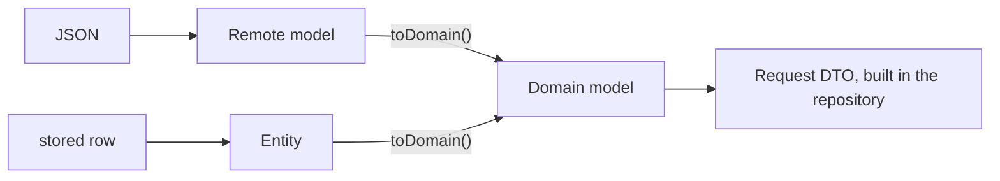

{/* Generated by docs/internal/scripts/sync_vault.py from the Sinew design notes. Edit the notes and re-run the script; changes made here are overwritten. */}

# 01 - Models

## Concept {#concept}

### 1. Why

Every layer needs a few shared shapes: what a domain model is, what an API payload is, how a page of items looks, how a result or a loading state is represented. Without shared shapes, each app invents its own. Each repository then writes a mapper function per endpoint, and each paged list maps its items by hand.

`sinew_models` holds those shapes and nothing else. It depends on no other package. Its central idea is the **self-mapping envelope**:
- A backend wraps its payloads in a few recurring shapes: one object, a list, a page. Each shape is modelled **once per backend**, generically.
- Each envelope names the remote model it parses and the domain type that remote model maps to. The compiler then knows every item has a `toDomain()`, so the envelope maps its payload, **including every item of a list or page**.
- One envelope per shape replaces a mapping function per endpoint.

Backends disagree on those shapes, and one app can talk to several. A single backend can even have three different paged shapes. So Sinew ships no concrete envelope with fixed JSON keys. It ships **abstract envelope bases** that do the mapping, and each app declares its own envelopes: the fields, the JSON keys and how its page metadata reads.

The same goes for a success flag and a message. Sinew assumes no `success`, `message` or `errors` key. An envelope has two optional hooks, `failure()` and `message()`, and the app's subclass fills them from its own keys, the way `meta()` reads its own page keys. A backend without those keys declares nothing, and Sinew reads nothing. A non-2xx status fails the call before any envelope is parsed, with the error body read by the app's `ErrorBodyReader` (see [Network](/guide/packages/network)).

### 2. Shape

#### Terms

| Term | Means |
|---|---|
| **response** | the whole HTTP message: status, headers and body |
| **envelope** | the shape of the body: the wrapper the backend puts around what it returns |
| **payload** | what the envelope carries: one object, a list or a page. A word for the docs, not a type. |

#### Four kinds of model

| Kind | Base type | Shaped like | Visibility in the app | Example |
|---|---|---|---|---|
| **Domain model** | `Domain` | what the app needs, in business language | public | `Order` |
| **Remote model** | `Remote<D : Domain>` | the JSON the backend sends | private to its data module | `OrderRemote` |
| **Local entity** | `Entity<D : Domain>` | what's stored on the device | private to its data module | `OrderEntity` |
| **Request DTO** | none | the JSON the backend accepts | private to its data module | `CreateOrderRequest` |



The mapper lives **on the remote model or entity** (`toDomain()`), because it's private and exists only to be mapped. The envelope calls it, so nothing else does.

#### Envelopes

Every envelope implements one interface, so one guard processes any of them:

```
interface Envelope<R> {
    toDomain(): R
    failure(): EnvelopeFailure? = null     // the app reads its own success flag and error keys; null = succeeded
    message(): String? = null              // the app reads its own message key; null = none
}

EnvelopeFailure(message: String? = null, fieldErrors: Map<String, List<String>>? = null)
```

`toDomain()` is the mapping, done by the bases. The two hooks are for a backend that reports inside a 2xx body:
- `failure()` reports a failure the HTTP status didn't show (`"success": false`). The guard checks it before `toDomain()` and turns it into `ValidationException` when `fieldErrors` is present, `ApiErrorException` otherwise.
- `message()` is the backend's text on success. The guard puts it on `Result.Success.message`, and a view model that wants it sends it as an effect.

Sinew provides four abstract bases on top of it. Each implements `toDomain()` once; the app's subclass only declares fields.

| Base | The app's subclass declares (plus `failure()` and `message()` when its backend has them) | `toDomain()` returns |
|---|---|---|
| `ObjectEnvelope<T : Remote<D>, D : Domain>` | `data: T?` | `D` (throws `EnvelopeDataMissing` when `data` is null) |
| `ListEnvelope<T : Remote<D>, D : Domain>` | `items: List<T>?` | `List<D>` (null → empty) |
| `PagedEnvelope<T : Remote<D>, D : Domain>` | `items: List<T>?` and `meta(): PagingMetaDomain` | `PagingDomain<D>`: every item mapped, plus the app's meta |
| `VoidEnvelope` | nothing | nothing (`Unit` / `void`) |

**Two type parameters, on purpose.** `ObjectEnvelope<T : Remote<D>, D : Domain>` names both the remote model and the domain type. The bound tells the compiler that `T.toDomain()` returns `D`. That's what lets `PagedEnvelope` map every item without a mapper argument.

**`meta()` is where the app reads its own page keys.** One backend says `total_page`, another `max_page`, a third nests it under `metadata.pagination`. Each app envelope turns its keys into the one `PagingMetaDomain` shape.

**Naming.** `Envelope` names Sinew's abstract mapping. An app's concrete classes describe one backend's wire shape and are conventionally suffixed `Response`: `ObjectResponse : ObjectEnvelope`, `ListResponse : ListEnvelope`, `PagedResponse : PagedEnvelope`. A project with several backends or shapes prefixes them (`RecordsPagedResponse`).

##### Example 1: a backend with a success flag, a message and a `meta` object

```
// JSON: { "success": true, "message": "", "data": [ … ], "meta": { "page": 1, "limit": 20, "total": 95, "totalPage": 5, "hasNextPage": true } }

class PageMeta(page?, limit?, total?, totalPage?, hasNextPage?)          // the app's meta remote model, every key optional

class PagedResponse<T : Remote<D>, D : Domain>(
    @key("success") ok: Boolean? = null,
    @key("message") text: String? = null,
    @key("errors") errors: Map<String, List<String>>? = null,
    @key("data") items: List<T>? = null,
    @key("meta") pageMeta: PageMeta? = null,
) : PagedEnvelope<T, D>() {
    failure() = if (ok == false) EnvelopeFailure(text, errors) else null
    message() = text
    meta() = PagingMetaDomain(
        page = pageMeta?.page ?: 1, limit = pageMeta?.limit ?: 0, total = pageMeta?.total ?: 0,
        totalPage = pageMeta?.totalPage ?: 0, hasNextPage = pageMeta?.hasNextPage ?: false,
    )
}

class ObjectResponse<T : Remote<D>, D : Domain>(
    @key("success") ok: Boolean? = null, @key("message") text: String? = null,
    @key("errors") errors: Map<String, List<String>>? = null, @key("data") data: T? = null,
) : ObjectEnvelope<T, D>() {
    failure() = if (ok == false) EnvelopeFailure(text, errors) else null
    message() = text
}
```

A missing `success` key counts as success (`ok == false` only when the backend says so). The same three keys repeat on every shape this backend has; an app can collect them in one shared remote model of its own.

##### Example 2: records nested in `data`

```
// JSON: { "data": { "records": [ … ], "max_page": 5, "total": 95, "page_size": 20, "current_page": 1 } }

class RecordsBody<T>(@key("records") records: List<T>?, @key("max_page") maxPage?, @key("total") total?,
                     @key("page_size") pageSize?, @key("current_page") page?)

class RecordsPagedResponse<T : Remote<D>, D : Domain>(@key("data") body: RecordsBody<T>? = null) : PagedEnvelope<T, D>() {
    items = body?.records
    meta() = PagingMetaDomain(
        page = body?.page ?: 1, limit = body?.pageSize ?: 0, total = body?.total ?: 0, totalPage = body?.maxPage ?: 0,
        hasNextPage = (body?.page ?: 1) < (body?.maxPage ?: 0),
    )
}
```

This backend has no success flag or message, so the envelope keeps both hooks at their defaults. Its failures come from HTTP status codes only.

#### Paging shapes

```
PagingDomain<T>(items: List<T> = [], meta: PagingMetaDomain = PagingMetaDomain())

PagingMetaDomain(
    page = 0,               // the page this response is
    limit = 0,              // items per page
    total = 0,              // items across all pages, when the backend knows
    totalPage = 0,          // pages, when the backend knows
    hasNextPage = false,
    hasPreviousPage = false,
    nextKey = ""            // cursor for the next page; "" = none
)
```

One shape for every backend, whatever its meta fields are called. Paging can be automated in the presentation layer because of it: the pager computes the next page or cursor from `PagingDomain.meta` and merges pages.

`PagingEntity<T>` is the storage counterpart: a page of stored items plus `PagingMetaEntity`. It maps with `toDomain(convert)`, because stored items aren't necessarily `Entity` subclasses.

#### Results and view states

**`Result<T>`** is what every guard, repository and use case returns.

| | Kotlin | Flutter |
|---|---|---|
| Type | Sinew's own `Result<T>`: `Success(data, message)` / `Failure(error)` | Sinew's own `Result<T>`: `Success(data, message)` / `Failure(error, stackTrace)` |
| The failure's error | typed `AppException`, no cast | the same |
| Error text | rendered from the exception's `message` at display time (see Exception) | the same |
| Success text | `Success.message`: the envelope's `message()`, or `""` | the same |
| Consuming | `fold`, `onSuccess`, `onFailure`, `map`, `getOrThrow` | `when`, `fold`, `transform`, `requireData` |

Both platforms use Sinew's own `Result`, because `kotlin.Result` has no place for a success message and can hold any `Throwable`. `map` / `transform` keep the message. A use case that composes several calls returns `Success(data)` with an empty message unless it passes one on itself.

**`ViewState<T>`** is what a page renders.

```
ViewState<T> =
    Loading(data: T? = null)
  | Done(data: T)
  | Failed(data: T? = null, error: AppException, stackTrace = null)
```

`Loading` and `Failed` can still carry the **previous data**, so a reload or a failed reload doesn't blank the screen. Read the renderable data with `dataOrNull`.

`Failed` keeps the `AppException`, never pre-rendered text: the page renders the message every time it builds, so a language switch updates an error already on screen. A success message is never state: it's an effect the view model sends (see [Presentation](/guide/packages/presentation)).

| Situation | State |
|---|---|
| A slice loaded when the page opens (the initial state) | `Loading()`: the first frame is already a skeleton |
| Several slices on one page (a home page) | each starts `Loading()` and loads in parallel, so each section appears as soon as its data arrives |
| Reload of a single item with data on screen | `Loading(data: previous)` |
| Loaded (an empty list is still `Done`) | `Done(data)` |
| First load failed | `Failed(error)` |
| Reload of a single item failed with data on screen | `Failed(data: previous, error)` |

A paged list has its own rules (refresh drops the data, see [Paging](/guide/packages/paging)).

**There's no `Idle` state.** State is for rendering, and rendering a state again is always safe. One-time reactions (a snackbar, a dialog, navigation) are **effects**, never reactions to a state change (see [Presentation](/guide/packages/presentation)). So nothing needs a "reset to idle" after a success or a failure. The two cases that look like they need one have their own shapes:

| Need | Shape |
|---|---|
| An action at rest (`cancelling`, `submitting`) | a `Boolean` that drives the button's spinner; the outcome is an effect |
| A slice loaded on demand, not requested yet (a details section, search results before typing) | a nullable slice, `ViewState<T>?`: `null` means not requested |

Without `Idle`, `ViewState` maps one-to-one onto Riverpod's `AsyncValue` (`AsyncLoading`, `AsyncData`, `AsyncError`).

#### DTO rules

| Rule | Why |
|---|---|
| DTO fields are nullable or have defaults. Domain fields are as strict as the business allows. `toDomain()` decides the fallback. | The backend is outside the app's control. A missing field should degrade one value, not fail a whole list. |
| Enums get an `unknown` value, and parsing falls back to it | A status the backend adds later doesn't break older app versions |
| Dates, money and IDs become real types in `toDomain()` (an instant in UTC, a money value object) | Domain code never parses strings |
| DTO field names match the JSON. Domain names match the business. | The DTO documents the wire format; the domain speaks the app's language. |
| Request DTOs contain only the fields the client may set, and are built in the repository | Nothing server-controlled is sent by mistake, and callers never see request shapes |
| One DTO per JSON shape. A remote model is never reused as a request body. | The two contracts change separately |
| Stored data uses entities, never remote models | The storage schema and the API schema change for different reasons |

#### What lives here from the error model

`ViewState` and `Result` carry an `AppException`, and `sinew_exception` depends on this package. So the **base contract** of the error model lives here, in the leaf:
- `AppException`, `ExceptionLayer` and `ErrorMessage` (who provides the user-facing text, see [Exception](/guide/packages/exception));
- `EnvelopeDataMissing`, a plain error an envelope throws when its payload is absent.

The concrete exception types, the handlers and the guards live in [Exception](/guide/packages/exception). Its handlers map `EnvelopeDataMissing` to `ParseException` with the guard's module and function. The envelope itself doesn't know them.

#### No code generation

`Result`, `ViewState` and the envelope base types are **hand-written** sealed classes on both platforms. Sinew needs no code generator. An app may still generate its own DTO parsing (kotlinx.serialization, json_serializable).

### 3. API

| Name | Signature (pseudocode) | For |
|---|---|---|
| `Domain` | `abstract class Domain` with value equality | marks domain models |
| `Remote<D>` | `abstract class Remote<D : Domain> { toDomain(): D }` | remote models (what the API sends) |
| `Entity<D>` | `abstract class Entity<D : Domain> { toDomain(): D }` | stored rows |
| `Envelope<R>` | `interface { toDomain(): R; failure(): EnvelopeFailure? = null; message(): String? = null }` | anything a guard can process |
| `EnvelopeFailure` | `(message: String? = null, fieldErrors: Map<String, List<String>>? = null)` | a failure reported inside a 2xx body |
| `ObjectEnvelope<T, D>` | `abstract { abstract data: T?; toDomain(): D }` | base for one-object envelopes |
| `ListEnvelope<T, D>` | `abstract { abstract items: List<T>?; toDomain(): List<D> }` | base for list envelopes |
| `PagedEnvelope<T, D>` | `abstract { abstract items: List<T>?; abstract meta(): PagingMetaDomain; toDomain(): PagingDomain<D> }` | base for paged envelopes |
| `VoidEnvelope` | `abstract : Envelope<Unit>` | base for payload-less envelopes |
| `PagingDomain<T>` | `(items = [], meta = PagingMetaDomain())`, `copy(items, meta)` | a page of items |
| `PagingMetaDomain` | fields above, `copy(…)` | page information |
| `PagingEntity<T>` | `(items, meta: PagingMetaEntity)`, `toDomain(convert: (T) -> R): PagingDomain<R>` | a stored page |
| `ViewState<T>` | `Loading \| Done \| Failed`, `dataOrNull`, `isLoading` | page rendering |
| `AppException`, `ExceptionLayer`, `ErrorMessage` | the base contract from the [Error Model](/guide/foundations/error-model) | so `ViewState` and `Result` can carry it |
| `EnvelopeDataMissing` | a plain error (not an `AppException`) | thrown by an envelope with no payload. The guard maps it to `ParseException`. |
| `Result<T>` | `Success(data, message = "") \| Failure(error: AppException)` (Flutter adds `stackTrace?`), with the consuming helpers above | operation outcome, on both platforms |

`ObjectEnvelope.toDomain()` with `data == null` throws `EnvelopeDataMissing`. The guard's handler turns that into `ParseException` with its module and function, returns it as a failed `Result`, and reports it.

### 4. Build steps

1. `Domain` with value equality, `Remote`, `Entity`, and the error base contract (`AppException`, `ExceptionLayer`, `EnvelopeDataMissing`).
2. `Envelope` and the four abstract bases, with tests on a test-only subclass of each:
   - a full payload;
   - missing optional keys;
   - `success: false` with and without `errors` (`failure()` returns them);
   - `message` present and absent (`message()`);
   - a subclass that keeps both hooks at their defaults.
3. `PagingDomain`, `PagingMetaDomain`, `PagingEntity`, with a test that a `PagedEnvelope` subclass maps every item through its own `toDomain()` and returns the subclass's `meta()`.
4. `ViewState` and its helpers, with tests for `dataOrNull` on each variant.
5. `Result` and its helpers, on both platforms. `getOrThrow()` / `requireData()` throw the failure's `AppException`, so a use case can read results in a straight line; `map` / `transform` keep `message`.
6. Write both examples from §2 as test fixtures. They double as the documentation's worked examples.

**Done when**
- [ ] Each abstract base, through a test subclass, maps its fixture to the right domain type.
- [ ] A paged envelope maps every item and its meta without a mapper argument.
- [ ] `ObjectEnvelope` with `data: null` throws `EnvelopeDataMissing` (and, through a guard, becomes `ParseException`), never a crash.
- [ ] The package has no dependencies and no code generation.

### 5. Edge cases

| Case | Decided behavior |
|---|---|
| A 2xx response with `success: false` in the body | The app's envelope returns it from `failure()`. The guard throws `ValidationException` when `fieldErrors` is present, `ApiErrorException` with the backend's message otherwise, and never calls `toDomain()`. |
| A backend with no success flag or message | The envelope keeps both hooks at their defaults. Failures come from HTTP status codes; `Success.message` is `""`. |
| A success message the page should show | The view model reads `Success.message` and sends it as an effect. It's never stored in `ViewState`. |
| An object envelope with `data: null` | `toDomain()` throws `EnvelopeDataMissing`. The guard maps it to `ParseException`, then reports and returns it. An endpoint where "no data" is a normal answer uses the optional-read guard instead (404 → `null`, see Network). |
| A list or paged response with `data: null` | Treated as an empty list. A missing list is not an error. |
| A paged response without its meta keys | The app's `meta()` falls back to its defaults. With `hasNextPage = false` the list shows one page and stops, so an envelope whose backend omits meta on the last page should compute `hasNextPage` from what it has (for example `page < totalPage`). |
| An unknown enum value | The DTO's enum falls back to `unknown`. The domain decides what `unknown` means. |
| A new backend wrapper shape | The app writes one envelope per shape on the abstract bases, or implements `Envelope<R>` directly for anything unusual. Nothing else changes. |
| An empty list on a first load | `Done(data: [])`, not `Failed`. The UI decides how to show "empty". |

## Implementation {#implementation}

<KotlinOnly>

### 1. Why {#kotlin-1-why}

The base note defines the shapes every layer shares. On Kotlin, the envelopes are where most of the care goes:
- kotlinx.serialization has to parse generic envelopes whose type parameters are bounded by `Remote<D>`;
- an abstract base class's abstract properties have to be serialized from the app's subclass.

This note gives the real types and shows an app envelope end to end.

### 2. Shape {#kotlin-2-shape}

#### Base types {#kotlin-base-types}

```kotlin
public interface Domain                                   // a marker: domain models are data classes

public abstract class Remote<out D : Domain> { public abstract fun toDomain(): D }
public abstract class Entity<out D : Domain> { public abstract fun toDomain(): D }

public interface Envelope<out R> {
    public fun toDomain(): R
    public fun failure(): EnvelopeFailure? = null      // the app's subclass reads its own success flag and error keys
    public fun message(): String? = null               // the app's subclass reads its own message key
}

public data class EnvelopeFailure(val message: String? = null, val fieldErrors: Map<String, List<String>>? = null)

public abstract class ObjectEnvelope<out T : Remote<D>, D : Domain> : Envelope<D> {
    public abstract val data: T?
    override fun toDomain(): D = data?.toDomain() ?: throw EnvelopeDataMissing()
}

public abstract class ListEnvelope<out T : Remote<D>, D : Domain> : Envelope<List<D>> {
    public abstract val items: List<T>?
    override fun toDomain(): List<D> = items.orEmpty().map { it.toDomain() }
}

public abstract class PagedEnvelope<out T : Remote<D>, D : Domain> : Envelope<PagingDomain<D>> {
    public abstract val items: List<T>?
    public abstract fun meta(): PagingMetaDomain
    override fun toDomain(): PagingDomain<D> = PagingDomain(items.orEmpty().map { it.toDomain() }, meta())
}

public abstract class VoidEnvelope : Envelope<Unit> { override fun toDomain() {} }

public class EnvelopeDataMissing : IllegalStateException("Envelope has no data")
```

The bases aren't `@Serializable`. The app's subclass is, and it overrides the abstract properties with constructor properties, which kotlinx.serialization serializes normally.

#### An app envelope {#kotlin-an-app-envelope}

```kotlin
@Serializable
internal data class PagedResponse<T : Remote<D>, D : Domain>(
    @SerialName("success") val ok: Boolean? = null,
    @SerialName("message") val text: String? = null,
    @SerialName("errors") val errors: Map<String, List<String>>? = null,
    @SerialName("data") override val items: List<T>? = null,
    @SerialName("meta") val pageMeta: PageMeta? = null,
) : PagedEnvelope<T, D>() {
    override fun failure(): EnvelopeFailure? = if (ok == false) EnvelopeFailure(text, errors) else null
    override fun message(): String? = text
    override fun meta(): PagingMetaDomain = PagingMetaDomain(
        page = pageMeta?.page ?: 1, limit = pageMeta?.limit ?: 0, total = pageMeta?.total ?: 0,
        totalPage = pageMeta?.totalPage ?: 0, hasNextPage = pageMeta?.hasNextPage ?: false,
    )
}

// the API client: Ktor decodes the generic envelope from the reified type
internal class OrderApiImpl(private val client: HttpClient) : OrderApi {
    override suspend fun getOrders(page: Int, query: String): PagedResponse<OrderRemote, Order> =
        client.get("api/orders") { parameter("page", page); parameter("search", query) }.body()
}
```

`body<PagedResponse<OrderRemote, Order>>()` works because Ktor's content negotiation resolves the serializer from the full reified type, including both type arguments. The domain type `Order` is never parsed, but kotlinx.serialization still needs a serializer for each type argument of a generic class. So each domain model gets a **stub serializer** that fails if it's ever used:

```kotlin
@Serializable(with = Order.Unparsed::class)
public data class Order(…) : Domain {
    internal object Unparsed : DomainNotParsed<Order>("Order")
}
// sinew-models: public abstract class DomainNotParsed<D>(name: String) : KSerializer<D>   // throws if called
```

#### Paging shapes, `ViewState`, results {#kotlin-paging-shapes-viewstate-results}

```kotlin
public data class PagingDomain<out T>(val items: List<T> = emptyList(), val meta: PagingMetaDomain = PagingMetaDomain())
public data class PagingMetaDomain(val page: Int = 0, val limit: Int = 0, val total: Int = 0, val totalPage: Int = 0,
                                   val hasNextPage: Boolean = false, val hasPreviousPage: Boolean = false, val nextKey: String = "")
public data class PagingEntity<out T>(val items: List<T> = emptyList(), val meta: PagingMetaEntity = PagingMetaEntity()) {
    public fun <R> toDomain(convert: (T) -> R): PagingDomain<R>
}

public sealed interface ViewState<out T> {
    public data class Loading<out T>(val data: T? = null) : ViewState<T>
    public data class Done<out T>(val data: T) : ViewState<T>
    public data class Failed<out T>(val data: T? = null, val error: AppException) : ViewState<T>
}
public val <T> ViewState<T>.dataOrNull: T?
public val ViewState<*>.isLoading: Boolean
```

Results use Sinew's own `Result<T>`, not `kotlin.Result` (see [Error Model](/guide/foundations/error-model#implementation)).

### 3. API {#kotlin-3-api}

The table in the base note, with these Kotlin specifics:

| Name | Kotlin |
|---|---|
| `Domain` | `public interface Domain` (marker; domain models are `data class`es) |
| `Envelope` | `public interface Envelope<out R>` with `toDomain()` and default `failure()` / `message()` returning `null` |
| `EnvelopeFailure` | `public data class EnvelopeFailure(message: String?, fieldErrors: Map<String, List<String>>?)` |
| envelope bases | `public abstract class ObjectEnvelope / ListEnvelope / PagedEnvelope / VoidEnvelope` |
| `DomainNotParsed<D>` | a `KSerializer<D>` that throws, for the domain type argument of generic envelopes |
| `ViewState<T>` | `public sealed interface` with `Loading`, `Done`, `Failed` |
| `AppException`, `ExceptionLayer`, `ErrorMessage`, `PlatformContext` | defined here (the leaf), documented in Exception and Architecture |

### 4. Build steps {#kotlin-4-build-steps}

1. The base types and envelope bases, with a test-only `@Serializable` subclass of each base.
2. Fixture tests in `commonTest` with `Json { ignoreUnknownKeys = true; explicitNulls = false }`:
   - a full payload;
   - missing keys;
   - `success: false` with and without `errors`, and `message` present and absent, through `failure()` / `message()`;
   - a backend with no success flag (both hooks `null`);
   - the records-shaped backend from the base note (`data.records`, `max_page`).
3. A test that decoding `PagedResponse<OrderRemote, Order>` never calls `DomainNotParsed`, and that calling it directly throws.
3a. The broken-envelope tests (Review Focus 3): `data: null` on an object envelope throws `EnvelopeDataMissing` (which the guard turns into a reported `ParseException`, tested in Network), and a DTO with an unknown enum value decodes to `Unknown` with `SinewJson`.
4. `ViewState`, `dataOrNull`, `isLoading`, with tests.

**Done when**
- [ ] Both worked envelopes from the base note decode their fixtures on all four targets.
- [ ] A domain model's only serialization trace is its `DomainNotParsed` stub.

### 5. Edge cases {#kotlin-5-edge-cases}

| Case | Decided behavior |
|---|---|
| kotlinx.serialization needs a serializer for the domain type argument | Each domain model declares a `DomainNotParsed` stub. It's the one serialization trace in the domain, and it throws if ever called. |
| A field that's a JSON number on one endpoint and a string on another | The DTO declares it as `JsonPrimitive` and converts in `toDomain()`. |
| Unknown keys | Ignored by the app's `Json` configuration (`ignoreUnknownKeys = true`), which `SinewHttp` sets as its default. |

:::info[Decided by default (revisit during implementation)]

- **A `DomainNotParsed` stub serializer** per domain model, the Kotlin counterpart of the Retrofit stub on Flutter. The alternative is envelopes with only the DTO type parameter, plus a mapping argument, which the base decision rejected.
- **`ViewState` as a sealed interface** with `data class` variants, so `when` is exhaustive and states compare by value.

:::

</KotlinOnly>

<DartOnly>

### 1. Why {#dart-1-why}

`sinew_models` is pure Dart: the base types, the envelope bases, the paging shapes, `ViewState` and `Result`. On Flutter, the envelope bases meet two generators the **app** runs: `json_serializable` for envelopes and DTOs, and Retrofit for API clients. This note shows how an app's envelope fits both.

### 2. Shape {#dart-2-shape}

#### Base types {#dart-base-types}

```dart
abstract class Domain {
  const Domain();
  List<Object?> get props;
  @override bool operator ==(Object other) => identical(this, other) || other.runtimeType == runtimeType && _listEquals(props, (other as Domain).props);
  @override int get hashCode => Object.hashAll(props);
}

abstract class Remote<D extends Domain> { const Remote(); D toDomain(); }
abstract class Entity<D extends Domain> { const Entity(); D toDomain(); }

abstract interface class Envelope<R> {
  R toDomain();
  EnvelopeFailure? failure();   // the bases return null
  String? message();            // the bases return null
}

class EnvelopeFailure {
  const EnvelopeFailure({this.message, this.fieldErrors});
  final String? message;
  final Map<String, List<String>>? fieldErrors;
}

abstract class ObjectEnvelope<T extends Remote<D>, D extends Domain> implements Envelope<D> {
  const ObjectEnvelope();
  T? get data;
  @override EnvelopeFailure? failure() => null;
  @override String? message() => null;
  @override D toDomain() => data?.toDomain() ?? (throw const EnvelopeDataMissing());
}
// ListEnvelope (items), PagedEnvelope (items + meta()), VoidEnvelope follow the same pattern.
```

`Domain` implements value equality from `props` itself, with no `equatable` dependency (base review).

#### An app envelope {#dart-an-app-envelope}

```dart
@JsonSerializable(genericArgumentFactories: true, createToJson: false)
class PagedResponse<T extends Remote<D>, D extends Domain> extends PagedEnvelope<T, D> {
  const PagedResponse({this.ok, this.text, this.errors, this.items, this.pageMeta});

  factory PagedResponse.fromJson(Map<String, dynamic> json, T Function(Object? json) fromJsonT, D Function(Object? json) fromJsonD) =>
      _$PagedResponseFromJson(json, fromJsonT, fromJsonD);

  @JsonKey(name: 'success') final bool? ok;
  @JsonKey(name: 'message') final String? text;
  @JsonKey(name: 'errors') final Map<String, List<String>>? errors;
  @override @JsonKey(name: 'data') final List<T>? items;
  @JsonKey(name: 'meta') final PageMeta? pageMeta;

  @override EnvelopeFailure? failure() => ok == false ? EnvelopeFailure(message: text, fieldErrors: errors) : null;
  @override String? message() => text;

  @override
  PagingMetaDomain meta() => PagingMetaDomain(
        page: pageMeta?.page ?? 1, limit: pageMeta?.limit ?? 0, total: pageMeta?.total ?? 0,
        totalPage: pageMeta?.totalPage ?? 0, hasNextPage: pageMeta?.hasNextPage ?? false);
}
```

Retrofit's generated code asks for a `fromJson` for **every** type argument, including the domain type `D`, which is never parsed. Each domain model satisfies it with a stub from `sinew_models` that throws if it's ever called:

```dart
class Order extends Domain {
  factory Order.fromJson(Map<String, dynamic> json) => unreachableDomainFromJson(json);
  …
}
```

#### `ViewState<T>` {#dart-viewstatet}

```dart
sealed class ViewState<T> {
  const ViewState();
  T? get dataOrNull;
  bool get isLoading => this is Loading<T>;
}
final class Loading<T> extends ViewState<T> { const Loading([this.data]); final T? data; … }
final class Done<T> extends ViewState<T> { const Done(this.data); final T data; … }
final class Failed<T> extends ViewState<T> { const Failed(this.error, {this.data, this.stackTrace}); final AppException error; final T? data; final StackTrace? stackTrace; … }
```

`Result` is documented in [Error Model](/guide/foundations/error-model#implementation).

### 3. API {#dart-3-api}

As the base note, with these Dart specifics:

| Name | Dart |
|---|---|
| `Domain` | `abstract class Domain` with `props`, `==`, `hashCode` |
| envelope bases | `abstract class ObjectEnvelope / ListEnvelope / PagedEnvelope / VoidEnvelope`, mapping plus `failure()` / `message()` returning `null` |
| `EnvelopeFailure` | `class EnvelopeFailure({String? message, Map<String, List<String>>? fieldErrors})` |
| `EnvelopeDataMissing` | `class EnvelopeDataMissing implements Exception` |
| `unreachableDomainFromJson` | `Never unreachableDomainFromJson(Map<String, dynamic> json)` |
| `ViewState<T>` | `sealed class` with `Loading`, `Done`, `Failed` |

### 4. Build steps {#dart-4-build-steps}

1. The base types and `Domain` equality, tested.
2. The envelope bases, with test-only subclasses parsed through `json_serializable` in the test folder. The fixtures are the two worked envelopes from the base note.
3. `unreachableDomainFromJson`, tested: Retrofit-style decoding never calls it, and calling it throws.
3a. The broken-envelope tests (Review Focus 3): `data: null` on an object envelope throws `EnvelopeDataMissing` (a reported `ParseException` through the guard, tested in Network), and a DTO enum with `unknownEnumValue` decodes an unknown value to `unknown`.
4. `ViewState` and `dataOrNull`.

**Done when**
- [ ] Both worked envelopes from the base note decode their fixtures, on the Dart VM and in Chrome.

### 5. Edge cases {#dart-5-edge-cases}

| Case | Decided behavior |
|---|---|
| Retrofit needs `fromJson` for the domain type | The `unreachableDomainFromJson` stub, accepted as a generator constraint. |
| A JSON number arriving as an `int` where a `double` is expected | The DTO declares `num` and converts in `toDomain()`. |

:::info[Decided by default (revisit during implementation)]

- **Abstract getters on the bases** (`data`, `items`), so an app's envelope declares only the fields its backend sends, under its own JSON keys. `failure()` and `message()` are methods, not getters, so a subclass's `message` field never collides with them.

:::

</DartOnly>
