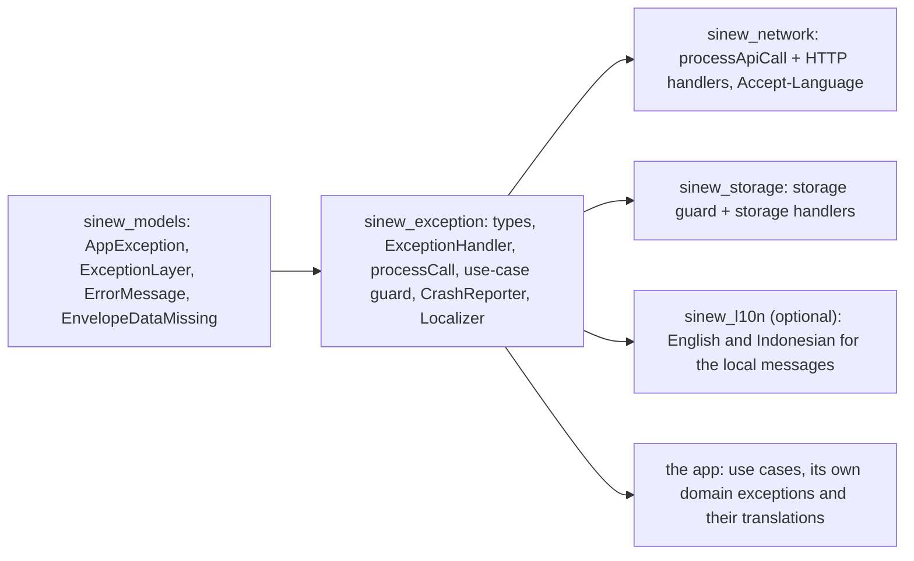

{/* Generated by docs/internal/scripts/sync_vault.py from the Sinew design notes. Edit the notes and re-run the script; changes made here are overwritten. */}

# 02 - Exception

## Concept {#concept}

### 1. Why

The [Error Model](/guide/foundations/error-model) says what failures look like and where they're caught. This package is the code that does it:
- the concrete exception types;
- the handler mechanism;
- the shared guard core every guard in Sinew is built on;
- the use-case guard;
- the crash reporter;
- **the user-facing message**: who provides it, and how it's localized.

The HTTP and storage guards live in Network and Storage. They're thin layers over this package's guard core, each with its own handler list.

### 2. Shape



The `AppException` base, `ExceptionLayer` and `ErrorMessage` live in `sinew_models`, so `ViewState` and `Result` can carry them without a dependency cycle. Everything else about errors lives here.

#### Who provides the message

A failure's text comes from one of two places, and Sinew never mixes them:

| Source | When | Localized by | Sinew's part |
|---|---|---|---|
| **The backend** | the failure arrived as a response with a readable message: `success: false`, an error body with a message, validation field messages | **the backend**, from the request's `Accept-Language` header | send `Accept-Language` from the app's current locale (Network), and show the backend's text unchanged |
| **Local** | Sinew or the app decided it: no connection, timeout, parse error, storage error, polling or retry gave up, an unexpected bug, an HTTP status with no readable message, a domain rule | **the app's UI layer**, from a message key and arguments | provide the key and arguments. `sinew_l10n` ships English and Indonesian for every built-in key. |

```
// in sinew_models
ErrorMessage =
    Server(text: String)                                            // shown as is
  | Local(key: String, args: Map<String, Any> = {}, fallback: String) // resolved at render time

AppException { …, message: ErrorMessage }
```

**Why keys, resolved at render time.** An exception is created in the data layer, which has no locale and no UI context. If it carried finished text, that text would be frozen in the page state: switching the app's language would leave an error on screen in the old language. So a local message stays a key plus arguments until the page renders it. `ViewState.Failed` and `Result.failure` keep the `AppException`, never pre-rendered text.

**Arguments and plurals.** Keys take named arguments, `{ "seconds": 30 }` or `{ "attempts": 3 }`. Translations use each platform's plural rules (ICU messages in Flutter ARB files, `plurals` in Compose resources), so "1 second" and "30 seconds" both read correctly.

#### The built-in types

| Type | Code | Retryable | Extra fields | Message source | Local key (when local) | English fallback |
|---|---|---|---|---|---|---|
| `NoInternetConnectionException` | NIC | yes | | local | `sinew.error.noInternet` | You're offline. Check your connection and try again. |
| `RequestTimeOutException` | RTO | yes | | local | `sinew.error.timeout` | This is taking too long. Please try again. |
| `CancelException` (Flutter only) | CNL | no | | never shown | | |
| `ValidationException` | VAL | no | `fieldErrors: Map<String, List<String>>` | server (form message and field messages) | `sinew.error.validation` if the backend sent no form message | Please check the highlighted fields. |
| `UnauthorizedException` | UNA | no | | server if readable, else local | `sinew.error.unauthorized` | Your session has ended. Please sign in again. |
| `ForbiddenException` | FOR | no | | server if readable, else local | `sinew.error.forbidden` | You don't have access to this. |
| `NotFoundException` | NTF | no | | server if readable, else local | `sinew.error.notFound` | This item no longer exists. |
| `ConflictException` | CFL | no | | server if readable, else local | `sinew.error.conflict` | This was changed by someone else. Reload and try again. |
| `RateLimitedException` | RTL | yes | `retryAfter: Duration?` | server if readable, else local | `sinew.error.rateLimited` (`seconds`), or `sinew.error.rateLimitedNoTime` | Too many attempts. Try again in \{seconds\} seconds. |
| `ServerException` | SRV | no | `status: Int` | server if readable, else local | `sinew.error.server` | Something went wrong on our side. |
| `ServiceUnavailableException` | SUN | yes | `status: Int` | server if readable, else local | `sinew.error.unavailable` | The service is busy. Please try again. |
| `ApiErrorException` | AE | no | | server | | (the backend's message) |
| `UndefinedErrorResponseException` | UER | no | `status: Int` | local | `sinew.error.generic` | Something went wrong. |
| `ParseException` | DF | no | | local | `sinew.error.generic` | Something went wrong. |
| `LocalStorageCorruptionException` | LSC | no | | local | `sinew.error.generic` | Something went wrong. |
| `StorageFullException` | SF | no | | local | `sinew.error.storageFull` | Your device is out of space. |
| `StorageReadException` | SR | yes | | local | `sinew.error.generic` | Something went wrong. |
| `StorageWriteException` | SW | yes | | local | `sinew.error.generic` | Something went wrong. |
| `PollingTimeOutException` | PTO | yes | | local | `sinew.error.stillProcessing` | This is still processing. Check again later. |
| `UnexpectedException` | GEN | no | | local | `sinew.error.generic` | Something went wrong. |

Every type takes `module`, `layer`, `function` and an optional `cause` from the guard that creates it. The codes and the `sinew.` key prefix are reserved: an app's own exceptions use other codes and their own key prefix.

**"Server if readable."** For an HTTP error status, the network guard reads the error body with the app's error-body reader (see Network). If it finds a message, the exception carries `Server(text)`. If not (an empty body, an HTML error page from a proxy), it carries the local key.

#### Domain exceptions and their messages

An app's domain exception is local by nature, so it carries a key in the app's own namespace and its own translations:

```
class OrderNotCancellableException(module, function, reason) : AppException(module, UseCase, function) {
    typeCode = "ONC"
    message  = Local(key = "orders.error.notCancellable", args = { "reason": reason.name },
                     fallback = "This order can no longer be cancelled.")
}
```

#### Rendering a message

```
interface Localizer { resolve(key: String, args: Map<String, Any>): String? }   // null → not translated

error.displayMessage(localizer: Localizer?): String =
    when (error.message)
        Server(text)               -> text
        Local(key, args, fallback) -> localizer?.resolve(key, args) ?: fallback
    + " (" + error.code + ")"
```

| Platform | The app's `Localizer` | Sinew's translations (`sinew_l10n`) |
|---|---|---|
| Flutter | reads the app's ARB-generated localizations from the current `BuildContext`, then Sinew's | `SinewLocalizations.delegate`, added to the app's `localizationsDelegates`. ARB files for `en` and `id`. An app overrides a key by defining it in its own ARB. |
| Kotlin | reads Compose Multiplatform resources (`composeResources/values-xx/strings.xml`) or Android string resources for the current locale, then Sinew's | `values/` (English) and `values-in/` (Indonesian) string resources in `sinew-l10n`. An app overrides a key with its own resource of the same name, resolved first by its `Localizer`. |

| Rule | Why |
|---|---|
| Pages render with `displayMessage(localizer)` every time they build, from the `AppException` in state | A language switch updates errors already on screen |
| The code ends every displayed message | A support ticket or screenshot points straight at the failing call |
| Validation field messages are shown beside their fields **without** a code | The code on every field is noise. The form-level message carries it. |
| `CancelException` is never displayed | Cancelling isn't a failure |
| Server text is never translated or rewritten on the device | The backend owns it, and two translations of one message would disagree |
| A missing translation falls back to the English fallback, never to the raw key | Users never see `sinew.error.timeout` |

#### Handlers

```
ExceptionHandler(
    matches: (Throwable) -> Boolean,                         // "is this a timeout?"
    transform: (Throwable) -> AppException,                  // "make a RequestTimeOutException for this call"
)
```

A guard receives its handler list already bound to its module and function, because each package builds its list with a function such as `apiHandlers(module, function)`. The first match wins, so lists go from specific to general. This package contributes one handler that every list ends with: `envelopeDataMissing`, which turns `EnvelopeDataMissing` into `ParseException`.

#### The shared guard core

Every guard is `processCall` with a layer and a handler list:

```
processCall(module, function, layer, handlers, block): Result<T> =
    try
        Result.success(block())
    catch CancellationException (Kotlin only)
        rethrow                                            // never a failure
    catch AppException e
        Result.failure(e)                                  // already translated below: pass through unchanged
    catch Throwable e
        mapped = try { handlers.first { it.matches(e) }?.transform(e) } catch any { null }   // a broken handler counts as unmatched
                 ?: UnexpectedException(module, layer, function, cause = e)
        if mapped is UnexpectedException or ParseException:
            try { CrashReporter.current.recordNonFatal(mapped, stackTrace of e) } catch any { }   // reporting never crashes
        Result.failure(mapped)
```

On Flutter, `Result.failure` carries `error = mapped` and the stack trace. On Kotlin it's `Result.failure(mapped)`. Neither carries pre-rendered text.

`processCall` is **public**, so an app can guard calls Sinew doesn't know about, such as a third-party SDK call, with its own handler list and the same codes.

#### The use-case guard

```
// Flutter
processUseCase(module, function, body: () -> T): Result<T> = processCall(module, function, UseCase, [], body)

// Kotlin
processResult(module, function, layer = UseCase, body: suspend () -> T): Result<T>
```

There are no handlers. A repository failure arrives as an `AppException` and passes through. A domain exception thrown by a rule passes through too. A bug in the use case's own code becomes `UnexpectedException` with layer `UC` and is reported.

Inside a use case, results are read in a straight line. `requireData()` (Flutter) and `getOrThrow()` (Kotlin) return the data or throw the failure's `AppException`, which the guard passes through unchanged:

```
placeOrder(cart) = processUseCase("ORD", "PO") {
    stock = inventory.check(cart).requireData()             // a failure here ends the use case, with its own code
    if (!stock.allAvailable) throw OutOfStockException("ORD", "PO", stock.missing)
    orders.create(cart).requireData()
}
```

#### Reporting

```
interface CrashReporter { recordNonFatal(error: AppException, stackTrace) }

CrashReporter.none                 // the default: records nothing
CrashReporter.install(reporter)    // once, at the app's composition root
CrashReporter.current              // what the guards call
```

This is the one documented global in Sinew. Tests install a recording reporter and reset to `none` in teardown. Reports use the English fallback and the code, never a translated text.

### 3. API

| Name | Signature (pseudocode) | Package | For |
|---|---|---|---|
| `ErrorMessage` | `Server(text) \| Local(key, args = {}, fallback)` | models | who provides the text |
| `AppException.message` | `message: ErrorMessage` | models | every exception's user-facing message |
| built-in types | `XException(module, layer, function, cause = null, …extra fields)`; each has `typeCode`, `message`, `retryable` | exception | the classification in the table |
| `ExceptionHandler` | `ExceptionHandler(matches: (Throwable) -> Boolean, transform: (Throwable) -> AppException)` | exception | one rule in a handler list |
| `envelopeDataMissing` | `envelopeDataMissing(module, function): ExceptionHandler` | exception | the shared last handler |
| `processCall` | `processCall(module, function, layer, handlers, block): Result<T>` | exception | the shared guard core, public |
| `processUseCase` (Flutter) | `processUseCase(module, function, body): Future<Result<T>>` | exception | the use-case guard |
| `processResult` (Kotlin) | `suspend processResult(module, function, layer = UseCase, body): Result<T>` | exception | the use-case guard |
| `requireData` (Flutter) | `Result<T>.requireData(): T` | models | straight-line reading inside a use case |
| `CrashReporter` | `interface`, `none`, `install(reporter)`, `current` | exception | where bugs are reported |
| `Localizer` | `interface { resolve(key, args): String? }` | exception | how the app resolves local keys |
| `displayMessage` | `AppException.displayMessage(localizer: Localizer?): String` | exception | the text a page shows, ending with the code |
| `SinewLocalizations` (Flutter) | `SinewLocalizations.delegate`, `SinewLocalizations.of(context)` | l10n | English and Indonesian for the `sinew.` keys |
| `sinew-l10n` resources (Kotlin) | `values/strings.xml`, `values-in/strings.xml`, `SinewStrings.resolve(key, args)` | l10n | the same, as Compose resources |

### 4. Build steps

1. `ErrorMessage` and the `message` field on `AppException` (in `sinew_models`).
2. The 20 built-in types with codes, retryable flags, extra fields, local keys and English fallbacks. A test checks that every code and every key is unique and that every key starts with `sinew.`.
3. `ExceptionHandler` and the `envelopeDataMissing` handler.
4. `processCall`, test first. Tests:
   - success returns the value;
   - a lower-layer `AppException` passes through with its original code and message;
   - a matched error is transformed;
   - an unmatched error becomes `UnexpectedException` and is reported once;
   - a `ParseException` is reported once;
   - a handler whose `transform` throws counts as unmatched;
   - a crash reporter that throws doesn't break the guard;
   - Kotlin: `CancellationException` is rethrown, not returned, and not reported.
5. `CrashReporter` with `none`, `install` and `current`, and a recording test reporter.
6. The use-case guard, with three tests:
   - a domain exception passes through;
   - a `requireData()` failure keeps the repository's code;
   - a bug becomes `ORD-UC-…-GEN` and is reported.
7. `Localizer` and `displayMessage`, with tests:
   - server text shown unchanged;
   - a local key resolved;
   - a missing translation falls back to English, never the raw key;
   - arguments substituted;
   - the code appended, except on validation field messages.
8. `sinew_l10n`: English and Indonesian for every built-in key. A test checks that both languages define every key and the same arguments, and that plural forms exist for `seconds` and `attempts`.

**Done when**
- [ ] Every built-in type exists with a unique code, a unique `sinew.` key (when local) and an English fallback with no technical detail.
- [ ] `processCall` passes every test in step 4 on every target.
- [ ] A failure from a repository keeps its `R` code and its message through a use case.
- [ ] Switching the app's language while an error is on screen shows the error in the new language (local messages), or unchanged (server messages).
- [ ] `sinew_l10n` covers every built-in key in English and Indonesian.
- [ ] `sinew_exception` depends on no HTTP client, storage library or localization framework. Only `sinew_l10n` touches a localization framework.

### 5. Edge cases

| Case | Decided behavior |
|---|---|
| A 2xx envelope with `success: false` | Network's `processApiCall` throws `ApiErrorException` with `Server(envelope.message)`, or `ValidationException` when `errors` is present. It's an `AppException`, so `processCall` passes it through. |
| A backend error with an empty `message` | Treated as "not readable": the type's local key is used. An `ApiErrorException` with an empty message falls back to `sinew.error.generic`. |
| The backend ignores `Accept-Language` | Its text is shown as it arrives. Sinew doesn't translate server text. |
| The app's language changes while a request is in flight | The request carries the old `Accept-Language`. Its server message arrives in the old language; the next request uses the new one. Local messages render in the new language immediately. |
| A language Sinew doesn't ship (say, Japanese) | The app's `Localizer` resolves the keys from its own translations. Any key it doesn't define falls back to English. |
| An app wants different wording for a built-in message | It defines the same `sinew.` key in its own translations. Its `Localizer` checks the app's strings before Sinew's. |
| An envelope with no payload | It throws `EnvelopeDataMissing`. The `envelopeDataMissing` handler turns it into `ParseException` (local, `sinew.error.generic`), which is reported. |
| A non-Exception throwable (Kotlin `Error`, Dart `Error`) | Becomes `UnexpectedException` and is reported, except Kotlin's `CancellationException`. |
| An app exception reusing a built-in code or the `sinew.` prefix | Not allowed. A debug-build check compares the app's codes and keys against the reserved list. |
| Secrets in messages | Local fallbacks are fixed text. Server text is the backend's responsibility. Technical detail stays in `cause`, which only reaches the crash reporter. |
| Two tests run in parallel with different reporters | `CrashReporter` is process-wide, so tests that assert on reporting run serially or share one recording reporter that they clear. |

## Implementation {#implementation}

<KotlinOnly>

### 1. Why {#kotlin-1-why}

This note gives the Kotlin types for the base exception package:
- the built-in exceptions;
- `processCall` and `processResult`;
- `CrashReporter`;
- the `Localizer`.

It also covers `sinew-l10n`: the English and Indonesian translations of the local message keys, as Compose Multiplatform resources.

### 2. Shape {#kotlin-2-shape}

#### Types {#kotlin-types}

```kotlin
public sealed interface ErrorMessage {
    public data class Server(val text: String) : ErrorMessage
    public data class Local(val key: String, val args: Map<String, Any> = emptyMap(), val fallback: String) : ErrorMessage
}

public class NoInternetConnectionException(module: String, layer: ExceptionLayer, function: String, cause: Throwable? = null) :
    AppException(module, layer, function, cause) {
    override val typeCode: String = "NIC"
    override val retryable: Boolean = true
    override val errorMessage: ErrorMessage = ErrorMessage.Local("sinew.error.noInternet", fallback = "You're offline. Check your connection and try again.")
}

public class RateLimitedException(module: String, layer: ExceptionLayer, function: String, public val retryAfter: Duration?,
                                  override val errorMessage: ErrorMessage, cause: Throwable? = null) : AppException(module, layer, function, cause) {
    override val typeCode: String = "RTL"
    override val retryable: Boolean = true
}
```

Every built-in type follows one of these two shapes: a fixed local message, or an `errorMessage` passed in by the handler (server text when readable). `CancelException` doesn't exist on Kotlin: cancellation is rethrown, never a failure.

#### Handlers and guards {#kotlin-handlers-and-guards}

```kotlin
public class ExceptionHandler(
    public val matches: (Throwable) -> Boolean,
    public val transform: (Throwable) -> AppException,
)

public fun envelopeDataMissing(module: String, function: String, layer: ExceptionLayer): ExceptionHandler =
    ExceptionHandler({ it is EnvelopeDataMissing }) { ParseException(module, layer, function, cause = it) }

public suspend fun <T> processResult(module: String, function: String, layer: ExceptionLayer = ExceptionLayer.UseCase,
                                     block: suspend () -> T): Result<T> = processCall(module, function, layer, emptyList(), block)
```

Inside a use case, results are read with `getOrThrow()`, which throws the failure's `AppException` for the guard to pass through:

```kotlin
override suspend fun invoke(cart: Cart): Result<Order> = processResult("ORD", "PO") {
    val stock = inventory.check(cart).getOrThrow()
    if (!stock.allAvailable) throw OutOfStockException("ORD", ExceptionLayer.UseCase, "PO", stock.missing)
    orders.create(cart).getOrThrow()
}
```

#### Rendering and `sinew-l10n` {#kotlin-rendering-and-sinew-l10n}

```kotlin
public fun interface Localizer { public fun resolve(key: String, args: Map<String, Any>): String? }

public fun AppException.displayMessage(localizer: Localizer?): String = when (val m = errorMessage) {
    is ErrorMessage.Server -> m.text
    is ErrorMessage.Local -> localizer?.resolve(m.key, m.args) ?: m.fallback
} + " ($code)"
```

`sinew-l10n` ships the translations as Compose Multiplatform resources:

```
sinew-l10n/src/commonMain/composeResources/
├── values/strings.xml        # English
├── values-in/strings.xml     # Indonesian, Android's legacy qualifier "in"
└── values-id/strings.xml     # Indonesian again, the ISO code "id": the same file, so every target resolves it
```

```xml
<!-- values/strings.xml (excerpt) -->
<string name="sinew_error_noInternet">You're offline. Check your connection and try again.</string>
<plurals name="sinew_error_rateLimited">
    <item quantity="one">Too many attempts. Try again in %1$d second.</item>
    <item quantity="other">Too many attempts. Try again in %1$d seconds.</item>
</plurals>

<!-- values-in/strings.xml (excerpt) -->
<string name="sinew_error_noInternet">Kamu sedang offline. Periksa koneksimu lalu coba lagi.</string>
<plurals name="sinew_error_rateLimited">
    <item quantity="other">Terlalu banyak percobaan. Coba lagi dalam %1$d detik.</item>
</plurals>
```

Resource names replace the dots in keys with underscores (`sinew.error.noInternet` → `sinew_error_noInternet`). `SinewStrings` maps a key to its resource and formats the arguments:

```kotlin
@Composable public fun rememberSinewLocalizer(appStrings: Localizer? = null): Localizer   // the app's strings first, then Sinew's
```

#### Indonesian texts {#kotlin-indonesian-texts}

| Key | Indonesian |
|---|---|
| `sinew.error.noInternet` | Kamu sedang offline. Periksa koneksimu lalu coba lagi. |
| `sinew.error.timeout` | Prosesnya terlalu lama. Silakan coba lagi. |
| `sinew.error.validation` | Periksa kembali isian yang ditandai. |
| `sinew.error.unauthorized` | Sesimu telah berakhir. Silakan masuk kembali. |
| `sinew.error.forbidden` | Kamu tidak punya akses ke halaman ini. |
| `sinew.error.notFound` | Data ini sudah tidak tersedia. |
| `sinew.error.conflict` | Data ini sudah diubah oleh orang lain. Muat ulang lalu coba lagi. |
| `sinew.error.rateLimited` | Terlalu banyak percobaan. Coba lagi dalam \{seconds\} detik. |
| `sinew.error.rateLimitedNoTime` | Terlalu banyak percobaan. Coba lagi sebentar lagi. |
| `sinew.error.server` | Terjadi kesalahan di sistem kami. |
| `sinew.error.unavailable` | Layanan sedang sibuk. Silakan coba lagi. |
| `sinew.error.generic` | Terjadi kesalahan. |
| `sinew.error.storageFull` | Penyimpanan perangkatmu penuh. |
| `sinew.error.stillProcessing` | Masih diproses. Coba cek lagi nanti. |

The same texts are used by the Flutter ARB files, so both platforms read identically.

### 3. API {#kotlin-3-api}

| Name | Kotlin signature |
|---|---|
| built-in types | `public class XException(module, layer, function, …, cause: Throwable? = null) : AppException` |
| `ExceptionHandler` | `public class ExceptionHandler(matches: (Throwable) -> Boolean, transform: (Throwable) -> AppException)` |
| `processCall`, `processResult` | `public suspend fun <T>`, see Error Model |
| `CrashReporter` | `public fun interface CrashReporter`, `CrashReporter.None`, `CrashReporter.install(r)`, `CrashReporter.current` |
| `Localizer` | `public fun interface Localizer` |
| `displayMessage` | `public fun AppException.displayMessage(localizer: Localizer?): String` |
| `rememberSinewLocalizer` | `@Composable public fun rememberSinewLocalizer(appStrings: Localizer? = null): Localizer` (`sinew-l10n`) |
| `SinewStrings` | `public object SinewStrings { public suspend fun resolve(key: String, args: Map<String, Any>): String? }` (`sinew-l10n`, non-Compose callers) |

### 4. Build steps {#kotlin-4-build-steps}

1. The 19 built-in types: the base table's 20 minus `CancelException`, which Kotlin doesn't have, with the uniqueness test for codes and keys.
2. `ExceptionHandler`, `envelopeDataMissing`, `processResult`, tested as in the base note.
3. `CrashReporter` with an `AtomicReference`-backed `current`, safe to read from any thread.
4. `Localizer` and `displayMessage`, tested with a fake localizer.
5. `sinew-l10n`: both `strings.xml` files, and a test that every key exists in both languages with the same arguments.

**Done when**
- [ ] Every built-in type exists with its code, key and fallback, on all four targets.
- [ ] `sinew-l10n` resolves every key in English and Indonesian, including plurals.

### 5. Edge cases {#kotlin-5-edge-cases}

| Case | Decided behavior |
|---|---|
| Indonesian is `in` on older Android and `id` elsewhere | Both `values-in/` and `values-id/` ship with the same content, so no target depends on how its locale code is mapped. A test checks the two files are identical. |
| An app in a language Sinew doesn't ship | Its own `Localizer` covers the keys, and anything missing falls back to English. |
| `CrashReporter.install` called twice | The second call replaces the first. A debug-build warning is logged. |

:::info[Decided by default (revisit during implementation)]

- **Indonesian wording** in the table above. It uses the informal "kamu", which is common in consumer apps. A product that needs the formal "Anda" overrides the keys in its own strings.
- **Resource names use underscores** in place of the dots in keys, because resource names can't contain dots.

:::

</KotlinOnly>

<DartOnly>

### 1. Why {#dart-1-why}

This note gives the Dart types for the base exception package, and `sinew_l10n`: the English and Indonesian translations of the local message keys, as ARB files generated into a `LocalizationsDelegate`.

### 2. Shape {#dart-2-shape}

#### Types {#dart-types}

```dart
sealed class ErrorMessage { const ErrorMessage(); }
final class ServerMessage extends ErrorMessage { const ServerMessage(this.text); final String text; }
final class LocalMessage extends ErrorMessage {
  const LocalMessage(this.key, {this.args = const {}, required this.fallback});
  final String key; final Map<String, Object> args; final String fallback;
}

abstract class AppException implements Exception {
  const AppException(this.module, this.layer, this.function, {this.cause});
  final String module; final ExceptionLayer layer; final String function; final Object? cause;
  String get typeCode;
  ErrorMessage get message;
  bool get retryable => false;
  String get code => '$module-${layer.code}-$function-$typeCode';
}

class NoInternetConnectionException extends AppException {
  const NoInternetConnectionException(super.module, super.layer, super.function, {super.cause});
  @override String get typeCode => 'NIC';
  @override bool get retryable => true;
  @override ErrorMessage get message => const LocalMessage('sinew.error.noInternet', fallback: "You're offline. Check your connection and try again.");
}
```

`CancelException` (CNL) exists on Flutter only. Its message is never displayed.

#### Guards and rendering {#dart-guards-and-rendering}

```dart
Future<Result<T>> processUseCase<T>(String module, String function, Future<T> Function() body) =>
    processCall(module, function, ExceptionLayer.useCase, const [], body);

abstract interface class Localizer { String? resolve(String key, Map<String, Object> args); }

extension DisplayMessage on AppException {
  String displayMessage(Localizer? localizer) {
    final text = switch (message) {
      ServerMessage(:final text) => text,
      LocalMessage(:final key, :final args, :final fallback) => localizer?.resolve(key, args) ?? fallback,
    };
    return '$text ($code)';
  }
}
```

#### `sinew_l10n` {#dart-sinew_l10n}

```
sinew_l10n/
├── l10n.yaml                   # arb-dir: lib/l10n, output-dir: lib/src/generated, output-class: SinewLocalizations, synthetic-package: false
└── lib/l10n/
    ├── sinew_en.arb
    └── sinew_id.arb
```

```json
// sinew_en.arb (excerpt)
{
  "sinewErrorNoInternet": "You're offline. Check your connection and try again.",
  "sinewErrorRateLimited": "{seconds, plural, =1{Too many attempts. Try again in 1 second.} other{Too many attempts. Try again in {seconds} seconds.}}",
  "@sinewErrorRateLimited": { "placeholders": { "seconds": { "type": "int" } } }
}
```

ARB keys can't contain dots, so `sinew.error.noInternet` becomes `sinewErrorNoInternet`. `SinewLocalizer` maps each key to its generated getter:

```dart
MaterialApp(
  localizationsDelegates: [...AppLocalizations.localizationsDelegates, SinewLocalizations.delegate],
  supportedLocales: const [Locale('en'), Locale('id')],
)

final localizer = SinewLocalizer.of(context, appStrings: AppLocalizer(context));   // the app's strings first, then Sinew's
```

The Indonesian texts are the table in the Kotlin Exception note, so both platforms read identically.

### 3. API {#dart-3-api}

| Name | Dart |
|---|---|
| `ErrorMessage` | `sealed class` with `ServerMessage`, `LocalMessage` |
| built-in types | `class XException extends AppException` |
| `ExceptionHandler` | `class ExceptionHandler { const ExceptionHandler(this.matches, this.transform); final bool Function(Object error) matches; final AppException Function(Object error) transform; }` |
| `processCall`, `processUseCase` | see Error Model |
| `Localizer`, `displayMessage` | as above |
| `SinewLocalizations`, `SinewLocalizer.of` | `sinew_l10n` |

### 4. Build steps {#dart-4-build-steps}

1. The 20 built-in types of the base table (including `CancelException`, which Flutter has and Kotlin doesn't), with the uniqueness test for codes and keys.
2. `ExceptionHandler`, `processCall`, `processUseCase`, `CrashReporter`, tested as in the base note.
3. `Localizer` and `displayMessage`.
4. `sinew_l10n`: both ARB files, generated with `flutter gen-l10n` into `lib/src/generated/` and **committed** (ADR-22), so consumers never run the generator. CI regenerates and fails if the committed output differs. A test checks that both languages define every key with the same placeholders.

**Done when**
- [ ] Switching the example's locale between `en` and `id` re-renders an error on screen in the new language.

### 5. Edge cases {#dart-5-edge-cases}

| Case | Decided behavior |
|---|---|
| `AppException.message` is an `ErrorMessage`, not a `String` | Dart's `Exception` has no `message` member, so there's no clash. The name matches the base contract. |
| An app's own ARB defines a `sinewError…` key | Its `Localizer` resolves it first, which overrides Sinew's wording. |

:::info[Decided by default (revisit during implementation)]

- **The same Indonesian wording as Kotlin**, kept in one table that both platforms copy.

:::

</DartOnly>
