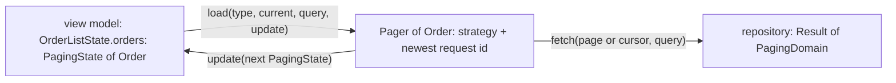

{/* Generated by docs/internal/scripts/sync_vault.py from the Sinew design notes. Edit the notes and re-run the script; changes made here are overwritten. */}

# 03 - Paging

## Concept {#concept}

### 1. Why

Every paged list follows the same unwritten rules:
1. The first page clears the data.
2. Refresh and a new search clear it too, and start again from page 1.
3. A later page keeps the items on screen and appends to them.
4. Retry repeats the load that failed, not page 1.
5. A late response for an old query or an old refresh is dropped.

Written by hand in every view model, these rules repeat and drift apart, and the bugs they cause are subtle: duplicated items, a stale search result replacing a fresh one, a retry that throws away three loaded pages.

`sinew_paging` owns those rules in one small class, `Pager<T>`. A list page only says **how to fetch one page**, and maps its events to loads.

### 2. Shape

#### Where the state lives

`Pager<T>` holds **no UI state**. The paging state is one field of the page's own state, so the page state stays the single source of truth. The pager reads the current `PagingState` from the page state and writes the next one back through an `update` callback, which is the view model's `setState`.



The pager remembers only its strategy (how the next page is found), the id of the newest request (to drop stale responses), and the query of its last `Initial` load (so `Initial` runs at most once per query). On Kotlin it also holds the newest load's job, so it can cancel it.

#### `PagingState<T>`

```
LoadType { Initial, Refresh, More }

PagingState<T>(
    view: ViewState<PagingDomain<T>> = Loading(),      // a list shows its skeleton from the first frame
    loadType: LoadType = Initial,                      // the load this state belongs to: explicit, never guessed from data == null
) {
    canLoadMore: Boolean                 // view is Done, and meta.hasNextPage
    retryType: LoadType                  // when view is Failed: the load that failed (loadType), else Initial
}
```

| Load | While loading | On success | On failure |
|---|---|---|---|
| `Initial` (first open, or a new search query) | `Loading(data: null)`: full skeleton | `Done(page 1)` | `Failed(data: null)`: first-page error |
| `Refresh` (pull to refresh) | `Loading(data: null)`: full skeleton | `Done(page 1)` | `Failed(data: null)`: first-page error |
| `More` (the end of the list is near) | `Loading(data: previous)`: the items, plus skeleton rows at the end | `Done(merged pages)` | `Failed(data: previous)`: the items, plus a retry row |

`loadType` stays set after the load finishes, so the UI can tell a first-page failure from a next-page failure, and retry knows what to repeat.

#### Strategies

| Strategy | Use when the backend pages by | First request | Next request | Has a next page when |
|---|---|---|---|---|
| `Pager.offset` | page number, and says whether a next page exists | `fetch(firstPage, query)` | `fetch(meta.page + 1, query)` | `meta.hasNextPage` |
| `Pager.offsetByTotal` | page number, and returns only a total page count | `fetch(firstPage, query)` | `fetch(meta.page + 1, query)` | `meta.page < meta.totalPage` (the pager writes it into `hasNextPage`) |
| `Pager.cursor` | an opaque cursor (`meta.nextKey`) | `fetch("", query)` | `fetch(meta.nextKey, query)` | `meta.hasNextPage` and `nextKey` isn't empty |
| `Pager.lastItem` | "items after this ID" | `fetch(null, query)` | `fetch(itemId(items.last), query)` | `meta.hasNextPage` and the list isn't empty |

`firstPage` defaults to 1 and is configurable for 0-based APIs. The offset strategies **write the page they requested** into the response's `meta.page`, so the next request is always `page + 1`, whatever the backend reports. Every strategy **normalizes** the merged meta's `hasNextPage` with its own rule, so `canLoadMore` only ever reads one field.

#### `load`, step by step

```
load(type, current: PagingState<T>, query = "", update):
    // 1. decide whether this load may start
    if type == More:
        moreAllowed = (current.view is Done and current.canLoadMore)
                   or (current.view is Failed and current.loadType == More)      // retrying a failed next page
        if not moreAllowed: return                                               // no request, no state change
        if current.view is Loading: return                                       // a load is already running
    if type == Initial and query == lastQuery and (initialRunning or current.view is Done):
        return                                                                   // Initial runs at most once per query
    // Refresh always starts. Initial and Refresh supersede whatever is running.

    // 2. take a request id; on Kotlin, cancel the previous load's job when Initial/Refresh supersedes it
    id = ++newestId
    previous = (type == More) ? current.view.dataOrNull : null

    // 3. loading state
    update(PagingState(Loading(data = previous), loadType = type))

    // 4. fetch one page through the strategy
    result = (type == More) ? strategy.next(previous, query) : strategy.first(query)

    // 5. drop a stale response
    if id != newestId: return

    // 6. write the outcome
    result.fold(
        success = page ->
            merged = (type == More) ? merge(previous, page, itemKey) : page
            update(PagingState(Done(strategy.normalize(merged)), loadType = type)),
        failure = error ->
            if error is CancelException: return                                  // Flutter: a superseded request, never shown
            update(PagingState(Failed(data = previous, error = error), loadType = type)),
    )

merge(previous, page, itemKey):
    items = previous.items + page.items
    if itemKey != null: items = items.distinctBy(itemKey), keeping the first occurrence
    PagingDomain(items, meta = page.meta)
```

#### In a view model

The view model maps events to actions, and only the load action touches the pager:

```
// events from the page
Opened | Refreshed | QueryChanged(query) | EndReached | RetryTapped

// view model (Event → Action → State + Effect)
pager = Pager.offset<Order> { page, query -> orders.getOrders(page, query) }

mapEventToAction(event) = when (event)
    Opened              -> Load(Initial)                    // a re-sent Opened (rotation) does nothing: Initial runs once per query
    Refreshed           -> Load(Refresh)
    QueryChanged(q)     -> Search(q)
    EndReached          -> if (state.orders.canLoadMore) Load(More) else null
    RetryTapped         -> Load(state.orders.retryType)

onAction(action) = when (action)
    Load(type)          -> pager.load(type, state.orders, state.query) { setState { copy(orders = it) } }
    Search(q)           -> setState { copy(query = q) }; debounce(300 ms) { pager.load(Initial, state.orders, q) { setState { copy(orders = it) } } }
```

The view model debounces typing. The pager only ever sees the final query, and its request ids drop any response that arrives for an older one.

### 3. API

| Name | Signature (pseudocode) | For |
|---|---|---|
| `LoadType` | `enum { Initial, Refresh, More }` | which load a state belongs to |
| `PagingState<T>` | `(view: ViewState<PagingDomain<T>> = Loading(), loadType: LoadType = Initial)`, `canLoadMore`, `retryType`, `copy` | the paging slice of a page's state |
| `Pager.offset` | `Pager.offset<T>(firstPage = 1, itemKey: ((T) -> Any)? = null, fetch: (page: Int, query: String) -> Result<PagingDomain<T>>)` | page-number paging with a has-next flag |
| `Pager.offsetByTotal` | `Pager.offsetByTotal<T>(firstPage = 1, itemKey = null, fetch)` | page-number paging with a total page count |
| `Pager.cursor` | `Pager.cursor<T>(itemKey = null, fetch: (cursor: String, query: String) -> Result<PagingDomain<T>>)` | cursor paging |
| `Pager.lastItem` | `Pager.lastItem<T>(itemId: (T) -> String, itemKey = null, fetch: (lastId: String?, query: String) -> Result<PagingDomain<T>>)` | "after this ID" paging |
| `load` | `pager.load(type: LoadType, current: PagingState<T>, query: String = "", update: (PagingState<T>) -> Unit)` | run one load |
| `cancel` | `pager.cancel()` | drop the running load (Kotlin: cancel its job), e.g. when the page closes |

The four strategies are internal. The factory functions are the only way to choose one.

### 4. Build steps

1. `LoadType` and `PagingState` with `canLoadMore` and `retryType`, with tests for each `view` × `loadType` combination.
2. The `Initial`-once rule, tested: a second `Initial` with the same query while running or after success sends no request; after a failure it does; a new query does.
3. The internal strategy interface (`first`, `next`, `normalize`) and the four strategies, each tested for:
   - the first request;
   - the next request;
   - the has-next rule.
4. `Pager.load`, test first, with a fake `fetch` the test controls (it returns when the test says so). Tests:
   - each row of the load table (loading, success, failure, for each load type);
   - `More` with no next page sends no request and doesn't change state;
   - `More` while a load runs is ignored;
   - `Refresh` during a running `More` wins, and the late `More` response is dropped;
   - a new `Initial` (search) during a running `Initial` wins;
   - retry after a `More` failure fetches the failed page, not page 1, and keeps the loaded items;
   - `itemKey` drops duplicates across pages;
   - the first load with the default meta (`hasNextPage = false`) still fetches;
   - an empty first page is `Done(empty)`.
5. Kotlin: a test that a superseded load's coroutine is cancelled. Flutter: a test that a `CancelException` failure leaves the state unchanged.
6. `cancel()`, tested: after it, a pending response changes nothing.

**Done when**
- [ ] Every test in steps 2 and 4 passes on every target.
- [ ] A view model needs no paging logic beyond one `fetch` function and its event mapping.
- [ ] No stale response, from an older query, refresh or page, ever reaches the state.

### 5. Edge cases

| Case | Decided behavior |
|---|---|
| The first load with the default meta (`hasNextPage = false`) | `Initial` and `Refresh` never check has-next. They fetch the first page. |
| `Opened` sent twice (a Kotlin rotation keeps the view model) | `Initial` for the same query is ignored while it runs or after it succeeded. It runs again after a failure (retry) or for a new query (search). `Refresh` always runs. |
| The state starts as `Loading()` but no load has started yet | The pager tracks its own requests, not the view state, so the first `Initial` always runs. |
| A 0-based API | `firstPage = 0`. |
| `More` with no next page | No request, no state change. |
| `More` while any load runs | Ignored. |
| `Refresh` or a new search while `More` runs | The new load starts. The `More` response is dropped when it arrives; on Kotlin its coroutine is cancelled. |
| The user types a search while a page loads | The view model debounces; each settled query starts an `Initial` load. Responses for older queries are dropped. |
| Retry after a `More` failure | Fetches the page that failed, with the loaded items kept. |
| Retry after a first-page failure | Starts `Initial` again. |
| An empty first page | `Done(data: empty)`. The UI shows its empty state. |
| `lastItem` with an empty list | No next page: `More` does nothing. |
| `cursor` with `hasNextPage = true` but an empty `nextKey` | Treated as no next page. A backend bug can't cause a loop on the first page. |
| Duplicates when items shift between offset pages | Off by default. With `itemKey`, merging keeps the first occurrence of each key. |
| Missing or wrong page number | Offset strategies always overwrite `meta.page` with the page they requested, so a backend that omits it (or reports it 0-based while requests are 1-based) can't break the next request. |
| A page smaller than `limit` but `hasNextPage = true` | The pager trusts the backend's flag. A wrong flag shows as one empty extra page and then stops. |
| The page closes mid-load | The view model calls `pager.cancel()`, or relies on its scope being cancelled (Kotlin). A late response changes nothing. |
| A failed load whose error is cancellation | Flutter: the pager returns without touching state. Kotlin: cancellation never reaches `fold`, because the guard rethrows it. |

## Implementation {#implementation}

<KotlinOnly>

### 1. Why {#kotlin-1-why}

The base note defines the pager's rules. On Kotlin, two of them need coroutine care:
- **dropping stale responses**, where the older load's coroutine should also be **cancelled**, not merely ignored;
- **the `Initial`-once rule**, which needs state that's safe when two loads start at almost the same time.

### 2. Shape {#kotlin-2-shape}

```kotlin
public enum class LoadType { Initial, Refresh, More }

public data class PagingState<out T>(
    val view: ViewState<PagingDomain<T>> = ViewState.Loading(),
    val loadType: LoadType = LoadType.Initial,
) {
    val canLoadMore: Boolean get() = view is ViewState.Done && view.data.meta.hasNextPage
    val retryType: LoadType get() = if (view is ViewState.Failed) loadType else LoadType.Initial
}

public class Pager<T> internal constructor(private val strategy: PagingStrategy<T>, private val itemKey: ((T) -> Any)?) {
    private val mutex = Mutex()
    private var newestId = 0L
    private var running: Job? = null
    private var initialQuery: String? = null          // the query of the last Initial that is running or succeeded
    private var initialRunId: Long? = null            // the id of the Initial currently running, if any

    public suspend fun load(type: LoadType, current: PagingState<T>, query: String = "", update: (PagingState<T>) -> Unit)
    public fun cancel()

    public companion object {
        public fun <T> offset(firstPage: Int = 1, itemKey: ((T) -> Any)? = null,
                              fetch: suspend (page: Int, query: String) -> Result<PagingDomain<T>>): Pager<T>
        public fun <T> offsetByTotal(firstPage: Int = 1, itemKey: ((T) -> Any)? = null,
                                     fetch: suspend (page: Int, query: String) -> Result<PagingDomain<T>>): Pager<T>
        public fun <T> cursor(itemKey: ((T) -> Any)? = null,
                              fetch: suspend (cursor: String, query: String) -> Result<PagingDomain<T>>): Pager<T>
        public fun <T> lastItem(itemId: (T) -> String, itemKey: ((T) -> Any)? = null,
                                fetch: suspend (lastId: String?, query: String) -> Result<PagingDomain<T>>): Pager<T>
    }
}
```

#### How `load` runs on Kotlin {#kotlin-how-load-runs-on-kotlin}

```kotlin
public suspend fun load(type: LoadType, current: PagingState<T>, query: String, update: (PagingState<T>) -> Unit): Unit = coroutineScope {
    val previous = if (type == LoadType.More) current.view.dataOrNull else null
    val id = mutex.withLock {
        if (!allowed(type, current, query)) return@coroutineScope          // the base rules: More guards, Initial once per query
        if (type != LoadType.More) running?.cancel()                        // supersede: cancel the older load's fetch, never a caller
        if (type == LoadType.Initial) { initialQuery = query; initialRunId = newestId + 1 }
        (++newestId).also { update(PagingState(ViewState.Loading(previous), type)) }
    }
    val fetch = async { if (type == LoadType.More) strategy.next(previous!!, query) else strategy.first(query) }   // a child job the pager can cancel
    mutex.withLock { if (id == newestId) running = fetch }
    var succeeded = false
    try {
        val result = fetch.await()
        mutex.withLock {
            if (id != newestId) return@withLock                             // stale: checked and written under one lock
            succeeded = result.isSuccess
            result.fold(
                onSuccess = { page -> update(PagingState(ViewState.Done(strategy.normalize(merge(previous, page, type))), type)) },
                onFailure = { error -> update(PagingState(ViewState.Failed(previous, error), type)) },
            )
        }
    } catch (e: CancellationException) {
        currentCoroutineContext().ensureActive()                            // the caller was cancelled: propagate
        // otherwise this load's fetch was superseded: nothing to write
    } finally {
        withContext(NonCancellable) {
            mutex.withLock {
                if (initialRunId == id) {                                   // this was the Initial that set the flag
                    initialRunId = null
                    if (!succeeded) initialQuery = null                     // failed, cancelled or stale: the same query may run again
                }
            }
        }
    }
}
```

| Rule | Why |
|---|---|
| The fetch runs in a **child job** (`async` inside `coroutineScope`), and only that job is cancelled when a newer load supersedes it | Cancelling the caller's own job could cancel the view model's coroutine, or the pager's own next call |
| The stale check and the `update` happen under the same lock | On a multi-threaded dispatcher, a stale result can't land between the check and the write |
| The `Initial` bookkeeping is reset in `finally`, under `NonCancellable` | A cancelled, stale or failed `Initial` never leaves the "already running" flag set, so the same query can run again |
| `Initial` counts as done for its query only after it **succeeded** | Matches the base rule: ignored while running or after success, runs again after a failure |
| A `Mutex` guards the pager's fields | Two `onAction` coroutines can start loads at the same moment |

### 3. API {#kotlin-3-api}

As in the registry, with the signatures above. `PagingState` and `LoadType` live in `sinew-paging`. The strategies are `internal`.

### 4. Build steps {#kotlin-4-build-steps}

1. `PagingState` and `LoadType`, with tests.
2. The four strategies, `internal`, tested on their own.
3. `Pager.load` with `runTest` and `StandardTestDispatcher`, using `ControlledFetch` from `sinew-testing`. Tests:
   - every row of the base load table;
   - `Refresh` during `More` cancels the `More` job (assert the fetch coroutine was cancelled) and drops its result;
   - two `Initial`s with the same query start one fetch;
   - a failed `Initial` runs again;
   - an `Initial` superseded by a `Refresh` (cancelled), and a stale `Initial`, both let the same query run again afterwards;
   - `searchDuringMore`: a new query while `More` is in flight drops the `More` result and loads the new query's first page;
   - `retryRepeatsFailedPage`: after page 3 fails, retry fetches page 3 with pages 1–2 kept;
   - a new query runs;
   - `itemKey` de-duplication;
   - the requested page wins over the reported one.
4. `cancel()`, tested: the running job is cancelled, and no `update` happens after it.

**Done when**
- [ ] Every test in step 3 passes on all four targets.
- [ ] Clearing a view model mid-load leaves no running fetch (checked with the test dispatcher).

### 5. Edge cases {#kotlin-5-edge-cases}

| Case | Decided behavior |
|---|---|
| `load` called from outside a coroutine | Not possible: it's `suspend`. The view model calls it from `onAction`. |
| The fetch function ignores cancellation (a blocking call) | The response is still dropped by the id check. Repositories use Ktor, which honors cancellation. |
| `update` throws (a bug in the view model's `copy`) | It propagates to the view model's coroutine like any other bug (base: a throw in `onAction` propagates). |

:::info[Decided by default (revisit during implementation)]

- **A `Mutex`** for the pager's state instead of confining it to the main dispatcher, so the pager doesn't depend on which dispatcher the view model uses.

:::

</KotlinOnly>

<DartOnly>

### 1. Why {#dart-1-why}

The base pager's rules carry over unchanged. On Dart they're simpler to enforce than on Kotlin: an isolate runs one event at a time, so the pager's fields need no lock. Cancellation is different, though. A Dart `Future` can't be cancelled, so a superseded request is cancelled through Dio's `CancelToken` by the view model, and its late result is dropped by the pager's request id.

### 2. Shape {#dart-2-shape}

```dart
enum LoadType { initial, refresh, more }

final class PagingState<T> {
  const PagingState({this.view = const Loading(), this.loadType = LoadType.initial});
  final ViewState<PagingDomain<T>> view;
  final LoadType loadType;
  bool get canLoadMore => switch (view) { Done(:final data) => data.meta.hasNextPage, _ => false };
  LoadType get retryType => view is Failed ? loadType : LoadType.initial;
  PagingState<T> copyWith({ViewState<PagingDomain<T>>? view, LoadType? loadType});
}

final class Pager<T> {
  Pager.offset(Future<Result<PagingDomain<T>>> Function(int page, String query) fetch, {int firstPage = 1, Object Function(T item)? itemKey});
  Pager.offsetByTotal(…);
  Pager.cursor(Future<Result<PagingDomain<T>>> Function(String cursor, String query) fetch, {Object Function(T item)? itemKey});
  Pager.lastItem(Future<Result<PagingDomain<T>>> Function(String? lastId, String query) fetch, {required String Function(T item) itemId, Object Function(T item)? itemKey});

  Future<void> load(LoadType type, PagingState<T> current, {String query = '', required void Function(PagingState<T>) update});
  void cancel();      // drop whatever is running; late results change nothing
}
```

#### In a notifier {#dart-in-a-notifier}

```dart
CancelToken? _token;
late final Pager<Order> _pager = Pager.offset((page, query) {
  _token?.cancel();                                   // cancel the superseded request
  _token = CancelToken();
  return _orders.getOrders(page: page, search: query, cancelToken: _token);
});

Future<void> _load(LoadType type) =>
    _pager.load(type, state.orders, query: state.query, update: (orders) => setState((s) => s.copyWith(orders: orders)));
```

| Rule | Why |
|---|---|
| The pager keeps a request counter, the last `initial` query and the id of the `initial` that's running | The base rules (stale responses, `initial` once per query) without any lock |
| The `initial` bookkeeping is reset in a `finally` around the fetch: if that `initial` didn't succeed (failed, superseded, or its result came back stale), its query may run again | A superseded or stale `initial` must never leave the query marked as "already loaded" |
| The notifier owns the `CancelToken` and cancels it in the fetch and in `dispose` | The pager stays free of Dio |
| A `CancelException` failure leaves the state unchanged | A cancelled request was superseded, not failed |

### 3. API {#dart-3-api}

As above, in `sinew_paging` (pure Dart, depends on `sinew_models` and `sinew_exception`).

### 4. Build steps {#dart-4-build-steps}

1. `PagingState` and the strategies, tested.
2. `Pager.load` with `ControlledFetch` from `sinew_testing`, in `fake_async`. Tests:
   - every row of the base load table;
   - a late `more` after a `refresh` is dropped;
   - two `initial`s with the same query start one fetch;
   - a failed `initial` runs again;
   - an `initial` superseded by a `refresh`, and a stale `initial`, both let the same query run again afterwards;
   - `searchDuringMore`: a new query while `more` is in flight drops the `more` result and loads the new query's first page;
   - `retryRepeatsFailedPage`: after page 3 fails, retry fetches page 3 with pages 1–2 kept;
   - `itemKey` de-duplication;
   - the requested page wins;
   - a `CancelException` leaves the state unchanged.
3. `cancel()`, tested.

**Done when**
- [ ] The same paging race tests as Kotlin pass on the Dart VM and in Chrome.

### 5. Edge cases {#dart-5-edge-cases}

| Case | Decided behavior |
|---|---|
| The fetch doesn't take a `CancelToken` (a local source) | The late result is still dropped by the request id. Nothing to cancel. |
| The notifier is disposed mid-load | It calls `cancel()` and cancels its token in `ref.onDispose`. A late `update` would otherwise touch a disposed notifier. |

:::info[Decided by default (revisit during implementation)]

- **The notifier owns the `CancelToken`**, not the pager, so `sinew_paging` stays pure Dart and works with any data source.

:::

</DartOnly>
