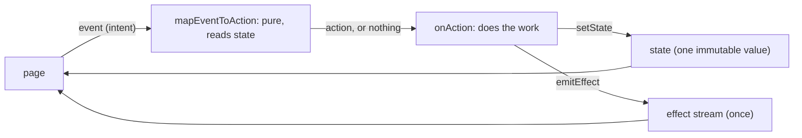

{/* Generated by docs/internal/scripts/sync_vault.py from the Sinew design notes. Edit the notes and re-run the script; changes made here are overwritten. */}

# 04 - Presentation

## Concept {#concept}

### 1. Why

A page's logic needs three things:
- one immutable **state** it renders from;
- a way to receive the user's **intents**;
- a way to fire **one-time outcomes** (a snackbar, a navigation callback) that must not replay when the page rebuilds.

Plain view-model methods called straight from the UI blur these. Decisions about "should this run now" end up scattered across callbacks, several intents duplicate the same work, and one-time outcomes leak into state as flags someone has to reset.

`sinew_presentation` gives every page the same small shape: **Event → Action → State + Effect**. It's framework-neutral: no Riverpod, no AndroidX. The [Adapters](/guide/packages/adapters) bind it to a framework.

### 2. Shape



#### Events and actions

**Events** are what the page reports: the user's or the system's intent. **Actions** are the work the view model runs. They're two types because several intents often mean the same work, and some intents mean no work right now:

| Event | Action |
|---|---|
| `Opened` | `Load(Initial)` (paged slices: the pager ignores a repeat) or `LoadHome` (plain slices: only the first time, see below) |
| `Refreshed` | `Load(Refresh)` |
| `RetryTapped` | `Load(` whichever load failed `)` |
| `EndReached` while another page exists | `Load(More)` |
| `EndReached` on the last page | nothing |
| `CancelTapped(orderId)` | `Cancel(orderId)` |

| Rule | Why |
|---|---|
| Events and actions are sealed hierarchies of immutable values | Exhaustive matching in `mapEventToAction` and `onAction` |
| Events are named for what happened (`…Tapped`, `…Changed`, `…Reached`, `Opened`); actions for the work (`Load`, `Cancel`) | Events stay honest about the user. Actions have one code path per kind of work. |
| `mapEventToAction` is **pure**: it reads the state and returns an action or nothing | Every "should this run now" decision is in one testable function |
| The page only sends events. It never calls an action. | The page states intent; the view model decides what runs |

#### State

One immutable value per page. Each async slice is a `ViewState` (or a `PagingState`), with plain values (a query, a selected filter) beside them:

```
OrderListState(
    orders: PagingState<Order> = PagingState(),     // starts Loading: skeleton from the first frame
    query: String = "",
    statusFilter: OrderStatus? = null,
    cancelling: Boolean = false,                    // an action at rest is just "not running"
)
```

| Rule | Why |
|---|---|
| One container with slices, not one subclass per screen state | Several things load independently: "the list is loaded **and** a cancel is running" needs both at once |
| State changes only through `setState { copy(…) }` | Immutable updates. The page rebuilds from one value. |
| No UI context, controllers, streams, timers or pre-rendered text in state | State is a plain value a test can compare. Errors stay `AppException`s, rendered at display time. |
| **Never trigger a side effect from a state change.** A snackbar, toast, dialog or navigation is an effect, emitted once. | A state is rendered again on every change elsewhere in the page. A side effect tied to a state (say, a snackbar on `Failed`) would fire again each time. |
| A slice loaded when the page opens starts as `Loading()`. A page with several slices starts them all `Loading()` and loads them in parallel. | The first frame is already a skeleton, and each section appears as soon as its own data arrives. |

#### Loading on open, once

A slice loaded on open starts as `Loading()`, so the state alone can't tell "the load already started" from "about to start". The opening event is guarded another way:

```
private var opened = false                                          // in the view model, not in state

mapEventToAction(Opened) = if (opened) null else { opened = true; LoadHome }
onAction(LoadHome) = parallel { loadBanner(); loadOrders(); loadPromos() }   // each slice: Loading → Done or Failed on its own
```

The flag lives in the view model, so it survives a rotation along with it. A new page gets a new view model, and loads again.

#### Two kinds of async work

| | Loading data to show | Performing an action (submit, cancel, delete) |
|---|---|---|
| Slice | `ViewState<Data>` or `PagingState<T>` | a `Boolean` (`cancelling`, `submitting`) |
| While running | skeleton, or a refresh indicator | a spinner inside the button, the button disabled |
| On success | `Done(data)` | back to `false`, plus a success **effect** |
| On failure | `Failed(error)` rendered **in the page** | back to `false`, plus an error **effect** carrying the `AppException` |

Loads fail **into state**, because the page must keep showing the problem. Actions fail **as an effect**, because the page is still valid and the user only needs to be told once.

#### Effects

An effect is a one-time outcome: show a snackbar, open a dialog, call a navigation callback. It isn't state, because it must happen once and must not replay on rebuild.

| Rule | Why |
|---|---|
| Effects go through an `EffectEmitter` and are collected by the page | One channel per page, released when the page goes away |
| An effect emitted while no one is collecting is **buffered** and delivered once, to the next collector | A snackbar emitted during a rotation or a brief pause isn't lost, and isn't shown twice |
| An error effect carries the `AppException`, never text | The page renders it with `displayMessage(localizer)` in the current language |
| View models never navigate. They emit an effect, and the page calls its navigation callback. | Navigation needs UI context |

#### Simple pages

The full skeleton pays off when a page has several intents. Smaller pages use less:

| Page | Shape |
|---|---|
| Static, or all state is widget-local | no view model |
| One or two actions (a confirmation page, one toggle) | `StateEffectHandler`: state and effects, with **direct methods** (`submit()`, `resend()`) and no event or action types |
| Three or more intents, or intents that map to the same work | `EventActionHandler`: the full skeleton |

When a simple page grows a third intent, it's converted to the full skeleton in the same change.

#### What stays in the app

App-level state (the signed-in session, its role) and routing are the app's own. Sinew's presentation base is per page.

### 3. API

```
abstract class StateEffectHandler<S, F>(initial: S, scope) {        // scope: Kotlin CoroutineScope; Dart: none
    state: S                                                         // read; observable (Kotlin StateFlow, Dart ValueListenable)
    effects: stream of F                                             // Kotlin Flow, Dart Stream
    protected setState(reduce: S -> S)
    protected emitEffect(effect: F)
    dispose()                                                        // closes the effect stream; later calls do nothing
}

abstract class EventActionHandler<S, E, A, F>(initial: S, scope) : StateEffectHandler<S, F> {
    onEvent(event: E)                                                // mapEventToAction, then onAction if non-null
    protected abstract mapEventToAction(event: E): A?               // pure
    protected abstract onAction(action: A)                          // Kotlin: suspend, launched in scope. Dart: async.
}

class EffectEmitter<F> {
    emit(effect: F)                                                  // buffered until collected, delivered once
    stream / flow
    dispose()
}
```

| Name | For |
|---|---|
| `StateEffectHandler<S, F>` | a simple page: state and effects, direct methods |
| `EventActionHandler<S, E, A, F>` | a full page: events, actions, state, effects |
| `EffectEmitter<F>` | the buffered, deliver-once effect channel both bases use, also usable alone |

| Platform | State | Effects | Scope |
|---|---|---|---|
| Kotlin | `StateFlow<S>` | `Channel<F>(BUFFERED)` exposed as `Flow<F>` | a `CoroutineScope` passed in. `onAction` runs in `scope.launch`. |
| Dart | a `ValueListenable<S>` | a stream that buffers while no one listens | none. `onAction` is an `async` method, not awaited by `onEvent`. |

### 4. Build steps

1. `EffectEmitter`, test first:
   - an effect emitted before a collector exists is delivered to the first collector;
   - each effect is delivered once, even with a second collector later;
   - after `dispose()`, `emit` does nothing.
2. `StateEffectHandler`:
   - `setState` updates and notifies;
   - `emitEffect` goes through the emitter;
   - `dispose()` closes it.
3. `EventActionHandler`:
   - `onEvent` calls `mapEventToAction`, then `onAction` only for a non-null action;
   - a null action runs nothing;
   - events after `dispose()` are ignored.
4. A sample order-list handler with fakes, tested end to end: events in, states and effects out, no framework.

**Done when**
- [ ] Both bases and the emitter pass their tests on every target, with no framework dependency.
- [ ] A page view model can be tested by sending events and reading state and effects, with no UI and no framework.
- [ ] An effect emitted during a rotation is shown exactly once afterwards.

### 5. Edge cases

| Case | Decided behavior |
|---|---|
| An effect emitted with no collector | Buffered, delivered once to the next collector. |
| A second collector after the first got the effect | It doesn't get it again. |
| Events sent after `dispose()` | Ignored. No action runs, no state changes. |
| A rotation re-sends `Opened` (Kotlin keeps the view model, the screen sends `Opened` again) | Paged slices: the pager runs `Initial` at most once per query, so nothing reloads. Plain `ViewState` slices: the view model keeps a private `opened` flag (not in state) and runs its opening loads only the first time. |
| Two actions run at once (a load, then a cancel tap) | Allowed: they touch different slices. Work that must not overlap is guarded in `mapEventToAction` by reading state (for example, ignore `CancelTapped` while `cancelling` is `Loading`). |
| A search typed quickly | The view model debounces, and `Pager` drops stale responses (see Paging). |
| `onAction` throws | It shouldn't: everything below returns `Result`. A throw is a bug in the view model's own code, and it propagates like any unhandled error, so it shows up in development and in crash reports. |
| An action finishes after the page closed | Kotlin: the scope is cancelled, so the action stops. Dart: `setState` and `emitEffect` after `dispose()` do nothing. |

## Implementation {#implementation}

<KotlinOnly>

### 1. Why {#kotlin-1-why}

The base presentation classes are framework-neutral, so on Kotlin they can't use `viewModelScope`. They take a `CoroutineScope` instead, and run actions in it. This note gives the real classes, and the buffered, deliver-once `EffectEmitter`.

### 2. Shape {#kotlin-2-shape}

```kotlin
public class EffectEmitter<F> {
    private val channel = Channel<F>(Channel.BUFFERED)
    public val effects: Flow<F> = channel.receiveAsFlow()       // each effect goes to one collector, once
    public fun emit(effect: F) { channel.trySend(effect) }
    public fun dispose() { channel.close() }
}

public abstract class StateEffectHandler<S, F>(initial: S, protected val scope: CoroutineScope) {
    private val _state = MutableStateFlow(initial)
    public val state: StateFlow<S> = _state.asStateFlow()
    protected val currentState: S get() = _state.value
    private val emitter = EffectEmitter<F>()
    public val effects: Flow<F> = emitter.effects
    protected fun setState(reduce: S.() -> S) { _state.update(reduce) }
    protected fun emitEffect(effect: F) { emitter.emit(effect) }
    public open fun dispose() { emitter.dispose(); scope.cancel() }
}

public abstract class EventActionHandler<S, E, A, F>(initial: S, scope: CoroutineScope) : StateEffectHandler<S, F>(initial, scope) {
    public fun onEvent(event: E) {
        val action = mapEventToAction(event) ?: return
        scope.launch { onAction(action) }
    }
    protected abstract fun mapEventToAction(event: E): A?
    protected abstract suspend fun onAction(action: A)
}
```

| Rule | Why |
|---|---|
| `Channel(BUFFERED)` + `receiveAsFlow()` | An effect sent while nobody collects waits in the buffer, and goes to exactly one collector |
| `trySend` in `emitEffect` | Emitting never suspends the caller. With a closed channel (after `dispose`), it does nothing. |
| `scope.launch` per action | Actions run concurrently, guarded by state in `mapEventToAction` (base) |
| `dispose()` cancels the scope | Running actions stop when the owner goes away |

#### Loading on open, once {#kotlin-loading-on-open-once}

```kotlin
private var opened = false

override fun mapEventToAction(event: HomeEvent): HomeAction? = when (event) {
    HomeEvent.Opened -> if (opened) null else { opened = true; HomeAction.LoadAll }
    …
}

override suspend fun onAction(action: HomeAction) = when (action) {
    HomeAction.LoadAll -> coroutineScope {
        launch { loadBanner() }; launch { loadOrders() }; launch { loadPromos() }     // each slice: Loading → Done/Failed on its own
    }
    …
}
```

### 3. API {#kotlin-3-api}

| Name | Kotlin |
|---|---|
| `EffectEmitter<F>` | as above |
| `StateEffectHandler<S, F>` | `public abstract class StateEffectHandler<S, F>(initial: S, scope: CoroutineScope)` |
| `EventActionHandler<S, E, A, F>` | `public abstract class EventActionHandler<S, E, A, F>(initial: S, scope: CoroutineScope)` |

The module depends only on `kotlinx-coroutines-core`.

### 4. Build steps {#kotlin-4-build-steps}

1. `EffectEmitter`, tested with Turbine:
   - an effect emitted before collection arrives at the first collector;
   - a second collector doesn't get it again;
   - `emit` after `dispose` does nothing.
2. `StateEffectHandler` and `EventActionHandler` with a `TestScope`. Tests:
   - state updates;
   - `null` actions run nothing;
   - `dispose` cancels a running action;
   - events after `dispose` are ignored.
3. The `opened` pattern in a sample home handler: `Opened` twice starts the parallel loads once.

**Done when**
- [ ] The sample order-list handler runs in `commonTest` with no Android dependency.

### 5. Edge cases {#kotlin-5-edge-cases}

| Case | Decided behavior |
|---|---|
| `onEvent` after `dispose` | The scope is cancelled, so `launch` does nothing. |
| An effect emitted between two collections (a configuration change) | It waits in the channel's buffer for the next collector. |
| A full buffer (64 pending effects) | `trySend` fails and the effect is dropped. A page never legitimately queues that many one-time effects. |

:::info[Decided by default (revisit during implementation)]

- **`Channel.BUFFERED`** (64) for effects, dropping beyond that, rather than an unlimited channel that could grow without bound.

:::

</KotlinOnly>

<DartOnly>

### 1. Why {#dart-1-why}

`sinew_presentation` is pure Dart, so it can't use Flutter's `ValueNotifier`. It holds state in a small listenable of its own, and effects in an emitter that buffers while nobody listens. A Dart broadcast stream would drop those effects.

### 2. Shape {#dart-2-shape}

```dart
final class EffectEmitter<F> {
  final _buffer = <F>[];
  StreamController<F>? _controller;
  bool _disposed = false;

  Stream<F> get stream { … }          // a single active listener; on listen, the buffer is flushed to it in order
  void emit(F effect) { if (_disposed) return; final c = _controller; if (c != null && c.hasListener) c.add(effect); else _buffer.add(effect); }
  void dispose() { _disposed = true; _buffer.clear(); _controller?.close(); }
}

abstract class StateEffectHandler<S, F> {
  StateEffectHandler(S initial) : _state = initial;
  S _state;
  S get state => _state;
  Stream<S> get states;               // emits each new state
  final _emitter = EffectEmitter<F>();
  Stream<F> get effects => _emitter.stream;
  @protected void setState(S Function(S) reduce) { if (_disposed) return; _state = reduce(_state); … }
  @protected void emitEffect(F effect) => _emitter.emit(effect);
  void dispose() { … }
}

abstract class EventActionHandler<S, E, A, F> extends StateEffectHandler<S, F> {
  EventActionHandler(super.initial);
  void onEvent(E event) { if (_disposed) return; final action = mapEventToAction(event); if (action != null) onAction(action); }
  @protected A? mapEventToAction(E event);
  @protected Future<void> onAction(A action);      // not awaited by onEvent (base review)
}
```

| Rule | Why |
|---|---|
| The effect stream accepts one listener at a time, and a new listener gets the buffered effects | A snackbar emitted while the page re-subscribes isn't lost, and isn't shown twice |
| `setState`, `emitEffect` and `onEvent` do nothing after `dispose` | A late `await` in an action can't touch a disposed handler |
| `package:meta`'s `@protected` marks the methods only subclasses call | The page sees `state`, `effects` and `onEvent` only |

#### Loading on open {#dart-loading-on-open}

On Flutter, a page sends `Opened` from `useOnOpened`, which runs once per page instance. A rebuild doesn't send it again, so plain slices need no `opened` flag. Paged slices still rely on the pager's `initial`-once rule, which also covers a page re-created by the router.

### 3. API {#dart-3-api}

| Name | Dart |
|---|---|
| `EffectEmitter<F>` | as above |
| `StateEffectHandler<S, F>`, `EventActionHandler<S, E, A, F>` | as above |

### 4. Build steps {#dart-4-build-steps}

1. `EffectEmitter`, tested:
   - an effect before the first listener is delivered;
   - a second listener after cancelling the first gets only new effects;
   - nothing after `dispose`.
2. Both handlers, tested on the Dart VM: events in, states and effects out; a `null` action runs nothing; calls after `dispose` are ignored.

**Done when**
- [ ] The sample order-list handler runs in a pure Dart test, with no Flutter import.

### 5. Edge cases {#dart-5-edge-cases}

| Case | Decided behavior |
|---|---|
| Two widgets listen to `effects` at once | The second `listen` throws, as with any single-subscription stream. One listener per page. |
| `onAction` throws | The `Future` completes with the error, which reaches the zone's error handler: a bug, visible in development and in crash reports (base review). |

:::info[Decided by default (revisit during implementation)]

- **A custom buffering emitter** over a single-subscription `StreamController`, because a plain one can't be re-listened after the page re-subscribes.
- **No `opened` flag needed on Flutter**, since the opening event is sent once per page instance. The flag stays a Kotlin rotation concern.

:::

</DartOnly>
