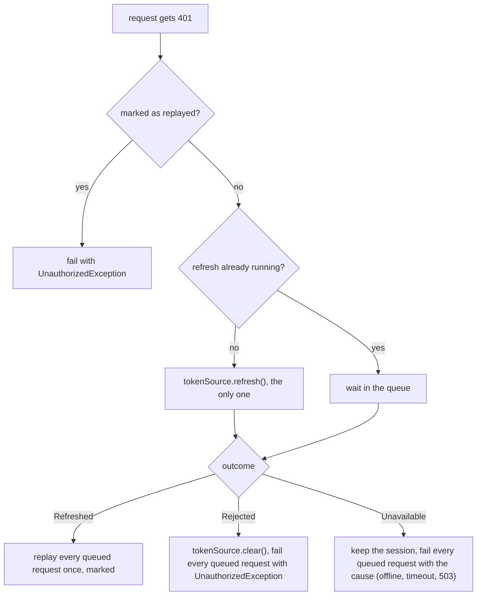

{/* Generated by docs/internal/scripts/sync_vault.py from the Sinew design notes. Edit the notes and re-run the script; changes made here are overwritten. */}

# 06 - Network

## Concept {#concept}

### 1. Why

Every app rebuilds the same HTTP setup. The hard parts are also the easiest to get wrong:
- **Token refresh.** Ten requests hit 401 at once, two refreshes race, and a rotating refresh token gets invalidated.
- **Translating HTTP errors into something a page can act on.**
- **Timeouts on every request.**
- **Logging that never leaks a token.**
- **Never sending a token to a host it doesn't belong to.**

`sinew_network` builds a configured client (Dio on Flutter, Ktor on Kotlin) with those parts done once, plus the source guard `processApiCall`. The app keeps writing its API clients directly on Dio or Ktor. Sinew doesn't hide the HTTP library.

### 2. Shape

#### What the app supplies

```
SinewConfig(
    baseUrl: String,
    connectTimeout = 15s,
    readTimeout = 30s,                        // reads
    writeTimeout = 60s,                       // writes: repeating them is costly, so they get longer
    logHttp = false,                          // debug builds only
    anonymousPaths: Set<String> = {},         // never get a token, never trigger a refresh (sign-in, register, OTP, password reset, refresh).
                                              // Matched relative to baseUrl's path: with baseUrl ".../v1", "/auth/login" matches "/v1/auth/login".
    locale: () -> String,                     // read per request, sent as Accept-Language
    defaultHeaders: () -> Map<String, String> = {},   // app version, API key, device id: read per request. Every name here is redacted by devtools.
    errorBodyReader: ErrorBodyReader = ErrorBodyReader.default,
)

interface TokenSource {
    accessToken(): String?                    // in memory
    refresh(): RefreshOutcome                 // gets a new pair from the backend and stores it
    clear()                                   // the session ended: drop tokens, void any refresh still running, tell the app's session service
}

RefreshOutcome = Refreshed | Rejected | Unavailable(cause: AppException)
//  Rejected:    the backend refused the refresh token, or the session ended while refreshing → the session is over
//  Unavailable: the refresh couldn't be completed (offline, timeout, 5xx) → the session is kept

// Sinew's ready implementation: the app supplies only the backend call and where the refresh token is kept
class SessionTokenSource(store: RefreshTokenStore, call: RefreshCall) : TokenSource
interface RefreshTokenStore { read(): String?, write(token: String), delete() }     // the app adapts its SecureStore in one line
interface RefreshCall { refresh(refreshToken: String): RefreshResult }               // the app's backend call, on a client without the auth layer
RefreshResult = Tokens(access: String, refresh: String) | Rejected | Unavailable(cause: AppException)

interface ErrorBodyReader { read(status: Int, body: String?): ErrorBody? }
ErrorBody(message: String?, fieldErrors: Map<String, List<String>>?)
// default: reads JSON "message" and "errors" ({ field: [messages] }), returns null for anything unreadable
```

The app builds **one client per backend** (`SinewHttp.dio(config, tokenSource)` / `SinewHttp.client(config, tokenSource)`) and registers each under a name in its DI.

#### The layers, in order

Each request passes through these layers, outermost first. They're Dio interceptors on Flutter and Ktor plugins on Kotlin.

| # | Layer | Does |
|---|---|---|
| 1 | **Timeout** | Sets the deadline by method: reads use `readTimeout`, writes (`POST`, `PUT`, `PATCH`, `DELETE`) use `writeTimeout`. Every request has one. |
| 2 | **Headers** | Adds `Accept: application/json`, `Accept-Language` from `locale()`, and `defaultHeaders()`. |
| 3 | **Auth** | Adds `Authorization: Bearer …` for requests to its own host, except anonymous paths. Refreshes on 401 (rules below). |
| 4 | **Fault injection** | Devtools hook: forces a status, a delay or a dropped connection on a matching path. Does nothing without devtools. |
| 5 | **Recorder** | Devtools hook: records the request and response, redacted when recorded. Does nothing without devtools. |
| 6 | **Redacting log** | Logs method, path, status and duration when `logHttp` is on. Redacts `Authorization`, cookies and the bodies of auth endpoints. |

Fault injection sits inside auth, so a forced 401 exercises the real refresh path.

#### The auth layer



| Rule | Why |
|---|---|
| **Single-flight:** while a refresh runs, other 401s wait for its outcome instead of starting their own | Parallel refreshes race, and with rotating refresh tokens the second invalidates the first |
| A 401 for a request sent with an **older** token than the current one replays at once, without refreshing | A refresh already finished while that request was in flight. Refreshing again would break "exactly one refresh". |
| The refresh runs in a scope owned by the client, not by the first caller | If the first caller is cancelled (its page closed), the other waiters still get the outcome |
| A replay goes out through the auth layer's own path, and its errors are handed back to the caller like any other error | A failing replay can never wait on the auth layer that is waiting on it |
| A replayed request is **marked**. A second 401 on it fails instead of refreshing again. | Otherwise a replay waits on a refresh that waits on the replay: a deadlock |
| Anonymous paths never get a token and never trigger a refresh | A 401 there means "wrong credentials", not "expired token" |
| The refresh call itself bypasses the auth layer | A failing refresh must not refresh itself |
| `Rejected` ends the session: `clear()`, then every queued request fails with `UnauthorizedException` | The app's session service routes to sign-in |
| `Unavailable` **keeps** the session: queued requests fail with the cause (`NoInternetConnectionException`, `RequestTimeOutException`, `ServiceUnavailableException`) | A refresh that fails because the network or the backend is down must not sign the user out. The page shows a retryable error; the next request tries again. |
| A token is attached only to requests whose host is the client's `baseUrl` host | An absolute URL to a CDN or a storage bucket never receives the user's token |
| `reset()` on sign-out clears the queue and the refreshing flag, and `clear()` voids a running refresh through the session epoch | Nothing leaks into the next user's session, and a late refresh result is never stored |
| A redirect to another host is followed **without** the `Authorization` header | A redirect can't carry the user's token off the backend's host |

#### Sign-out during a refresh: the session epoch

A refresh is a network call, so it can finish after the user signed out. If it then stored its new tokens, the user (or the next user on the device) would be silently signed back in. `SessionTokenSource` prevents that with a **session epoch**, a counter that `clear()` increments:

```
refresh():
    epoch = currentEpoch                         // remember which session started this refresh
    result = call.refresh(store.read())
    lock:
        if currentEpoch != epoch: return Rejected            // signed out meanwhile: discard the result, store nothing
        if result is Tokens: store.write(result.refresh), access = result.access, return Refreshed
        …
clear():
    lock: currentEpoch += 1, access = null, store.delete()
```

The check and the write happen under one lock, so no ordering of `clear()` and a finishing refresh can store tokens after sign-out. An app that writes its own `TokenSource` must give `clear()` the same guarantee; the rule is part of the interface's contract.

#### The source guard

```
processApiCall(module, function, call: () -> Envelope<R>): Result<R> =
    message = ""
    processCall(module, function, Repository, apiHandlers(module, function)) {
        envelope = call()                                      // a non-2xx status already threw, with the error body read by ErrorBodyReader
        failure = envelope.failure()                           // null unless the app's envelope maps a failure inside a 2xx body
        if failure != null:
            throw failure.fieldErrors != null
                ? ValidationException(module, Repository, function, fieldErrors = failure.fieldErrors, message = serverOrLocal(failure.message, "sinew.error.validation"))
                : ApiErrorException(module, Repository, function, message = serverOrLocal(failure.message, "sinew.error.generic"))
        message = envelope.message() ?: ""
        envelope.toDomain()                                    // inside the guard: a mapping bug becomes ParseException
    }.withMessage(message)                                     // a success becomes Success(data, message); a failure is unchanged

processOptionalApiCall(module, function, call): Result<R?>    // the same, except a 404 is success(null)

serverOrLocal(text, key) = text is not blank ? Server(text) : Local(key, fallback = English for key)
```

`apiHandlers` turns HTTP library errors into the [Exception](/guide/packages/exception) types, first match wins:

| # | Matches | Produces |
|---|---|---|
| 1 | a cancelled request (Flutter) | `CancelException`. On Kotlin, cancellation is rethrown before handlers run. |
| 2 | a connect, send or receive timeout | `RequestTimeOutException` |
| 3 | no connection, DNS failure, connection refused or reset | `NoInternetConnectionException` |
| 4 | a response with status 400 or 422 whose body has field errors | `ValidationException` |
| 5 | status 401 (after the auth layer gave up) | `UnauthorizedException` |
| 6 | 403, 404, 409 | `ForbiddenException`, `NotFoundException`, `ConflictException` |
| 7 | 429 | `RateLimitedException`, with `retryAfter` from the `Retry-After` header (seconds or an HTTP date) |
| 8 | 500, 502 / 503, 504 | `ServerException` / `ServiceUnavailableException` |
| 9 | any other non-2xx status with a readable message | `ApiErrorException` |
| 10 | any other non-2xx status | `UndefinedErrorResponseException` |
| 11 | JSON that doesn't fit the DTO, including an enum value the DTO can't fall back from | `ParseException` |
| 12 | `EnvelopeDataMissing` (shared) | `ParseException` |

For rows 4–10, the **client** has already read the error body: when a response fails, its error layer runs the client's own `errorBodyReader.read(status, body)` and attaches the result to the error as an `HttpStatusError(status, errorBody, retryAfter)`. The reader belongs to each client's `SinewConfig`, so the handlers never need it; they classify `HttpStatusError` by status. A readable message becomes `Server(text)`; otherwise the type's local key is used.

#### Retry and polling

| Helper | Does | Rules |
|---|---|---|
| `retryWithBackoff(module, function, maxAttempts = 3, initialDelay = 500 ms, maxDelay = 5 s, retryIf = { it.retryable }, block)` | Runs `block` (which returns a `Result`) again after a retryable failure, with exponential backoff and full jitter. A 429 waits at least `retryAfter`. When it gives up, it returns the **last failure unchanged**, so the user sees the real reason. | **Idempotent requests only** (reads, and writes carrying an `Idempotency-Key`). Retry in one layer only: never around a call that's already retried. |
| `poll(module, function, interval = 2 s, maxInterval = 10 s, timeout = 60 s, until: (T) -> Boolean, block)` | Calls `block` until `until(data)` is true, growing the interval by 1.5× with jitter | Retryable failures keep polling until the timeout. A non-retryable failure stops at once and is returned. The timeout gives `PollingTimeOutException`. |

There's **no automatic retry** in the client. A failed request shows its error with a retry action, and the user decides.

#### Network checker

```
NetworkChecker { isOnline(): Boolean, changes: stream of NetworkStatus }   NetworkStatus { Online, Offline }
```

It's for the UI (an offline banner, disabling a submit button). It never decides a request's error type. That comes from the request's own failure, because "connected to Wi-Fi" doesn't mean "the backend is reachable".

#### Environment rules

| Rule | Why |
|---|---|
| The base URL and keys come from the app's build configuration, passed in `SinewConfig` | One source per environment. Nothing hard-coded in API clients. |
| Accepting invalid certificates is possible only through a debug-only option that release builds can't set | A leftover "accept any certificate" disables TLS checks in production |
| Certificate pinning, when an app wants it, is configured on the client's engine (each platform note says how) | One place, next to the rest of the client setup |
| `logHttp` is off by default and must never be on in release builds | Logs end up in device logs and bug reports |

### 3. API

| Name | Signature (pseudocode) | For |
|---|---|---|
| `SinewConfig` | as above | per-client configuration |
| `TokenSource` | `accessToken(): String?`, `refresh(): RefreshOutcome`, `clear()` (voids a running refresh) | where tokens live, how they refresh |
| `SessionTokenSource` | `SessionTokenSource(store: RefreshTokenStore, call: RefreshCall)` | the ready, epoch-guarded implementation |
| `RefreshTokenStore`, `RefreshCall`, `RefreshResult` | as above | what the app supplies to `SessionTokenSource` |
| `RefreshOutcome` | `Refreshed \| Rejected \| Unavailable(cause)` | what a refresh attempt concluded |
| `ErrorBodyReader`, `ErrorBody` | `read(status, body): ErrorBody?`, `ErrorBodyReader.default` | reading the backend's error messages |
| `SinewHttp` | Flutter `SinewHttp.dio(config, tokenSource, extraInterceptors = []): Dio`. Kotlin `SinewHttp.client(config, tokenSource, engine = platform default, configure = {}): HttpClient`. | building one client |
| `resetAuth` | `SinewHttp.resetAuth(client)` | sign-out: clear the auth layer's queue and flag |
| `processApiCall` | `processApiCall(module, function, call: () -> Envelope<R>): Result<R>` | the source guard for HTTP calls |
| `processOptionalApiCall` | `processOptionalApiCall(module, function, call): Result<R?>` | 404 → `null` |
| `retryWithBackoff` | as above, `→ Result<T>` | explicit retries |
| `poll` | as above, `→ Result<T>` | bounded waiting for a backend process |
| `NetworkChecker` | `isOnline()`, `changes` | connectivity for the UI |
| devtools hooks | `RecorderLayer`, `FaultInjectionLayer`, no-ops until devtools install them | see DevTools |

### 4. Build steps

1. `SinewConfig`, `TokenSource`, `RefreshOutcome`, `ErrorBodyReader` with its default, and tests that the default reader:
   - reads `message` and `errors` from an error body;
   - returns null for HTML, empty or non-JSON bodies.
2. The timeout and headers layers, tested against a mock server:
   - read and write deadlines;
   - `Accept-Language` follows a locale change between two requests;
   - default headers are read per request.
3. The auth layer, test first, against a mock server that counts refresh calls. Tests:
   - ten parallel 401s cause exactly one refresh, and all ten replay once;
   - `Rejected` clears the session and fails all ten with `UnauthorizedException`;
   - `Unavailable` keeps the session and fails them with the cause;
   - a replayed request that gets 401 again fails without a second refresh;
   - anonymous paths never get a token, including with a `baseUrl` path prefix (`/v1`);
   - sign-out while a refresh is running: the refresh's tokens are not stored, and waiters fail with `UnauthorizedException`;
   - a 401 for a request sent with an older token replays without a second refresh;
   - the first caller cancelled mid-refresh: the other waiters still get the outcome;
   - a replay that returns 401, and one that returns 500, fail the caller without blocking later requests;
   - a cross-host redirect drops `Authorization`;
   - a request to another host never gets a token;
   - sign-out during a refresh fails the queue and leaves no state behind.
4. `processApiCall` and `processOptionalApiCall`, with one test per handler row. That includes a 400/422 error body with and without field errors, an envelope whose `failure()` is set (with and without `fieldErrors`), `Success.message` from `message()`, a 404 on the optional variant, a 429 with `Retry-After` in seconds and as a date, and an HTML 502 page.
5. `retryWithBackoff` and `poll` with a virtual clock. Tests:
   - attempts and delays;
   - a non-retryable failure stops at once;
   - a 429 waits at least `retryAfter`;
   - the polling timeout.
6. `NetworkChecker` per platform.
7. The redacting log, with a test that no logged line contains a bearer token or an auth endpoint's body.

#### Platforms

| Platform | Notes |
|---|---|
| Flutter web | Dio's browser adapter can't set a send timeout or pin certificates. Those settings are ignored there, as documented in the Flutter note. |
| Kotlin wasmJs | Ktor's JS engine follows the browser's own TLS and redirect handling. Pinning isn't available. |

**Done when**
- [ ] Every test in step 3 passes against a real HTTP mock on every target.
- [ ] Every handler row has a test that produces its exception type and code.
- [ ] No log line, in any test, contains a bearer token.
- [ ] A refresh failing because the backend is down never signs the user out.

### 5. Edge cases

| Case | Decided behavior |
|---|---|
| Ten requests get 401 at once | One refresh. The others wait and replay once with the new token, or all fail together. |
| The refresh token was rejected | `Rejected`: the session ends and every waiting request fails with `UnauthorizedException`. |
| The refresh call times out or gets a 503 | `Unavailable`: the session is kept, waiting requests fail with the cause, and the page shows a retryable error. |
| The user signs out while a refresh runs | The app calls `resetAuth` and `tokenSource.clear()`, which bumps the session epoch. When the refresh finishes, its tokens are not stored (the epoch moved), and waiting requests fail with `UnauthorizedException`. |
| A 401 arrives for a request sent before a refresh that has since finished | It replays with the new token. No second refresh. |
| The first request that triggered a refresh is cancelled | The refresh keeps running in the client's scope, and the other waiters get its outcome. |
| The replay itself fails (a second 401, a 500, offline) | The caller gets that failure. The auth layer is never blocked by its own replay. |
| A replayed request gets 401 again | It fails with `UnauthorizedException`. No second refresh. |
| A timeout on a non-idempotent write (`POST`) | Returned as `RequestTimeOutException`, never retried automatically. The app decides; an `Idempotency-Key` makes a retry safe. |
| Offline at app start | Requests fail with `NoInternetConnectionException`. The network checker shows offline, and pages offer retry. |
| A 429 with `Retry-After` | `RateLimitedException.retryAfter` is set, and the message names the wait. `retryWithBackoff` waits at least that long. |
| A redirect | GET redirects are followed within the same host. A redirect to another host is followed without the `Authorization` header. |
| A 502 whose body is an HTML page from a proxy | The error-body reader returns null, so the message is the local `sinew.error.server`. |
| An error body with an empty `message` | Treated as unreadable: the local message for the status is shown. |
| An envelope `failure()` with an empty message | The same: the local generic (or validation) message is shown. |
| The app's language changes mid-request | That request carries the old `Accept-Language`. The next one uses the new locale. |
| An absolute URL to another host (a CDN image, a pre-signed upload) | No `Authorization` header is attached. |

## Implementation {#implementation}

<KotlinOnly>

### 1. Why {#kotlin-1-why}

This note builds the base network design on **Ktor 3**: one configured `HttpClient` per backend, the six layers as Ktor plugins, a custom auth plugin for the three-way refresh outcome, and `processApiCall`.

### 2. Shape {#kotlin-2-shape}

#### Building a client {#kotlin-building-a-client}

```kotlin
public object SinewHttp {
    public fun client(
        config: SinewConfig,
        tokenSource: TokenSource,
        engine: HttpClientEngineFactory<*> = platformEngine(),      // OkHttp (android, jvm), Darwin (ios), Js (wasmJs)
        hooks: SinewHttpHooks = SinewHttpHooks.None,                // devtools recorder and fault injection
        configure: HttpClientConfig<*>.() -> Unit = {},             // the app's extras: pinning, a custom engine setting
    ): HttpClient = HttpClient(engine) {
        expectSuccess = false                                        // Sinew validates responses itself, after SinewAuth has seen them
        followRedirects = false                                      // SinewRedirect follows them, dropping the token across hosts
        install(ContentNegotiation) { json(SinewJson) }             // ignoreUnknownKeys, explicitNulls = false, coerceInputValues = true
        install(HttpTimeout)                                         // per request, set by SinewTimeout
        defaultRequest { url(config.baseUrl) }
        install(SinewTimeout) { read = config.readTimeout; write = config.writeTimeout; connect = config.connectTimeout }
        install(SinewHeaders) { locale = config.locale; defaults = config.defaultHeaders }
        install(SinewAuth) { source = tokenSource; anonymousPaths = config.anonymousPaths; baseUrl = Url(config.baseUrl) }
        install(SinewRedirect)                                       // GET/HEAD only, at most 5 hops
        HttpResponseValidator { validateResponse { r -> if (!r.status.isSuccess()) throw HttpStatusError.from(r, config.errorBodyReader) } }
        install(SinewFaults) { this.hooks = hooks }
        install(SinewRecorder) { this.hooks = hooks }
        if (config.logHttp) install(Logging) { level = LogLevel.INFO; sanitizeHeader { it in RedactedHeaders } }
        configure()
    }
    public suspend fun resetAuth(client: HttpClient)
    public fun debugExpireToken(client: HttpClient)                  // devtools only
}
```

#### The auth plugin {#kotlin-the-auth-plugin}

Ktor's built-in `Auth` bearer provider refreshes once for concurrent 401s, but its refresh result is only "new tokens or nothing". Sinew's base contract needs three outcomes (`Refreshed`, `Rejected`, `Unavailable(cause)`), and a failure that carries its cause to every waiting request. So `SinewAuth` is a small custom plugin on Ktor's `HttpSend` interceptor:

```kotlin
internal val SinewAuth = createClientPlugin("SinewAuth", ::SinewAuthConfig) {
    val cfg = pluginConfig
    val refresher = SingleFlightRefresher(cfg.source, scope = CoroutineScope(SupervisorJob()))   // owned by the client, not by the first caller
    client.plugin(HttpSend).intercept { request ->
        val path = request.url.encodedPath.removePrefix(cfg.baseUrl.encodedPath.trimEnd('/'))     // anonymous paths are relative to baseUrl's path
        val anonymous = path in cfg.anonymousPaths
        val ownHost = request.url.host == cfg.baseUrl.host
        val sentWith = if (!anonymous && ownHost) cfg.source.accessToken()?.also { request.bearerAuth(it) } else null
        val call = execute(request)
        if (call.response.status != HttpStatusCode.Unauthorized || sentWith == null || request.attributes.contains(Replayed)) return@intercept call
        val outcome = if (cfg.source.accessToken() != sentWith) RefreshOutcome.Refreshed   // a refresh already finished meanwhile
                      else refresher.refresh()                                              // joins the running refresh, or starts one
        when (outcome) {
            RefreshOutcome.Refreshed -> execute(request.apply {
                attributes.put(Replayed, Unit); headers.remove(HttpHeaders.Authorization); cfg.source.accessToken()?.let { bearerAuth(it) } })
            RefreshOutcome.Rejected -> { cfg.source.clear(); throw SessionRejected() }
            is RefreshOutcome.Unavailable -> throw outcome.cause                               // already an AppException: passes through
        }
    }
}
```

| Part | Does |
|---|---|
| `SingleFlightRefresher` | holds a `Mutex` and the in-flight `Deferred<RefreshOutcome>`, started with `scope.async`. Waiters `await` it. Cancelling a waiter cancels only its own wait, never the refresh. `resetAuth` cancels the scope's children and starts fresh. |
| The sent-token check | a 401 for a request sent with an older token replays at once, so ten requests produce exactly one refresh even when some 401s arrive after it finished |
| The replay | goes through `execute` like any request. Its failure (a second 401, a 500) is returned to its caller; nothing waits on it, so it can't block the plugin. |
| `SessionRejected` | mapped to `UnauthorizedException` by the handlers |

The refresh call itself is made by the `TokenSource`. With Sinew's `SessionTokenSource`, the app's `RefreshCall` uses a separate `HttpClient` without `SinewAuth`, so a refresh can never refresh itself.

#### `SessionTokenSource` and the session epoch {#kotlin-sessiontokensource-and-the-session-epoch}

```kotlin
public class SessionTokenSource(private val store: RefreshTokenStore, private val call: RefreshCall) : TokenSource {
    private val mutex = Mutex()
    private var epoch = 0L
    @Volatile private var access: String? = null

    override fun accessToken(): String? = access
    override suspend fun refresh(): RefreshOutcome {
        val started = mutex.withLock { epoch }
        val refreshToken = store.read() ?: return RefreshOutcome.Rejected
        val result = call.refresh(refreshToken)
        return mutex.withLock {
            if (epoch != started) return@withLock RefreshOutcome.Rejected          // signed out meanwhile: store nothing
            when (result) {
                is RefreshResult.Tokens -> { store.write(result.refresh); access = result.access; RefreshOutcome.Refreshed }
                RefreshResult.Rejected -> RefreshOutcome.Rejected
                is RefreshResult.Unavailable -> RefreshOutcome.Unavailable(result.cause)
            }
        }
    }
    override suspend fun clear(): Unit = mutex.withLock { epoch++; access = null; store.delete() }
}
```

#### Redirects {#kotlin-redirects}

`SinewRedirect` follows `301`, `302`, `303`, `307` and `308` for `GET` and `HEAD` only, up to 5 hops. Each hop is a new request through `HttpSend`, so `SinewAuth` attaches the token only when the hop's host is the client's own. A cross-host hop never carries `Authorization`.

#### Timeouts and headers {#kotlin-timeouts-and-headers}

| Plugin | Does |
|---|---|
| `SinewTimeout` | For `GET`/`HEAD`, sets `requestTimeoutMillis` and `socketTimeoutMillis` to `readTimeout`. For other methods, `writeTimeout`. `connectTimeoutMillis` is always `connectTimeout`. |
| `SinewHeaders` | Adds `Accept: application/json`, `Accept-Language: locale()`, and `defaultHeaders()`, read on every request |
| `SinewFaults` / `SinewRecorder` | Call `hooks`. `SinewHttpHooks.None` makes them do nothing. |

#### The guard and the error body {#kotlin-the-guard-and-the-error-body}

Reading a response body is a `suspend` call, but handlers are plain functions. So the client's response validator reads a failed response's body with **its own** `errorBodyReader` and throws a plain `HttpStatusError(status, errorBody, retryAfter)`. The guard's handlers only classify it by status:

```kotlin
public suspend fun <R> processApiCall(module: String, function: String, call: suspend () -> Envelope<R>): Result<R> {
    var message = ""
    return processCall(module, function, ExceptionLayer.Repository, apiHandlers(module, function)) {
        val envelope = call()                                                    // a failed status already threw HttpStatusError
        envelope.failure()?.let { throw it.toAppException(module, function) }   // ValidationException or ApiErrorException
        message = envelope.message().orEmpty()
        envelope.toDomain()
    }.withMessage(message)
}
```

`apiHandlers` follows the base table. The connection and timeout predicates are `expect` functions, because each engine throws its own types:

| Platform | No connection | Timeout |
|---|---|---|
| android, jvm (OkHttp) | `UnknownHostException`, `ConnectException`, `NoRouteToHostException`, `SocketException` | `HttpRequestTimeoutException`, `SocketTimeoutException`, `ConnectTimeoutException` |
| ios (Darwin) | `DarwinHttpRequestException` with `NSURLErrorNotConnectedToInternet`, `CannotFindHost`, `CannotConnectToHost`, `NetworkConnectionLost` | the same with `NSURLErrorTimedOut`, plus Ktor's timeout types |
| wasmJs (Js) | a `fetch` `TypeError` while `navigator.onLine` is false | Ktor's timeout types |

Some engines report a timeout as a `CancellationException`. `processCall` tells the two apart by checking whether the **caller** is still active (see [Error Model](/guide/foundations/error-model#implementation)): if it is, the "cancellation" is classified like any other failure, and the timeout predicates above turn it into `RequestTimeOutException`.

**Unknown enum values.** `SinewJson` sets `coerceInputValues = true`, and DTO enum properties declare a default (`val status: OrderStatusDto = OrderStatusDto.Unknown`), so an unknown value becomes `Unknown` instead of failing the whole response. An enum inside a list has no property default; its DTO uses a custom serializer that falls back to `Unknown`.

#### Network checker {#kotlin-network-checker}

| Platform | Implementation |
|---|---|
| Android | `ConnectivityManager.registerDefaultNetworkCallback`, online when the network has `NET_CAPABILITY_VALIDATED` |
| iOS | `NWPathMonitor`, online when the path status is satisfied |
| JVM | polls `NetworkInterface` every 5 seconds for an interface that's up and not loopback |
| wasmJs | `navigator.onLine` plus the `online` and `offline` window events |

#### Retry and polling {#kotlin-retry-and-polling}

`retryWithBackoff` and `poll` use `delay`, so tests run them on virtual time with `runTest`. Full jitter uses `Random.nextLong(0, backoff)`.

#### Certificate pinning and TLS {#kotlin-certificate-pinning-and-tls}

Pinning goes in `configure`, on the engine:

```kotlin
SinewHttp.client(config, tokens, configure = {
    engine { /* OkHttp: config { certificatePinner(pins) }   Darwin: handleChallenge { … } */ }
})
```

Sinew offers **no option** to accept invalid certificates. A local-development setup that needs it configures the engine in the app's debug source set only, so release code can't contain it.

### 3. API {#kotlin-3-api}

| Name | Kotlin |
|---|---|
| `SinewHttp.client` | as above, returns `HttpClient` |
| `SinewHttp.resetAuth` | `public suspend fun resetAuth(client: HttpClient)` |
| `SinewHttpHooks` | `public interface SinewHttpHooks { public suspend fun fault(request: HttpRequestData): FaultDecision?; public fun record(exchange: HttpExchange) }`, `None` |
| `processApiCall`, `processOptionalApiCall` | `public suspend fun <R>` as above |
| `ErrorBodyReader` | `public fun interface ErrorBodyReader { public fun read(status: Int, body: String?): ErrorBody? }`, `Default` |
| `retryWithBackoff`, `poll` | `public suspend fun <T>` |
| `NetworkChecker` | `public interface NetworkChecker { public val status: StateFlow<NetworkStatus> }`, `NetworkChecker.create(context)` |

`NetworkChecker` exposes a `StateFlow`, so `isOnline()` is `status.value == Online`.

### 4. Build steps {#kotlin-4-build-steps}

1. `SinewJson`, `SinewTimeout`, `SinewHeaders`, tested with Ktor's `MockEngine`:
   - per-method timeouts;
   - `Accept-Language` changes between two requests;
   - default headers.
2. `SingleFlightRefresher` and `SinewAuth`, test first with `MockEngine` and `FakeTokenSource`. These are the Review Focus 1 tests:
   - ten parallel 401s cause one refresh;
   - `Rejected` fails all ten with `UnauthorizedException`;
   - `Unavailable` fails all ten with its cause and keeps the session;
   - a replayed 401 fails without a second refresh;
   - a replay that returns 500 fails its caller, and the next request still works;
   - a 401 for a request sent with an older token replays without refreshing;
   - the first caller cancelled mid-refresh: the other nine still get `Refreshed`;
   - `signOutMidRefresh`: `clear()` while the refresh is suspended; the refresh's tokens are not stored, all waiters fail with `UnauthorizedException`;
   - anonymous paths (with a `/v1` base path) and other hosts never get a token.
3. `SessionTokenSource` alone: the epoch check under the lock, in every interleaving of `refresh` and `clear` (driven by a test dispatcher).
4. `SinewRedirect`: a same-host redirect keeps the token, a cross-host one drops it, a `POST` isn't followed.
5. `processApiCall` with one test per handler row (including `data: null` → `ParseException` reported, and an unknown enum value → `Unknown`), plus the platform predicate tests on each target, plus an engine-wrapped timeout classified as `RequestTimeOutException`.
6. The network checker per platform (instrumented on Android, simulator on iOS, browser test on wasm).
7. `retryWithBackoff` and `poll` on virtual time.

**Done when**
- [ ] Every test in step 2 passes on all four targets.
- [ ] No test log contains a bearer token.

### 5. Edge cases {#kotlin-5-edge-cases}

| Case | Decided behavior |
|---|---|
| Ktor's `Auth` plugin installed by the app as well | Not supported. It would compete with `SinewAuth` over 401s. |
| A request body that can't be replayed (a one-shot stream upload) | Not replayed after a refresh: it fails with `UnauthorizedException`, and the app retries the upload. |
| The refresh token call uses the same client | It must not. The `TokenSource` uses its own client without `SinewAuth`, documented in the sample. |
| A `HEAD` request | Uses the read timeout. |

:::info[Decided by default (revisit during implementation)]

- **A custom `SinewAuth` plugin** instead of Ktor's `Auth` bearer provider, because the three-way `RefreshOutcome` and the shared failure cause can't be expressed with it.
- **Sinew validates responses itself** (`expectSuccess = false` plus a validator) and follows redirects itself, so the order relative to `SinewAuth` is known. Verify at S3 that the validator runs after `HttpSend` interceptors on all four engines.
- **No insecure-certificate option in Sinew.** The base note allowed a debug-only option. On Kotlin, the app's debug source set configures the engine itself, which keeps the option out of Sinew's API entirely.
- **`NetworkChecker.status` as a `StateFlow`**, the Kotlin idiom for "current value plus changes".

:::

</KotlinOnly>

<DartOnly>

### 1. Why {#dart-1-why}

This note builds the base network design on **Dio 5**: one configured `Dio` per backend, the six layers as interceptors, the single-flight auth layer on a `QueuedInterceptor`, and `processApiCall` over Dio's error types.

### 2. Shape {#dart-2-shape}

#### Building a client {#dart-building-a-client}

```dart
abstract final class SinewHttp {
  static Dio dio(SinewConfig config, TokenSource tokenSource, {SinewHttpHooks hooks = SinewHttpHooks.none, List<Interceptor> extraInterceptors = const []}) {
    final base = BaseOptions(baseUrl: config.baseUrl, connectTimeout: config.connectTimeout, responseType: ResponseType.json,
                             followRedirects: false, validateStatus: (s) => s != null && s < 300);
    final common = [
      SinewTimeoutInterceptor(config),                    // a total deadline per request, by method
      SinewHeadersInterceptor(config),                    // Accept, Accept-Language, default headers
      SinewFaultInterceptor(hooks),                       // devtools; no-op by default
      SinewRecorderInterceptor(hooks),                    // devtools; no-op by default
      if (config.logHttp) SinewLogInterceptor(),          // redacted
      ...extraInterceptors,
    ];
    final replayDio = Dio(base)..interceptors.addAll([...common, SinewRedirectInterceptor(), SinewErrorBodyInterceptor(config)]);   // no auth
    final dio = Dio(base)..interceptors.addAll([
      SinewAuthInterceptor(config, tokenSource, replayDio),   // first: it sees every 401 before the error body is read
      ...common,
      SinewRedirectInterceptor(),                            // GET/HEAD, same rules as Kotlin; the token is re-attached only on the own host
      SinewErrorBodyInterceptor(config),                     // last: reads the error body with this client's reader
    ]);
    return dio;
  }
  static void resetAuth(Dio dio);
  static void debugExpireToken(Dio dio);                  // devtools only
}
```

#### The auth interceptor {#dart-the-auth-interceptor}

`SinewAuthInterceptor` is a plain `Interceptor`, **not** a `QueuedInterceptor`. A queued interceptor that awaits a replay on the same `Dio` deadlocks when the replay itself fails: the replay's error queues behind the handler that's waiting for it. Single-flight comes from a shared `Completer` instead; Dart runs one event at a time, so no lock is needed around it.

```dart
Completer<RefreshOutcome>? _refreshing;

@override
void onRequest(RequestOptions options, RequestInterceptorHandler handler) {
  if (!_isAnonymous(options) && _isOwnHost(options)) {
    final token = _source.accessToken();
    if (token != null) { options.headers['Authorization'] = 'Bearer $token'; options.extra[_sentWith] = token; }
  }
  handler.next(options);
}

@override
Future<void> onError(DioException err, ErrorInterceptorHandler handler) async {
  final options = err.requestOptions;
  final sentWith = options.extra[_sentWith] as String?;
  if (err.response?.statusCode != 401 || sentWith == null || options.extra[_replayed] == true) return handler.next(err);

  final outcome = _source.accessToken() != sentWith
      ? const Refreshed()                                                     // a refresh already finished meanwhile
      : await (_refreshing ??= _startRefresh()).future;                      // join the running refresh, or start one
  switch (outcome) {
    case Refreshed():
      options.extra[_replayed] = true;
      options.headers['Authorization'] = 'Bearer ${_source.accessToken()}';
      try {
        handler.resolve(await _replayDio.fetch(options));                    // a separate Dio without this interceptor
      } on DioException catch (e) {
        handler.next(e);                                                     // a failing replay goes back to its caller
      }
    case Rejected():
      handler.reject(DioException(requestOptions: options, error: UnauthorizedException(…)));
    case Unavailable(:final cause):
      handler.reject(DioException(requestOptions: options, error: cause));   // the session is kept
  }
}

Completer<RefreshOutcome> _startRefresh() {
  final c = Completer<RefreshOutcome>();
  _source.refresh().then((o) async { if (o is Rejected) await _source.clear(); c.complete(o); }, onError: (Object e) => c.complete(Unavailable(…)))
      .whenComplete(() => _refreshing = null);
  return c;
}
```

| Part | Does |
|---|---|
| The `Completer` | every 401 that arrives while a refresh runs awaits the same future. It isn't tied to any request's `CancelToken`, so cancelling the first request never cancels the refresh. |
| The sent-token check | a 401 for a request sent with an older token replays at once, without a second refresh |
| `_replayDio` | the replay goes out on a `Dio` with every interceptor **except** this one, so its failure can't wait on the auth interceptor |
| Anonymous paths | matched relative to `baseUrl`'s path, so `/auth/login` matches `/v1/auth/login` |
| `resetAuth` | completes a running refresh's waiters with `Rejected` and clears `_refreshing`; the session epoch in `SessionTokenSource` makes sure the late refresh stores nothing |

#### `SessionTokenSource` and the session epoch {#dart-sessiontokensource-and-the-session-epoch}

```dart
final class SessionTokenSource implements TokenSource {
  SessionTokenSource(this._store, this._call);
  final RefreshTokenStore _store;
  final RefreshCall _call;
  final _lock = AsyncLock();                    // sinew_network's tiny async mutex: one critical section at a time across awaits
  int _epoch = 0;
  String? _access;

  @override String? accessToken() => _access;

  @override
  Future<RefreshOutcome> refresh() async {
    final started = _epoch;
    final token = await _store.read();
    if (token == null) return const Rejected();
    final result = await _call.refresh(token);
    return _lock.run(() async {
      if (_epoch != started) return const Rejected();               // signed out meanwhile: store nothing
      return switch (result) {
        Tokens(:final access, :final refresh) => await _store.write(refresh).then((_) { _access = access; return const Refreshed(); }),
        RefreshRejected() => const Rejected(),
        RefreshUnavailable(:final cause) => Unavailable(cause),
      };
    });
  }

  @override
  Future<void> clear() => _lock.run(() async { _epoch++; _access = null; await _store.delete(); });
}
```

The check and the write happen inside one critical section, and `clear()` takes the same lock. A `clear()` that starts while the write is awaiting runs after it, and deletes what was written. A `clear()` that ran first makes the epoch check fail. No ordering leaves tokens stored after sign-out.

#### Timeouts and headers {#dart-timeouts-and-headers}

| Interceptor | Does |
|---|---|
| `SinewTimeoutInterceptor` | A **total deadline**: `readTimeout` for `GET`/`HEAD`, `writeTimeout` for the rest. Dio's own `receiveTimeout` only limits the gap between data chunks, so a slow trickle never trips it. The interceptor starts a timer that cancels the request's `CancelToken` with the reason `DeadlineExceeded`, and the handlers turn that into `RequestTimeOutException`, not `CancelException`. |
| `SinewHeadersInterceptor` | `Accept: application/json`, `Accept-Language: config.locale()`, `config.defaultHeaders?.call()`, read per request |

#### The guard {#dart-the-guard}

```dart
Future<Result<R>> processApiCall<R>(String module, String function, Future<Envelope<R>> Function() call) async {
  var message = '';
  final result = await processCall(module, function, ExceptionLayer.repository, apiHandlers(module, function), () async {
    final envelope = await call();   // a failed status already threw, with the HttpStatusError attached
    final failure = envelope.failure();
    if (failure != null) throw failure.toAppException(module, function);   // ValidationException or ApiErrorException
    message = envelope.message() ?? '';
    return envelope.toDomain();
  });
  return result.withMessage(message);
}
```

`apiHandlers` over Dio's error types:

| `DioException` | Produces |
|---|---|
| `error` is an `AppException` (from the auth interceptor) | that exception, unchanged |
| `type == cancel` with the reason `DeadlineExceeded` | `RequestTimeOutException` |
| `type == cancel`, any other reason | `CancelException` |
| `connectionTimeout`, `sendTimeout`, `receiveTimeout` | `RequestTimeOutException` |
| `connectionError`, or `unknown` with a `SocketException` / `HttpException` | `NoInternetConnectionException` |
| `badResponse`, whose `error` is the `HttpStatusError` attached by `SinewErrorBodyInterceptor` (the client read the body with its own `errorBodyReader`) | by status: the base table rows 4–10 |
| `badCertificate` | `UnexpectedException`, reported: a certificate failure is a security event, not a connectivity one |
| a `TypeError`, `FormatException`, `CheckedFromJsonException`, or the `ArgumentError` that `json_serializable` throws for an enum value with no `unknownEnumValue` (thrown while Retrofit parses) | `ParseException` |

`ErrorBodyReader.read` receives `Object? body`, because Dio has usually decoded JSON into a `Map` already.

**Unknown enum values.** DTO enums are annotated `@JsonKey(unknownEnumValue: OrderStatusDto.unknown)`, so a new backend value falls back instead of failing. One without the annotation fails as `ParseException`, which is reported, so the missing annotation is found.

#### Network checker {#dart-network-checker}

`NetworkChecker` wraps `connectivity_plus`: online when any interface other than `none` is reported. That's interface-level only (connected to Wi-Fi isn't the same as "the backend is reachable"), which is fine for its UI-only role (base note).

#### Certificate pinning {#dart-certificate-pinning}

Dio's `validateCertificate` runs **after** the response arrives, when the token and the request body have already been sent. So Sinew doesn't pin with it. Pinning is done at handshake time, by trusting **only** the pinned certificate authorities:

```dart
(dio.httpClientAdapter as IOHttpClientAdapter).createHttpClient = () =>
    HttpClient(context: SecurityContext(withTrustedRoots: false)..setTrustedCertificatesBytes(pinnedCaPem));
```

The connection fails during the TLS handshake if the server's chain doesn't lead to a pinned authority, before any header is sent. Pinning a single leaf key isn't possible before sending with `dart:io`, so Sinew pins authorities. Pinning isn't available on web: the browser owns TLS.

#### Redirects {#dart-redirects}

`followRedirects` is off on both `Dio`s. `SinewRedirectInterceptor` follows `GET` and `HEAD` redirects (up to 5 hops) as new requests, so the auth interceptor attaches the token only when a hop stays on the client's own host. On web, the browser follows redirects itself; the Fetch standard drops `Authorization` on a cross-origin redirect, which is verified by a browser test.

### 3. API {#dart-3-api}

| Name | Dart |
|---|---|
| `SinewHttp.dio`, `resetAuth`, `debugExpireToken` | as above |
| `SessionTokenSource`, `RefreshTokenStore`, `RefreshCall`, `RefreshResult` | as above (`RefreshResult`: `Tokens`, `RefreshRejected`, `RefreshUnavailable`) |
| `AsyncLock` | `final class AsyncLock { Future<T> run<T>(Future<T> Function() body); }` |
| `SinewHttpHooks` | `abstract interface class SinewHttpHooks { Future<FaultDecision?> fault(RequestOptions o); void record(HttpExchange e); static const none = …; }` |
| `processApiCall`, `processOptionalApiCall` | `Future<Result<R>>` / `Future<Result<R?>>` |
| `ErrorBodyReader` | `abstract interface class ErrorBodyReader { ErrorBody? read(int status, Object? body); static const standard = …; }` |
| `retryWithBackoff`, `poll` | `Future<Result<T>>` with `Future.delayed` |
| `NetworkChecker` | `class NetworkChecker { Future<bool> isOnline(); Stream<NetworkStatus> get changes; void dispose(); }` |

### 4. Build steps {#dart-4-build-steps}

1. The timeout and headers interceptors, tested with `http_mock_adapter`, including a response that trickles in slower than the deadline (a `RequestTimeOutException`, not a `CancelException`).
2. `SinewAuthInterceptor`, test first with `http_mock_adapter` and `FakeTokenSource`. These are the Review Focus 1 tests:
   - ten parallel 401s cause one refresh;
   - `Rejected` fails all with `UnauthorizedException`;
   - `Unavailable` fails all with its cause and keeps the session;
   - a replayed 401 fails without refreshing, **and** a later request on the same client still completes (the deadlock regression test);
   - a replay that returns 500 fails its caller, and the next request still works;
   - a 401 for a request sent with an older token replays without refreshing;
   - the first request cancelled mid-refresh: the other nine still get the outcome;
   - `signOutMidRefresh`: `clear()` while the refresh call is pending; nothing is stored, all waiters fail with `UnauthorizedException`;
   - anonymous paths (with a `/v1` base path) and other hosts never get a token.
3. `SessionTokenSource` alone, in `fake_async`: every ordering of `refresh` and `clear` around the awaits leaves no token stored after `clear`.
4. `SinewRedirectInterceptor`: same-host keeps the token, cross-host drops it, `POST` isn't followed. A Chrome test for the browser's cross-origin redirect.
5. `processApiCall` and the handler table, one test per row, including `data: null` → reported `ParseException` and an enum without `unknownEnumValue` → `ParseException`.
6. Certificate pinning: a test server with an unpinned chain fails the handshake, and the mock server sees no request.
7. `retryWithBackoff` and `poll` in `fake_async`.
8. The network checker in an integration test on Android and iOS.

**Done when**
- [ ] The step 2 tests pass on the Dart VM.
- [ ] The same suite passes in Chrome, where the browser adapter is used.

### 5. Edge cases {#dart-5-edge-cases}

| Case | Decided behavior |
|---|---|
| A multipart upload replayed after a refresh | Dio can't resend a consumed `FormData` stream. The upload fails with `UnauthorizedException`, and the app retries it. |
| `sendTimeout` on web | Skipped. The browser enforces its own limits. |
| The app adds its own auth interceptor too | Not supported: two interceptors would compete over 401s. |

:::info[Decided by default (revisit during implementation)]

- **A plain interceptor with a shared `Completer`**, and replays on a separate `Dio`, instead of a `QueuedInterceptor` (which deadlocks when a replay fails on the same client).
- **A total deadline via the request's `CancelToken`**, because Dio's `receiveTimeout` only limits the gap between chunks.
- **Pinning certificate authorities at handshake time**, not with `validateCertificate`, which runs after the request was sent.
- **`badCertificate` is reported as `UnexpectedException`**, not classified as offline, because a certificate failure can mean interception.

:::

</DartOnly>
