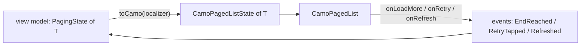

{/* Generated by docs/internal/scripts/sync_vault.py from the Sinew design notes. Edit the notes and re-run the script; changes made here are overwritten. */}

# 10 - Camouflage Glue

## Concept {#concept}

### 1. Why

Sinew owns paging state; Camouflage owns the paged list UI. Neither depends on the other:
- Camouflage's CamoPagedList takes a plain `CamoPagedListState` and never fetches.
- Sinew's `PagingState` knows nothing about UI.

`sinew_camouflage` is the one small package that knows both. It turns a `PagingState<T>` into a `CamoPagedListState<T>`, so a list screen built on both libraries is one line of glue.

### 2. Shape



#### The mapping

| `PagingState` (`view`, `loadType`) | `items` | `loading` | `endReached` | `error` |
|---|---|---|---|---|
| `Loading`, `Initial` | `[]` | `Initial` | `false` | none |
| `Loading`, `Refresh` | `[]` | `Refresh` | `false` | none |
| `Loading`, `More` | the previous items | `More` | `false` | none |
| `Done`, any | the items | `None` | `!canLoadMore` | none |
| `Failed`, `Initial` or `Refresh` | `[]` | `None` | `false` | `PagedError(message, FirstPage)` |
| `Failed`, `More` | the previous items | `None` | `false` | `PagedError(message, NextPage)` |

| Rule | Why |
|---|---|
| A `PagingState` starts as `Loading` + `Initial` | The list shows its skeleton from the first frame, and never fires `onLoadMore` on an empty list that hasn't loaded |
| `endReached` comes from `canLoadMore`, which the pager has already normalized for every strategy | One rule for offset, total, cursor and last-item paging |
| The error message is rendered **at conversion time** with the app's `Localizer`: `error.displayMessage(localizer)` | `CamoPagedList` takes text. The conversion runs when the UI builds, so the text follows the current language. |

#### On the page

```
CamoPagedList(
    state      = state.orders.toCamo(localizer),
    itemKey    = { it.id },
    onLoadMore = { onEvent(EndReached) },
    onRetry    = { onEvent(RetryTapped) },
    onRefresh  = { onEvent(Refreshed) },
    item       = { order, _ -> OrderRow(order) },
)
```

`CamoPagedList` fires `onLoadMore` only when `loading` is `None`, `endReached` is false, and there's no next-page error. The view model's `mapEventToAction` guards it again with `canLoadMore`. The double guard is harmless and keeps each side correct on its own.

#### Versioning

`sinew_camouflage` is released in Sinew's lockstep, and declares the Camouflage version range it was tested with. A Camouflage release that changes `CamoPagedListState` needs a new `sinew_camouflage` release. Nothing else in Sinew is affected.

### 3. API

| Name | Signature (pseudocode) | For |
|---|---|---|
| `toCamo` | `PagingState<T>.toCamo(localizer: Localizer?): CamoPagedListState<T>` | the conversion |

### 4. Build steps

1. `toCamo`, test first, with one test per row of the mapping table.
2. A test that a `Failed` state renders its message in the localizer's language, and falls back to English without one.
3. The sample app on each platform: one list screen through `Pager` → `PagingState` → `toCamo` → `CamoPagedList`, covering first load, next page, a next-page failure with retry, pull to refresh, and the end of the list.

**Done when**
- [ ] Every row of the mapping table has a test.
- [ ] The sample list screen on each platform runs the full cycle: skeleton, items, more items, retry row, refresh, end.
- [ ] `sinew_camouflage` is the only Sinew package that depends on Camouflage.

### 5. Edge cases

| Case | Decided behavior |
|---|---|
| A Camouflage release changes `CamoPagedListState` | Only `sinew_camouflage` changes, in a new Sinew lockstep release. Its declared version range stops apps from mixing incompatible versions. |
| An empty first page | `Done([])` → `items = []`, `loading = None`, `endReached = true` (an empty page has no next page). `CamoPagedList` shows its empty state. |
| A `Done` state whose meta says there's a next page but the list is shorter than the screen | `CamoPagedList` fires `onLoadMore` right away, and the pager loads the next page. |
| The app doesn't use Sinew's `Localizer` | It passes `null`: messages fall back to the English fallback or the server text. |
| `refreshKeepsItems = true` in the brand's list theme | Not supported by this mapping: Sinew's paged refresh drops the items (`Loading(data: null)`), so the list shows the skeleton. A product that wants to keep items on refresh needs a different paging rule, which is a Sinew change, not a glue option. |

## Implementation {#implementation}

<KotlinOnly>

### 1. Why {#kotlin-1-why}

`sinew-camouflage` maps Sinew's `PagingState<T>` to Camouflage's `CamoPagedListState<T>`. On Kotlin it's one extension function, plus a composable convenience that remembers the localizer.

### 2. Shape {#kotlin-2-shape}

```kotlin
public fun <T> PagingState<T>.toCamo(localizer: Localizer?): CamoPagedListState<T> = when (val v = view) {
    is ViewState.Loading -> CamoPagedListState(
        items = if (loadType == LoadType.More) v.data?.items.orEmpty() else emptyList(),
        loading = when (loadType) { LoadType.Initial -> PagedLoad.Initial; LoadType.Refresh -> PagedLoad.Refresh; LoadType.More -> PagedLoad.More },
    )
    is ViewState.Done -> CamoPagedListState(items = v.data.items, loading = PagedLoad.None, endReached = !canLoadMore)
    is ViewState.Failed -> CamoPagedListState(
        items = if (loadType == LoadType.More) v.data?.items.orEmpty() else emptyList(),
        error = PagedError(v.error.displayMessage(localizer), if (loadType == LoadType.More) PagedErrorScope.NextPage else PagedErrorScope.FirstPage),
    )
}

@Composable
public fun <T> PagingState<T>.toCamo(): CamoPagedListState<T> = toCamo(rememberSinewLocalizer())
```

On the screen:

```kotlin
CamoPagedList(
    state = state.orders.toCamo(),
    itemKey = { it.id },
    onLoadMore = { onEvent(OrderListEvent.EndReached) },
    onRetry = { onEvent(OrderListEvent.RetryTapped) },
    onRefresh = { onEvent(OrderListEvent.Refreshed) },
) { order, _ -> OrderRow(order) }
```

### 3. API {#kotlin-3-api}

| Name | Kotlin |
|---|---|
| `toCamo` | `public fun <T> PagingState<T>.toCamo(localizer: Localizer?): CamoPagedListState<T>` and the `@Composable` overload |

### 4. Build steps {#kotlin-4-build-steps}

1. `toCamo`, with one `commonTest` test per row of the base mapping table.
2. The `@Composable` overload, tested with `runComposeUiTest` in English and Indonesian.
3. The sample list screen in `:sample:shared`, on all four targets.

**Done when**
- [ ] The sample list screen runs the full cycle (skeleton, items, more, retry, refresh, end) on Android, iOS, desktop and web.

### 5. Edge cases {#kotlin-5-edge-cases}

| Case | Decided behavior |
|---|---|
| Camouflage's `PagedErrorScope` naming differs in the released API | The glue follows Camouflage's released names. Only this file changes. |

:::info[Decided by default (revisit during implementation)]

- **A `@Composable` overload** that remembers Sinew's localizer, so the common case needs no argument.

:::

</KotlinOnly>

<DartOnly>

### 1. Why {#dart-1-why}

`sinew_camouflage` maps `PagingState<T>` to `CamoPagedListState<T>`. On Flutter it's one extension, plus a context-based convenience that reads the localizer.

### 2. Shape {#dart-2-shape}

```dart
extension PagingStateToCamo<T> on PagingState<T> {
  CamoPagedListState<T> toCamo(Localizer? localizer) => switch (view) {
        Loading(:final data) => CamoPagedListState(
            items: loadType == LoadType.more ? data?.items ?? const [] : const [],
            loading: switch (loadType) { LoadType.initial => PagedLoad.initial, LoadType.refresh => PagedLoad.refresh, LoadType.more => PagedLoad.more }),
        Done(:final data) => CamoPagedListState(items: data.items, endReached: !canLoadMore),
        Failed(:final data, :final error) => CamoPagedListState(
            items: loadType == LoadType.more ? data?.items ?? const [] : const [],
            error: PagedError(error.displayMessage(localizer), loadType == LoadType.more ? PagedErrorScope.nextPage : PagedErrorScope.firstPage)),
      };

  CamoPagedListState<T> toCamoOf(BuildContext context) => toCamo(SinewLocalizer.of(context));
}
```

```dart
CamoPagedList<Order>(
  state: state.orders.toCamoOf(context),
  itemKey: (o) => o.id,
  onLoadMore: () => onEvent(const OrderListEndReached()),
  onRetry: () => onEvent(const OrderListRetryTapped()),
  onRefresh: () => onEvent(const OrderListRefreshed()),
  item: (order, _) => OrderRow(order),
)
```

### 3. API {#dart-3-api}

| Name | Dart |
|---|---|
| `toCamo`, `toCamoOf` | as above |

### 4. Build steps {#dart-4-build-steps}

1. `toCamo`, one test per mapping row.
2. `toCamoOf` in a widget test, in English and Indonesian.
3. The example's list screen on all six platforms.

**Done when**
- [ ] The example list runs the full cycle on Android, iOS, web, macOS, Windows and Linux.

### 5. Edge cases {#dart-5-edge-cases}

| Case | Decided behavior |
|---|---|
| Camouflage renames a type in its released API | Only this file changes, in the next Sinew release. |

:::info[Decided by default (revisit during implementation)]

- **`toCamoOf(context)`** as the convenience name, since Dart has no `@Composable`-style implicit context.

:::

</DartOnly>
