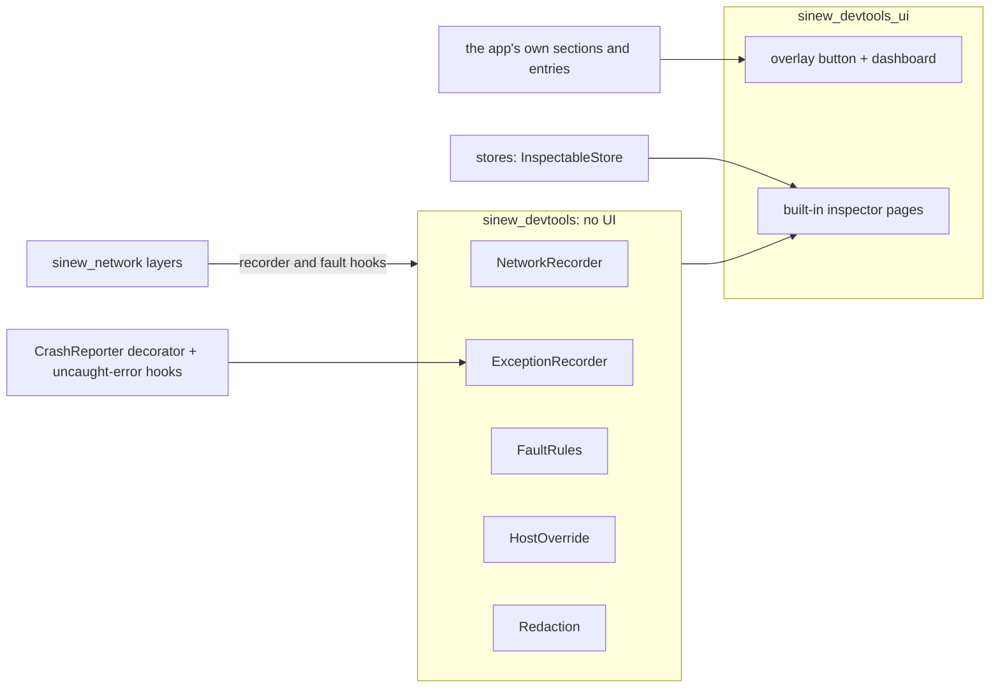

{/* Generated by docs/internal/scripts/sync_vault.py from the Sinew design notes. Edit the notes and re-run the script; changes made here are overwritten. */}

# 11 - DevTools

## Concept {#concept}

### 1. Why

Developers and QA testers need to see inside a running app on a real device: the requests it sent, the errors it hit, what it stored. They also need to force the hard cases: an expired token, a failing backend, another API host. External tools need a computer and a cable. A tester in the field has neither.

So apps grow an in-app developer dashboard behind a floating button. That's useful, and dangerous if done carelessly:
- A dashboard that ships in an installable production build, even a profile build, can show a user's refresh token and copy it to the clipboard.
- A network monitor that records request bodies holds passwords and one-time codes in memory, ready to be copied into a bug report.

`sinew_devtools` provides the dashboard as a reusable mechanism, with those risks designed out:
- it's compiled out of production builds;
- it redacts **when recording**, not when displaying;
- it masks secrets and never copies them;
- it asks before anything destructive.

It ships as **1.1**, after the 1.0 packages it inspects.

### 2. Shape

#### Capture and UI, split



| Package | Holds | Why separate |
|---|---|---|
| `sinew_devtools` | the entry contract, recorders, redaction, fault rules, host override | Capture works without the UI, for example to attach the last requests to a bug report. It has no UI toolkit dependency. |
| `sinew_devtools_ui` | the floating button, the dashboard, the built-in inspector pages, on each platform's Material toolkit | Developer UI isn't brand UI, so it doesn't depend on Camouflage. It uses its own theme and back stack, never the app's. |
| `sinew-devtools-noop` (Kotlin) | the same public API as empty stubs | Release builds of Android depend on it instead, so no devtools code exists there |

#### The entry contract

```
DevToolSection(title: String, entries: List<DevToolEntry>)

DevToolEntry =
    Page(name, description, icon, color, content, appBarActions = [])      // opens a page
  | Group(name, description, icon, color, children: List<DevToolEntry>)    // opens a sub-list
  | Toggle(name, description, icon, value: () -> Boolean, onChanged)       // a switch shown inline
  | Action(name, description, icon, confirm: String? = null, run)          // runs on tap; confirm asks first

BuildRibbon(label: String)          // "1.4.0 (212) · staging", in a corner of every screen
```

Sinew's built-in inspectors come in **their own section**. The app adds its own sections, with its own titles and entries: remote copy, analytics events, form playgrounds, its caches. Sinew predefines no app section.

```
SinewDevTools(
    enabled = DevToolsGate.enabled,                 // a compile-time value, see Gating
    sections = [ appSection("Product", [...]) ],    // the built-in "Sinew" section is added first
    ribbon = BuildRibbon("${version} · ${flavor}"),
    redaction = Redaction.default + { fieldParts += ["cardnumber", "cvv"] },
) { App() }
```

#### Built-in inspectors

| Inspector | Kind | Fed by | Safety rule |
|---|---|---|---|
| **Network Monitor** | Page | the network recorder layer, plus cache serves the app reports | Redacted when recorded. Capped at 200 records. Cleared on sign-out. |
| **Exception Log** | Page | a `CrashReporter` decorator, plus the platform's uncaught-error hooks | Capped at 50, with repeats within 2 seconds merged into one row with a count. Copy gives the redacted text only. |
| **Key-Value Store** | Page | `KeyValueStore` through `InspectableStore` | Values shown. Edit and delete ask for confirmation. |
| **Secure Store** | Page | `SecureStore` through `InspectableStore` | Values **masked**: the last 4 characters and the length (`•••• 9f2c (412 chars)`). Never copyable. "Clear all" asks for confirmation. |
| **Local DB** | Group | `InspectableStore`s the app registers (one per DAO it wants visible) | Read-only. |
| **Expire Access Token** | Action | the auth layer | The next request goes out with an invalid token, so the real 401 → refresh path runs. Non-production only. |
| **Fault Injection** | Page | fault rules applied in the network stack | Rules live in memory only and are gone after a restart. See below. |
| **API Host** | Page | the hosts listed in the app's config | Never compiled into a production flavor. The active host shows in the ribbon. |
| **Changelog** | Page | text the app supplies | |

#### Redaction, when recording

```
Redaction(
    headers = { "Authorization", "Cookie", "Set-Cookie", "Proxy-Authorization" } + every name in each client's defaultHeaders,
    fieldParts = { "password", "passwd", "token", "secret", "otp", "pin", "apikey", "credential", "signature" },   // matched inside normalized names
    exactFields = { "code" },                                                                                       // too short to match as a part
    mask    = "•••",
    maxBodyBytes = 64 KB,
)
```

| Rule | Why |
|---|---|
| Redact **before** storing a record | Nothing sensitive exists in memory, so no screen, copy or export can leak it |
| A key's name is **normalized** before matching: lowercased, with `_`, `-` and `.` removed. `refreshToken`, `refresh_token` and `Refresh-Token` all become `refreshtoken`. | Backends mix naming styles, and camelCase is the common one. Exact-name matching would record `refreshToken` in clear. |
| A normalized name is redacted when it **contains** any of `fieldParts` (`refreshtoken`, `newpassword`, `idtoken`, `xapikey` all match), or equals one of `exactFields` | New fields that carry secrets are caught by their names, without updating a list |
| Matching runs at **any depth** of a JSON body, including objects inside arrays | A password nested in `{ "user": { "credentials": [ { "password": … } ] } }` is still caught |
| Every header the app sends through `defaultHeaders` is redacted automatically | Those are exactly the headers that carry API keys and device identifiers |
| Form bodies and query parameters are redacted by the same field list | Tokens also travel as `?token=…` and form fields |
| A body over `maxBodyBytes` is cut, with its real size shown | Large downloads don't fill memory |
| Binary bodies (images, files) are stored as type and size only | Nothing useful to read, and they can contain personal data |
| Cache records go through the same redaction | A cached response is still a response |
| An app extends the defaults, never replaces them wholesale | A custom list can't accidentally drop `Authorization` |

#### Recorders

| Recorder | Keeps | Cleared |
|---|---|---|
| `NetworkRecorder(capacity = 200)` | method, URL, status, duration, redacted headers and bodies, error type and code, a "served from cache" marker | on sign-out, on "Clear" in the page, on app restart |
| `ExceptionRecorder(capacity = 50, dedupeWindow = 2 s)` | time, exception type, code, message key or server text, stack trace, repeat count | on "Clear", on app restart |

The recorders keep data in memory only and never write it to disk. The app's sign-out use case calls `SinewDevTools.clearUserData()`. In a build without devtools, that call does nothing.

`DevToolsCrashReporter` wraps the app's real reporter: `CrashReporter.install(DevToolsCrashReporter(wrapping = realReporter))`. Every report goes to the Exception Log and then on to the real reporter, unchanged.

#### Fault injection

```
FaultRule(method: String? = null, pathPattern: String, status: Int? = null, delay: Duration? = null, drop: Boolean = false, body: String? = null)
```

| Rule | Why |
|---|---|
| Rules apply **inside** the auth layer | A forced 401 runs the real refresh path. A forced 503 on the refresh call previews the "backend down, session kept" screen. |
| Rules are in memory only, gone after a restart | A rule forgotten on a test device can't break the next day's session |
| The ribbon shows "faults on" while any rule is active | A tester always knows the app is being lied to |

#### The overlay

| Rule | Why |
|---|---|
| A floating button, draggable, that opens the dashboard on tap (a drag never opens it) | Always reachable, never in the way |
| Its position is remembered in devtools' own key-value namespace (`sinew.devtools.*`) | The app's preferences stay untouched |
| The dashboard has its own theme and its own back stack, shown above the app | It works the same in every app, whatever router or theme the app uses, and never pushes a route into the app's navigation |
| The button hides while the dashboard is open | |

#### Gating

| Build | Devtools |
|---|---|
| debug, any flavor | on |
| release, non-production flavor (the builds QA installs) | on |
| release or profile, production flavor | **compiled out** |

| Platform | How it's compiled out |
|---|---|
| Flutter | `DevToolsGate.enabled` is a `const`, computed from the build mode and the flavor (a compile-time define). Every devtools entry point sits behind it, so release builds tree-shake the code away. A profile build of production is excluded, because a profile build is release-signed and installable. |
| Android | variant dependencies: the real artifact for debug and non-production variants, `sinew-devtools-noop` for production release |
| iOS / KMP | a Gradle flag picks the real or the no-op module when the framework is built |

Staging builds still mask secrets and never copy them: QA devices get shared, and screens get recorded.

#### Later

Inspectors that need native code ship as **separate optional packages**: EXIF, a camera/gallery playground, a map picker playground. Flutter links a plugin's native code into release builds even when Dart never calls it, so these must never be pulled in by `sinew_devtools_ui`.

Also Later:
- router adapters (route stack and parameters);
- a notification playground, after `sinew_notification`;
- a Camouflage skin and theme inspector, in the Camouflage family;
- an external companion that reads `sinew_devtools` over a connection.

### 3. API

| Name | Signature (pseudocode) | Package |
|---|---|---|
| `DevToolSection`, `DevToolEntry`, `BuildRibbon` | as above | devtools |
| `SinewDevTools` | `SinewDevTools(enabled, sections, ribbon, redaction = Redaction.default, stores: List<InspectableStore> = [], changelog: String? = null, hosts: List<String> = [], showUncaughtErrors = !debug) { app }` | devtools-ui |
| `SinewDevTools.clearUserData` | `clearUserData()` | devtools (no-op without devtools) |
| `DevToolsGate` | `DevToolsGate.enabled: Boolean` (compile-time) | devtools |
| `Redaction` | `Redaction(headers, fieldParts, exactFields, mask, maxBodyBytes)`, `Redaction.default`, `+ { … }` | devtools |
| `NetworkRecorder` | `NetworkRecorder(capacity = 200, redaction)`, `.records`, `.clear()`, `.recordCacheServe(key, source, body)` | devtools |
| `ExceptionRecorder` | `ExceptionRecorder(capacity = 50, dedupeWindow = 2 s)`, `.records`, `.clear()` | devtools |
| `DevToolsCrashReporter` | `DevToolsCrashReporter(wrapping: CrashReporter)` | devtools |
| `FaultRule`, `FaultRules` | `FaultRules.add(rule)`, `.remove(rule)`, `.clear()`, `.active` | devtools |
| `HostOverride` | `HostOverride(hosts)`, `.current`, `.select(host)` | devtools |
| `expireAccessToken` | `SinewHttp.debugExpireToken(client)` | network (a devtools hook, absent from release builds) |

### 4. Build steps

1. `Redaction`, test first. Tests:
   - headers;
   - top-level fields;
   - fields nested in objects and arrays;
   - normalized keys: `refreshToken`, `refresh_token`, `Refresh-Token`, `newPassword`, `idToken`, `X-Api-Key` are all redacted;
   - every `defaultHeaders` name is redacted;
   - a staging build's Secure Store page shows only masked values (Review Focus 5);
   - query parameters;
   - form bodies;
   - a body over the size cap;
   - a binary body;
   - extending the defaults keeps `Authorization`.
2. `NetworkRecorder`, with tests:
   - the capacity drops the oldest record;
   - nothing unredacted is ever stored (assert on the stored record, not the screen);
   - `clearUserData()` empties it.
3. `ExceptionRecorder` and `DevToolsCrashReporter`. Tests:
   - de-duplication within the window;
   - capacity;
   - the wrapped reporter still receives every report;
   - the uncaught-error hooks chain to the previous handlers.
4. `FaultRules` in the network stack, tested: a forced 401 triggers exactly one refresh, a forced 503 on the refresh keeps the session, and a restart clears the rules.
5. `HostOverride` and `debugExpireToken`, tested against the mock HTTP setup.
6. `sinew_devtools_ui`, with the overlay and every built-in page, plus golden tests of the pages.
7. Gating. A CI job builds the production release (and, on Flutter, profile) variant and checks that no devtools class or symbol is in the output. On Kotlin, an ABI check confirms `sinew-devtools-noop` matches the real API.

**Done when**
- [ ] A production release or profile build contains no devtools code (checked in CI on every platform).
- [ ] No test can find a token, password or one-time code in any stored record.
- [ ] A forced 401 and a forced 503 on refresh each behave as the Network note says.
- [ ] An app adds its own section and its entries appear after the Sinew section.

### 5. Edge cases

| Case | Decided behavior |
|---|---|
| A password inside a JSON array of objects | Redacted: matching walks every depth. |
| A 20 MB response | Stored cut at 64 KB, with "20 MB" shown. |
| An image upload | Recorded as type and size only. |
| The user signs out while the Network Monitor is open | The records are cleared, and the open page shows an empty list. |
| A screen recording on a staging device shows the Secure Store page | Values are masked to their last 4 characters, so nothing usable is recorded. |
| A tester forgets an active fault rule | It's gone after the next restart, and the ribbon says "faults on" until then. |
| The app has no router, or a custom one | The dashboard uses its own back stack, so it works the same. |
| A production build by mistake depends on the real devtools | The CI gating job fails the build. |
| The app's own uncaught-error handler is already set | Devtools chains to it. The app's handler still runs. |

## Implementation {#implementation}

<KotlinOnly>

### 1. Why {#kotlin-1-why}

This note builds the base devtools on Kotlin. Capture lives in `commonMain`, the UI on Compose Multiplatform Material 3, and release builds swap in a no-op artifact with the same API. Most of the care goes into the gating: no devtools code may reach a production build on any target.

### 2. Shape {#kotlin-2-shape}

#### Modules {#kotlin-modules}

| Module | Holds |
|---|---|
| `sinew-devtools` | `Redaction`, `NetworkRecorder`, `ExceptionRecorder`, `DevToolsCrashReporter`, `FaultRules`, `HostOverride`, the entry contract, and `DevTools.httpHooks`, a `SinewHttpHooks` that feeds the recorder and applies fault rules |
| `sinew-devtools-ui` | `SinewDevTools { App() }`: the overlay button, the dashboard and the pages, on Compose Material 3 with its own `MaterialTheme` and its own back stack (a `SnapshotStateList` of screens) |
| `sinew-devtools-noop` | **one** module that stands in for **both** real modules, with the same packages and the same public API. `SinewDevTools { content }` just calls `content()`, `httpHooks` is `SinewHttpHooks.None`, and every recorder is empty. |

The no-op module has no devtools logic, but its API still names types from other modules (`SinewHttpHooks` from network, `InspectableStore` from storage, `CrashReporter` from exception, `@Composable` from the Compose runtime). So it depends on `sinew-network`, `sinew-storage`, `sinew-exception` and `compose-runtime`, exactly as the real modules expose them.

**API parity:** CI merges the ABI dumps of `sinew-devtools` and `sinew-devtools-ui` and compares them with `sinew-devtools-noop`'s dump. They must be identical.

#### Wiring: only in the platform entry points {#kotlin-wiring-only-in-the-platform-entry-points}

Shared code never depends on devtools. The app's `commonMain` takes the hooks as plain parameters (`SinewHttpHooks` is a network type), and only each **platform entry point** depends on a devtools artifact and wraps the app:

```kotlin
// commonMain of the app: no devtools import
fun appClients(hooks: SinewHttpHooks): Clients = Clients(main = SinewHttp.client(mainConfig, tokens, hooks = hooks))
@Composable fun App(clients: Clients) { … }

// androidApp: MainActivity (the artifact comes from the variant)
CrashReporter.install(DevToolsCrashReporter(wrapping = realReporter))
setContent { SinewDevTools(sections = listOf(productSection), ribbon = BuildRibbon(versionLabel)) { App(appClients(DevTools.httpHooks)) } }

// iosMain: MainViewController, the same lines; jvmMain / wasmJsMain: main(), the same lines
```

#### Gating: one switch per platform {#kotlin-gating-one-switch-per-platform}

| Platform | Where the switch is | Real artifact | No-op artifact |
|---|---|---|---|
| Android | the **app module's** variant configurations | `productionDebugImplementation`, and `<flavor>Implementation` for every non-production flavor (`stagingImplementation`) | `productionReleaseImplementation` |
| iOS | the `iosMain` dependencies of the module that builds the framework, chosen by the `sinew.devtools` Gradle property (Xcode debug and staging schemes pass `true`) | property `true` | property `false` or missing |
| JVM desktop, wasm | the `jvmMain` / `wasmJsMain` dependencies, by the same property | property `true` | property `false` or missing |

```kotlin
// the shared module that builds the iOS framework and the desktop/web apps
val devtools = providers.gradleProperty("sinew.devtools").map(String::toBoolean).orElse(false)
val devtoolsArtifact = if (devtools.get()) sinewLibs.devtools.ui else sinewLibs.devtools.noop
iosMain.dependencies { implementation(devtoolsArtifact) }
jvmMain.dependencies { implementation(devtoolsArtifact) }
wasmJsMain.dependencies { implementation(devtoolsArtifact) }
// androidMain: nothing. Android gets its artifact from the app module's variant, so it can never see both.
```

On non-Android targets the default is **off**: a build that forgets the property gets the no-op. On Android, every variant must be assigned one artifact; a new variant with none fails to compile, so the choice is always explicit.

#### Uncaught errors {#kotlin-uncaught-errors}

| Target | Hook |
|---|---|
| Android, JVM | `Thread.setDefaultUncaughtExceptionHandler`, chained to the previous handler |
| iOS | `setUnhandledExceptionHook` (Kotlin/Native), chained |
| wasm | the window's `error` and `unhandledrejection` events |
| coroutines | a `CoroutineExceptionHandler` the app can add to its root scopes, from `DevTools.coroutineHandler` |

### 3. API {#kotlin-3-api}

As the base note. Kotlin specifics:

| Name | Kotlin |
|---|---|
| `SinewDevTools` | `@Composable public fun SinewDevTools(sections: List<DevToolSection> = emptyList(), ribbon: BuildRibbon? = null, redaction: Redaction = Redaction.Default, stores: List<InspectableStore> = emptyList(), changelog: String? = null, hosts: List<String> = emptyList(), showUncaughtErrors: Boolean = …, content: @Composable () -> Unit)` |
| `DevTools.httpHooks` | `public val httpHooks: SinewHttpHooks` |
| `DevTools.clearUserData` | `public fun clearUserData()` |

### 4. Build steps {#kotlin-4-build-steps}

1. `Redaction` with the base test list, in `commonTest`.
2. The recorders and `DevToolsCrashReporter`.
3. `DevTools.httpHooks` with `MockEngine`: recorded exchanges are redacted, and fault rules apply inside `SinewAuth`.
4. The UI pages, with Compose UI tests and screenshot tests on Android and desktop.
5. `sinew-devtools-noop`, with its ABI dump checked equal to the real one.
6. The CI gating check (see [Testing and CI](/guide/delivery/testing-and-ci)).

**Done when**
- [ ] A production APK, the production iOS framework and the production desktop and web bundles contain no `com.srctool.sinew.devtools` classes except the no-op ones.
- [ ] The real and no-op ABI dumps are identical.

### 5. Edge cases {#kotlin-5-edge-cases}

| Case | Decided behavior |
|---|---|
| A build without the `sinew.devtools` property | Off: the no-op artifact. |
| An Android variant added later (`preprod`) | It fails to compile until the app assigns it the real or the no-op artifact. That's deliberate: no variant gets devtools, or loses them, by accident. |
| The app's own Material theme | Devtools wrap their UI in their own `MaterialTheme`, so the app's theme never affects them. |

:::info[Decided by default (revisit during implementation)]

- **Off by default** when the Gradle property is missing, so a forgotten setting fails safe.
- **The real and no-op artifacts must have identical ABI dumps**, which CI enforces.

:::

</KotlinOnly>

<DartOnly>

### 1. Why {#dart-1-why}

On Flutter there's no debug-only dependency: `sinew_devtools_ui` is in the app's `pubspec.yaml` for every build. What keeps it out of production is the **compiler**. Every entry point sits behind a `const` condition, so production builds tree-shake the code away. This note shows that gate, and the CI check that proves it worked.

### 2. Shape {#dart-2-shape}

#### The gate {#dart-the-gate}

```dart
abstract final class DevToolsGate {
  static const _flavor = String.fromEnvironment('SINEW_FLAVOR');        // --dart-define=SINEW_FLAVOR=production
  static const enabled = kDebugMode || (_flavor != '' && _flavor != 'production');
}
```

| Build | `kDebugMode` | flavor | `enabled` |
|---|---|---|---|
| debug, any flavor | true | any | **true** |
| release, staging | false | `staging` | **true** |
| release or profile, production | false | `production` | **false** |
| release or profile, no flavor defined | false | `''` | **false** (fails safe) |

A profile build is release-signed and installable, so `kDebugMode` alone is never the gate.

#### Using it {#dart-using-it}

```dart
void main() {
  DevToolsGate.assertMatchesFlavor();     // throws at startup if SINEW_FLAVOR differs from the --flavor being run (appFlavor)
  if (DevToolsGate.enabled) CrashReporter.install(DevToolsCrashReporter(wrapping: AppCrashReporter()));
  else CrashReporter.install(AppCrashReporter());
  final dio = SinewHttp.dio(config, tokens, hooks: DevToolsGate.enabled ? DevTools.httpHooks : SinewHttpHooks.none);
  runApp(DevToolsGate.enabled ? SinewDevTools(sections: [productSection], ribbon: BuildRibbon(versionLabel), child: const App()) : const App());
}
```

Because `DevToolsGate.enabled` is `const`, the compiler removes the `true` branches from production builds, and with them every reference to `sinew_devtools_ui`.

#### The overlay {#dart-the-overlay}

`SinewDevTools` puts its floating button and dashboard in an `Overlay` above the app, with its own `Navigator` and its own `Theme` (Material 3, independent of the app's theme). It never uses the app's router or `BuildContext` navigation.

#### Native-plugin inspectors {#dart-native-plugin-inspectors}

EXIF, camera and map playgrounds are separate packages. Flutter links every plugin's native code into release builds, even when Dart tree-shaking removes the Dart side, so these never ship inside `sinew_devtools_ui`.

#### Uncaught errors {#dart-uncaught-errors}

`ExceptionRecorder` chains into `FlutterError.onError` and `PlatformDispatcher.instance.onError`, calling the previous handlers first.

### 3. API {#dart-3-api}

| Name | Dart |
|---|---|
| `DevToolsGate.enabled` | `static const bool` |
| `DevToolsGate.assertMatchesFlavor` | `static void assertMatchesFlavor()`: compares the define with Flutter's `appFlavor` |
| `SinewDevTools` | `SinewDevTools({required Widget child, List<DevToolSection> sections = const [], BuildRibbon? ribbon, Redaction redaction = Redaction.standard, List<InspectableStore> stores = const [], String? changelog, List<String> hosts = const [], bool? showUncaughtErrors})` |
| `DevTools.httpHooks`, `DevTools.clearUserData()` | as the base note |

### 4. Build steps {#dart-4-build-steps}

1. `Redaction`, the recorders, `DevToolsCrashReporter`, `FaultRules`, `HostOverride`, with the base test list, on the Dart VM.
2. `DevTools.httpHooks` with `http_mock_adapter`: records are redacted, and fault rules apply inside the auth interceptor.
3. The UI, with widget tests and golden tests.
4. The CI gating check. `sinew_devtools_ui` contains one unique constant string, a **marker** (`sinew-devtools-included-7f3a`), referenced by `SinewDevTools`. CI builds the example's production variants in **release and profile** mode for Android, iOS and web (JS and Wasm), and searches each compiled output (`libapp.so`, `App.framework`, `main.dart.js`, `main.dart.wasm`) for the marker. If it's present, devtools code survived, and the job fails. A staging build is checked the opposite way: the marker must be there.
5. `DevToolsGate.assertMatchesFlavor()`, tested: a mismatch between `SINEW_FLAVOR` and `appFlavor` throws at startup, in every build mode.

**Done when**
- [ ] The production release and profile builds, on Android, iOS and web, contain no devtools marker.
- [ ] A staging release build shows the overlay.

### 5. Edge cases {#dart-5-edge-cases}

| Case | Decided behavior |
|---|---|
| `DevToolsGate.enabled` read at runtime from a non-const place | It can't be: it's a `static const`. A wrapper that isn't `const` would defeat tree-shaking, so code review and the CI check both catch it. |
| The app forgets `--dart-define=SINEW_FLAVOR` in a staging release | Devtools are off. A forgotten setting fails safe. |
| The app's `MaterialApp` theme | The dashboard has its own `Theme`, so the app's theme never affects it. |

:::info[Decided by default (revisit during implementation)]

- **`SINEW_FLAVOR` as the define name**, separate from any flavor define the app already uses, so the gate can't be broken by an app's own flavor logic.
- **A marker string as the gating proof**, instead of `--analyze-size`, because the marker check works for release, profile and web builds alike.
- **A startup check that `SINEW_FLAVOR` matches `appFlavor`**, so a build can't run the production flavor with a staging define (or the reverse).

:::

</DartOnly>
