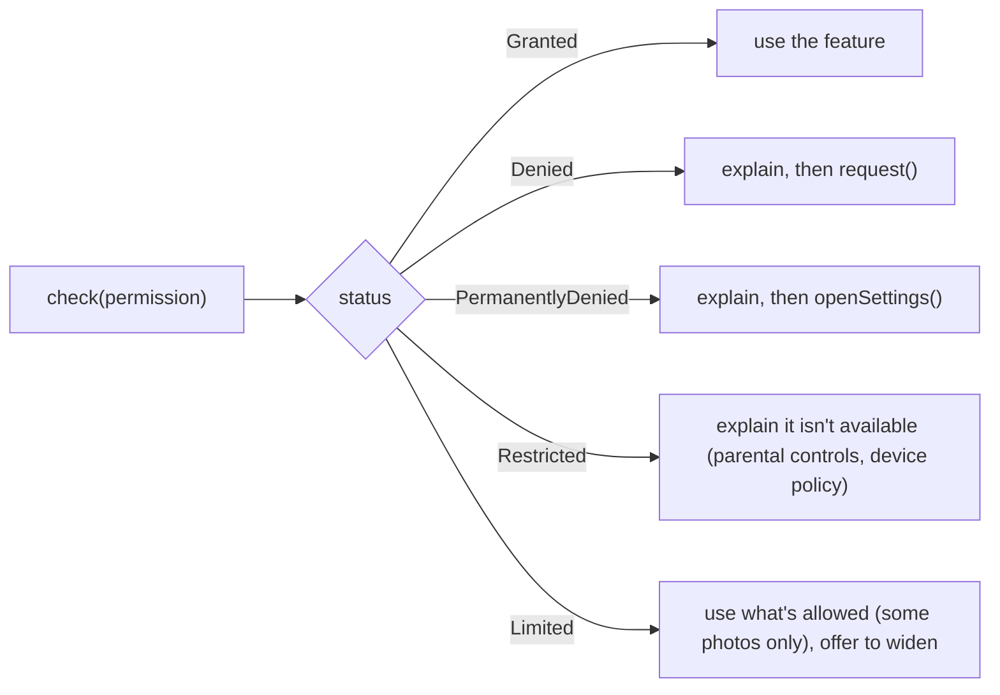

{/* Generated by docs/internal/scripts/sync_vault.py from the Sinew design notes. Edit the notes and re-run the script; changes made here are overwritten. */}

# 01 - Permission

## 1. Why

Asking for a runtime permission (camera, location, notifications, photos) has more outcomes than "yes" or "no". A user who denies twice on Android, or once on iOS, can't be asked again: the app must explain and send them to the system settings. A checker that returns only a `Boolean` can't tell the UI which of those situations it's in. Every app then rewrites the same branching, usually wrong.

`sinew_permission` gives one checker with a status that names every outcome the UI has to handle.

## 2. Shape

| Status | Meaning | The UI should |
|---|---|---|
| `Granted` | allowed | proceed |
| `Denied` | not allowed yet, and the app may ask | show why, then request |
| `PermanentlyDenied` | the system won't show the prompt again | explain, then offer to open settings |
| `Restricted` | the user can't grant it (parental controls, a managed device) | explain that the feature is unavailable |
| `Limited` | partly allowed (iOS: selected photos only, approximate location) | work with what's allowed, offer to widen |

| Rule | Why |
|---|---|
| Ask only at the moment the feature is used, after explaining why | Prompts out of context get denied, and a denial can be permanent |
| Re-check the status when the app returns to the foreground | The user may have changed it in settings |
| Permissions are an app concern: the checker never decides what a feature does without one | Sinew provides the mechanism, the product decides the fallback |

## 3. API

| Name | Signature (pseudocode) |
|---|---|
| `Permission` | `enum { Camera, Photos, Location, LocationAlways, Notifications, Microphone, Contacts, … }` |
| `PermissionStatus` | `Granted \| Denied \| PermanentlyDenied \| Restricted \| Limited` |
| `PermissionChecker` | `status(permission): PermissionStatus`, `request(permission): PermissionStatus`, `request(permissions): Map<Permission, PermissionStatus>`, `openSettings()` |
| `PermissionChecker.create` | the platform implementation |

## 4. Open questions

None left. Settled in review (2026-10-02):
- **First version:** camera, photos, location, notifications, microphone.
- **Notifications on Android 12 and older** report `Granted`, because they're granted at install.
- Wrap an existing plugin or write it directly: decided when the package moves out of Later.
