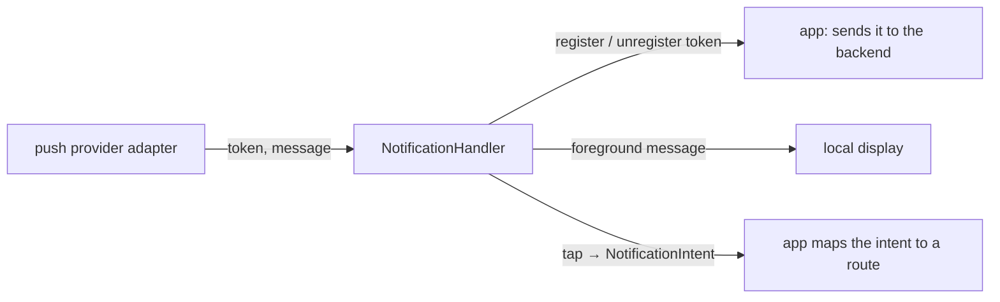

{/* Generated by docs/internal/scripts/sync_vault.py from the Sinew design notes. Edit the notes and re-run the script; changes made here are overwritten. */}

# 02 - Notification

## 1. Why

Push notifications repeat the same lifecycle in every app:
- get a device token, send it to the backend, and send it again when it changes;
- forget it on sign-out;
- show a notification while the app is in the foreground;
- turn a tap into a screen.

The mistakes repeat too: a token left registered after sign-out (the next user gets the previous user's notifications), personal data in the payload, or a tap that opens any URL the payload names.

`sinew_notification` handles that lifecycle behind one interface. The push provider is an **adapter**, so the core doesn't depend on any vendor.

## 2. Shape

| Rule | Why |
|---|---|
| The token is sent to the backend after sign-in and whenever it changes, and **unregistered on sign-out** | The next user on the device must not receive the previous user's notifications |
| Payloads carry **identifiers only** (an order id, a type). The app fetches details after opening. | A notification is shown on a lock screen and logged by the system. Personal data doesn't belong there. |
| A tap becomes a `NotificationIntent(type, ids)`, which the app maps to a route through its own access rules | A payload never opens an arbitrary URL. Links to outside the app are allowed only for hosts the app lists. |
| Foreground display uses one channel or category per notification type, defined by the app | Users can mute a type without muting everything |
| The provider (a vendor push service) is an adapter package | The core works with any provider, or with a test fake |

The devtools **notification playground** plugs in here: it shows the current token and the last payloads, and fires a local test notification through the same tap path.

## 3. API

| Name | Signature (pseudocode) |
|---|---|
| `PushProvider` | `token(): String?`, `tokenChanges`, `messages`, `taps` (implemented by an adapter) |
| `NotificationHandler` | `start(onToken: (String) -> Unit, onIntent: (NotificationIntent) -> Unit)`, `signOut()`, `showLocal(notification)` |
| `NotificationIntent` | `NotificationIntent(type: String, ids: Map<String, String>)` |
| `AllowedLinkHosts` | the hosts a payload link may open |

## 4. Open questions

None left. Settled in review (2026-10-02):
- **It depends on `sinew_permission`** to ask for the notification permission.
- **It owns foreground display.** Most providers don't display in the foreground on their own.
- The first provider adapter is a product choice, made when the package moves out of Later.
