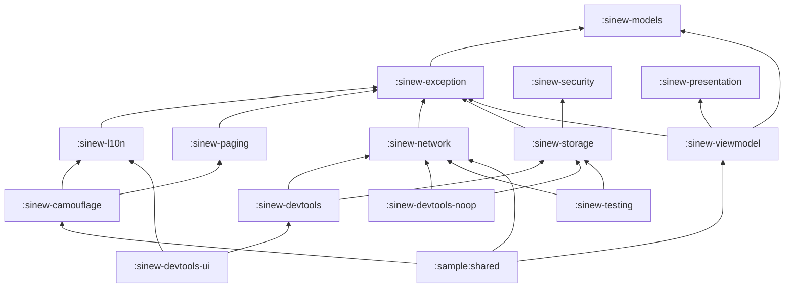
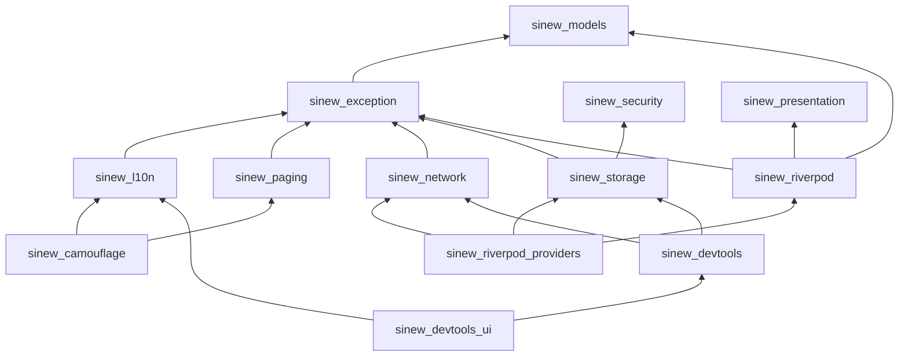

{/* Generated by docs/internal/scripts/sync_vault.py from the Sinew design notes. Edit the notes and re-run the script; changes made here are overwritten. */}

# 01 - Project Setup

<KotlinOnly>

## 1. Why {#kotlin-1-why}

S0 proves the skeleton before any package has content:
- one Gradle module per Sinew package;
- **four targets** (Android, iOS, JVM desktop, wasmJs);
- a dependency graph that CI enforces;
- a sample app that runs everywhere.

Getting the structure right first saves fighting it in every later milestone. This note implements the module, target and graph parts of [Architecture](/guide/foundations/architecture).

## 2. Shape {#kotlin-2-shape}



**Targets per module**

| Module | android | iosArm64 + iosSimulatorArm64 | jvm | wasmJs |
|---|---|---|---|---|
| every library module | library | library | library | library |
| `:sample:shared` | library (used by `:sample:androidApp`) | framework `SinewSample` | desktop `application` | browser `executable` |

`iosX64` is left out (arm64 Macs only), as in Camouflage.

**What each module uses** (`commonMain`, plus the platform source sets that differ)

| Module | Depends on (`api` = exposed to consumers) | Platform source sets |
|---|---|---|
| `:sinew-models` | coroutines | none |
| `:sinew-exception` | `api(:sinew-models)` | none |
| `:sinew-l10n` | `api(:sinew-exception)`, Compose resources | none (resources per locale) |
| `:sinew-paging` | `api(:sinew-models)`, `api(:sinew-exception)`, coroutines | none |
| `:sinew-presentation` | coroutines | none |
| `:sinew-viewmodel` | `api(:sinew-presentation)`, `api(:sinew-models)`, `:sinew-exception`, lifecycle-viewmodel, lifecycle-runtime-compose, Compose runtime | none |
| `:sinew-network` | `api(:sinew-exception)`, `api(ktor-client-core)`, ktor content-negotiation, kotlinx-serialization-json, kotlinx-datetime | `androidMain` + `jvmMain` OkHttp engine, `iosMain` Darwin engine, `wasmJsMain` Js engine; network checker per platform |
| `:sinew-security` | coroutines | `androidMain` Tink + Keystore + Biometric; `iosMain` Keychain + platform AES-GCM; `jvmMain` Tink; `wasmJsMain` Web Crypto |
| `:sinew-storage` | `api(:sinew-exception)`, `api(:sinew-security)`, DataStore (non-web targets) | `androidMain`, `iosMain`, `jvmMain` DataStore; `wasmJsMain` browser storage |
| `:sinew-testing` | `api` of every package it fakes, ktor-client-mock, Turbine | none |
| `:sinew-camouflage` | `api(:sinew-paging)`, `:sinew-exception`, `:sinew-l10n`, `api(camouflage-core)` | none |
| `:sinew-devtools` | `api(:sinew-network)` (for `SinewHttpHooks`), `api(:sinew-storage)` (for `InspectableStore`) | none |
| `:sinew-devtools-ui` | `api(:sinew-devtools)`, `:sinew-l10n`, Compose foundation + Material 3 | none |
| `:sinew-devtools-noop` | `api(:sinew-network)`, `api(:sinew-storage)`, Compose runtime: the types its API names, no devtools logic. It replaces both real modules. | none |

## 3. API {#kotlin-3-api}

### 3.1 `settings.gradle.kts` {#kotlin-31-settingsgradlekts}

```kotlin
rootProject.name = "sinew-kotlin"
enableFeaturePreview("TYPESAFE_PROJECT_ACCESSORS")

pluginManagement {
    includeBuild("build-logic")
    repositories { google(); mavenCentral(); gradlePluginPortal() }
}
dependencyResolutionManagement {
    repositories { google(); mavenCentral() }
    versionCatalogs {
        create("kotlinLibs") { from(files("gradle/kotlin.versions.toml")) }     // kotlin, coroutines, serialization, datetime
        create("ktorLibs") { from(files("gradle/ktor.versions.toml")) }         // ktor core, engines, content-negotiation, mock
        create("androidxLibs") { from(files("gradle/androidx.versions.toml")) } // lifecycle, datastore, biometric
        create("composeLibs") { from(files("gradle/compose.versions.toml")) }   // compose multiplatform, resources (l10n), material3 (devtools-ui only)
        create("securityLibs") { from(files("gradle/security.versions.toml")) } // tink, cryptography-kotlin
        create("toolLibs") { from(files("gradle/tools.versions.toml")) }        // turbine, kover, detekt, dokka, vanniktech, agp
    }
}
include(
    ":sinew-models", ":sinew-exception", ":sinew-l10n", ":sinew-paging", ":sinew-presentation", ":sinew-viewmodel",
    ":sinew-network", ":sinew-security", ":sinew-storage", ":sinew-testing", ":sinew-camouflage",
    ":sinew-devtools", ":sinew-devtools-ui", ":sinew-devtools-noop", ":sinew-bom",
    ":sample:shared", ":sample:androidApp",
)
```

### 3.2 Convention plugins {#kotlin-32-convention-plugins}

Sinew uses the same `srctool` convention plugins as Camouflage (`com.srctool.kmp.library`, `com.srctool.compose`, `com.srctool.publish`), configured through the `srctool {}` extension:

```kotlin
srctool {
    namespacePrefix = "com.srctool.sinew"
    targets = setOf(Android, Ios, Jvm, WasmJs)
    publishing { groupId = "com.srctool.sinew"; repoUrl = "https://github.com/srctool/sinew-kotlin" }
}
```

| Module kind | Plugins |
|---|---|
| plain library | `com.srctool.kmp.library`, `com.srctool.publish` |
| library with Compose | the above + `com.srctool.compose` |
| `:sinew-bom` | `java-platform` + `com.srctool.publish` |

### 3.3 The dependency-graph check {#kotlin-33-the-dependency-graph-check}

A Gradle task, `checkSinewGraph`, runs on `check`. It reads every library module's declared project dependencies and fails if any edge isn't in an allowed list kept next to it (`gradle/sinew-graph.txt`, one `from -> to` per line). The list mirrors the base Architecture graph.

```
// gradle/sinew-graph.txt (excerpt)
sinew-exception -> sinew-models
sinew-storage -> sinew-exception
sinew-storage -> sinew-security
sinew-camouflage -> sinew-paging
```

### 3.4 Sample app {#kotlin-34-sample-app}

| Platform | Entry |
|---|---|
| Android | `:sample:androidApp`: `MainActivity` → `setContent { SampleApp() }` |
| iOS | `fun MainViewController() = ComposeUIViewController { SampleApp() }`, shown from SwiftUI |
| Desktop | `fun main() = application { Window(::exitApplication, title = "Sinew") { SampleApp() } }` |
| Web | `fun main() = ComposeViewport(document.body!!) { SampleApp() }` |

`SampleApp()` uses Camouflage's Minimal skin and one list screen built on `Pager` → `PagingState` → `toCamo` → `CamoPagedList`. Until S5 it shows a placeholder.

## 4. Build steps {#kotlin-4-build-steps}

1. Create the repo layout, `settings.gradle.kts` and the six catalogs.
2. Bring in the convention plugins. Use the published `srctool` plugins if they exist by then, otherwise a copy of Camouflage's `build-logic`.
3. Create every module from the table, each with one public placeholder type, and the declared dependencies.
4. Write `checkSinewGraph` and `gradle/sinew-graph.txt`. Prove it by adding a forbidden edge (`sinew-models -> sinew-network`) on a branch and watching `check` fail.
5. Create the sample app with its four entry points, and run it on an Android emulator, an iOS simulator, a desktop window and in a browser.
6. Run the Kotlin Gradle plugin's ABI update task for the first ABI dumps (`updateKotlinAbi` in the KGP version Camouflage uses; verify the task name at S0), and commit them.
7. CI: see [Testing and CI](/guide/delivery/testing-and-ci).

### Platform setup (for contributors) {#kotlin-platform-setup-for-contributors}

- JDK 17, Xcode (iOS only, macOS only), a recent Chrome for the wasm tests.

**Done when**
- [ ] Every module compiles for every target.
- [ ] `checkSinewGraph` fails on a forbidden edge and passes on the real graph.
- [ ] The sample opens on Android, iOS, desktop and web.
- [ ] Changing any public signature fails `checkKotlinAbi` until `updateKotlinAbi` is run.

## 5. Edge cases {#kotlin-5-edge-cases}

| Case | Decided behavior |
|---|---|
| DataStore has no wasmJs target | `:sinew-storage` uses browser storage in `wasmJsMain` for `KeyValueStore`, and DataStore everywhere else. The Storage note documents the weaker guarantees on web. |
| Tink has no iOS or wasm target | `:sinew-security` uses Tink only in `androidMain` and `jvmMain`. iOS and web use the platform's AES-GCM (see Security). |
| A module that needs Compose only for one function (`ObserveEffects`) | It applies `com.srctool.compose` anyway. Settled in base review: no separate module for it. |
| AGP's KMP library target changed its DSL name between versions (`androidLibrary`, then `android`) | The convention plugin looks up whichever exists, so an AGP upgrade doesn't break every module. It also calls `withHostTest {}`, so `commonTest` runs as Android host tests. |
| Flavor + build-type configurations (`productionReleaseImplementation`) don't exist until AGP creates the variants | The sample's Android app creates the ones it uses with `configurations.maybeCreate`, so per-variant devtools dependencies resolve. |
| The convention plugins aren't published yet at S0 | Sinew carries a copy of Camouflage's `build-logic`, and switches to the published plugins when they exist. |
| Building iOS without a Mac | Not possible. CI's macOS job covers it. |

:::info[Decided by default (revisit during implementation)]

- **Six version catalogs** split by concern (Kotlin, Ktor, AndroidX, Compose, security, tools), matching Camouflage's split-catalog style.
- **`checkSinewGraph` with an allow-list file**, rather than a third-party dependency-analysis plugin. It's small, it reads like the base graph, and it fails hard (base review).
- **A copy of `build-logic`** until the shared convention plugins are published. Two copies drift, so the switch to the published plugins should happen early.

:::

</KotlinOnly>

<DartOnly>

## 1. Why {#dart-1-why}

S0 on Flutter proves the skeleton:
- one package per Sinew package, in a **pub workspace** managed by Melos;
- the dependency graph enforced in CI;
- an example app that runs on every platform Flutter supports.

This note implements the package, platform and graph parts of [Architecture](/guide/foundations/architecture).

## 2. Shape {#dart-2-shape}



**Platforms per package**

| Package | Kind | Android | iOS | web | macOS | Windows | Linux |
|---|---|---|---|---|---|---|---|
| models, exception, paging, presentation | pure Dart | ✓ | ✓ | ✓ | ✓ | ✓ | ✓ |
| l10n, riverpod, riverpod_providers, camouflage, devtools, devtools_ui | Flutter | ✓ | ✓ | ✓ | ✓ | ✓ | ✓ |
| network | Dart + Dio | ✓ | ✓ | ✓ (no send timeout, no pinning) | ✓ | ✓ | ✓ |
| security | Flutter plugin (native biometrics) | ✓ | ✓ | `FieldCipher` only | `FieldCipher` only | `FieldCipher` only | `FieldCipher` only |
| storage | Flutter | ✓ | ✓ | ✓ (weaker, documented) | ✓ | ✓ | ✓ |

## 3. API {#dart-3-api}

### 3.1 The workspace root `pubspec.yaml` {#dart-31-the-workspace-root-pubspecyaml}

```yaml
name: sinew_workspace
publish_to: none
environment:
  sdk: ^3.13.0
workspace:
  - packages/sinew_models
  - packages/sinew_exception
  # … every package, and example/
dev_dependencies:
  melos: ^8.9.0

melos:
  scripts:
    analyze: dart analyze --fatal-infos
    test: melos exec --dir-exists=test -- flutter test --coverage
    graph: dart run tool/check_graph.dart
    format: dart format --set-exit-if-changed .
```

Each package's `pubspec.yaml` declares `resolution: workspace`, so packages resolve against each other locally without publishing.

### 3.2 A package's layout {#dart-32-a-packages-layout}

```
packages/sinew_paging/
├── lib/
│   ├── sinew_paging.dart        # the barrel: export 'src/api/…'
│   └── src/
│       ├── api/                 # public types
│       └── implementation/      # private: never exported, never imported from outside
├── test/
├── pubspec.yaml
├── CHANGELOG.md
└── analysis_options.yaml
```

### 3.3 The dependency-graph check {#dart-33-the-dependency-graph-check}

`tool/check_graph.dart` reads every package's `dependencies` and fails if a Sinew-to-Sinew edge isn't in `tool/sinew_graph.txt`, the same allow-list format as on Kotlin. It also fails if any package lists `sinew_testing` outside `dev_dependencies`.

## 4. Build steps {#dart-4-build-steps}

1. Create the workspace root, the Melos scripts, and one package per row of the table, each with one public placeholder type.
2. Write `tool/check_graph.dart` and `tool/sinew_graph.txt`. Prove it by adding a forbidden edge on a branch.
3. Create `example/` with one screen showing a text, and run it on Android, iOS, web (`--wasm`), macOS, Windows and Linux.
4. CI: see [Testing and CI](/guide/delivery/testing-and-ci).

### Platform setup (for contributors) {#dart-platform-setup-for-contributors}

- The Flutter SDK, Xcode for iOS and macOS, Android Studio or the command-line tools, Chrome for web.

**Done when**
- [ ] `melos run analyze` and `melos run graph` pass, and every package builds for its platforms.
- [ ] The example opens on all six platforms.

## 5. Edge cases {#dart-5-edge-cases}

| Case | Decided behavior |
|---|---|
| A package that can't support a platform | It compiles there and throws `UnsupportedError` with a clear message (base Architecture). Its Platforms row lists the gap. |
| Pure-Dart packages | They depend on `package:lints`, not Flutter, and run their tests with `dart test`. |

:::info[Decided by default (revisit during implementation)]

- **Pub workspaces + Melos 8**, the current monorepo standard: the workspace resolves packages locally, and Melos handles scripts, versions and publishing.
- **`public_member_api_docs`** is on in every package, because these are published libraries.

:::

</DartOnly>
