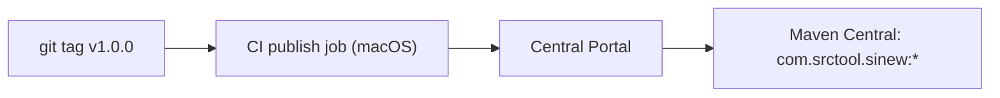
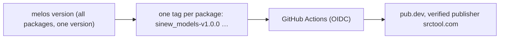

{/* Generated by docs/internal/scripts/sync_vault.py from the Sinew design notes. Edit the notes and re-run the script; changes made here are overwritten. */}

# 02 - Publishing

<KotlinOnly>

## 1. Why {#kotlin-1-why}

Sinew's Kotlin packages ship to **Maven Central**. They're released together (lockstep), with a BOM so apps write one version. The base Architecture note sets the rules; this note is the mechanics.

## 2. Shape {#kotlin-2-shape}



| Artifact | Holds |
|---|---|
| `com.srctool.sinew:sinew-<module>:<v>` | one per library module, with KMP variants for android, iosArm64, iosSimulatorArm64, jvm, wasmJs |
| `com.srctool.sinew:sinew-bom:<v>` | pins every Sinew module to `<v>` |

```kotlin
// an app
implementation(platform("com.srctool.sinew:sinew-bom:1.0.0"))
implementation("com.srctool.sinew:sinew-network")
implementation("com.srctool.sinew:sinew-paging")
// devtools: one artifact per variant, in the app module (see DevTools)
"productionDebugImplementation"("com.srctool.sinew:sinew-devtools-ui")
"stagingImplementation"("com.srctool.sinew:sinew-devtools-ui")
"productionReleaseImplementation"("com.srctool.sinew:sinew-devtools-noop")
```

| Rule | Why |
|---|---|
| **One publish job, on macOS** | The iOS variants need Xcode. Maven Central rejects the same coordinates published from two hosts. |
| Every module publishes at the same version, from one tag | Lockstep: any set of Sinew artifacts at one version fits together |
| Group `com.srctool.sinew`. If the `srctool.com` namespace verification fails: `io.github.srctool.sinew`. | Only the `srctool { publishing { groupId } }` value changes. |
| A released version is never deleted. A mistake gets a patch release. | Maven Central doesn't allow deletion |
| `sinew-camouflage` declares the Camouflage version range it was tested with | Apps can't silently combine incompatible versions |

## 3. API {#kotlin-3-api}

The `com.srctool.publish` convention plugin (vanniktech 0.37.0 + Dokka + signing) configures:
- coordinates;
- the POM (name, description, license Apache 2.0, the `srctool/sinew-kotlin` SCM URL, developer `srctool`);
- signing with an in-memory PGP key.

Secrets in CI: `ORG_GRADLE_PROJECT_mavenCentralUsername` / `…Password` (a Central Portal user token), `ORG_GRADLE_PROJECT_signingInMemoryKey`, `…KeyPassword`.

## 4. Build steps {#kotlin-4-build-steps}

1. Verify the `com.srctool` namespace on the Central Portal (a DNS TXT record on `srctool.com`).
2. Apply `com.srctool.publish` to every library module and the BOM.
3. A dry run: `./gradlew publishToMavenLocal`, then build the sample app against `mavenLocal()` with the BOM.
4. The publish workflow: on a `v*` tag, on macOS, `./gradlew publishAndReleaseToMavenCentral`.
5. A changelog per release, shared by all modules.

**Done when**
- [ ] A fresh Android app and a fresh KMP app resolve `sinew-bom:1.0.0` and every module from Maven Central.
- [ ] Publishing runs from one macOS job only.

## 5. Edge cases {#kotlin-5-edge-cases}

| Case | Decided behavior |
|---|---|
| One module needs a fix | The whole set is released at the next patch version, even if other modules are unchanged. |
| Namespace verification still pending at S6 | Publish under `io.github.srctool.sinew`, and move to `com.srctool.sinew` at the next minor version, with a relocation POM for the old coordinates. |

:::info[Decided by default (revisit during implementation)]

- **Relocation POMs** if the group has to move later, so old coordinates keep resolving.

:::

</KotlinOnly>

<DartOnly>

## 1. Why {#dart-1-why}

Sinew's Dart packages ship to **pub.dev**. There's no BOM in pub, so lockstep releases do that job: every package is released together at one version, and a caret range on any of them fits all the others.

## 2. Shape {#dart-2-shape}



| Rule | Why |
|---|---|
| Every package has the same version, bumped together by Melos in fixed mode | Lockstep |
| **Automated publishing from GitHub Actions**, with pub.dev's OIDC token. One tag pattern per package (`sinew_models-v{{version}}`). | No long-lived credential in the repo |
| The verified publisher is `srctool.com`, once Google Search Console verifies the domain | Packages show the publisher badge. Until then they publish under the author's account and move to the publisher later. |
| A released version can be retracted within 7 days, never deleted. A mistake gets a patch release. | pub.dev's rules |
| `sinew_camouflage` declares the Camouflage version range it was tested with | Apps can't combine incompatible versions |

## 3. API {#dart-3-api}

Each `pubspec.yaml` carries:
- `name`, `version` (lockstep), a `description`;
- `repository: https://github.com/srctool/sinew-dart`, `issue_tracker`;
- `topics: [architecture, networking, paging]`, as relevant to the package.

Each package has a `CHANGELOG.md`, written by Melos from conventional commits.

## 4. Build steps {#dart-4-build-steps}

1. Enable automated publishing on pub.dev for each package, for `srctool/sinew-dart`, with its tag pattern.
2. `melos publish --dry-run` in CI on every pull request, so a package that would fail `pana` or `dart pub publish --dry-run` is caught early.
3. The publish workflow: on tags, run `dart pub publish --force` for the tagged package.
4. Verify `srctool.com` in Google Search Console and create the publisher.

**Done when**
- [ ] A fresh Flutter app resolves every Sinew package at 1.0.0 from pub.dev and runs the example screen.

## 5. Edge cases {#dart-5-edge-cases}

| Case | Decided behavior |
|---|---|
| One package needs a fix | The whole set is released at the next patch version. |
| A `pana` score drop (missing docs, platform support) | Fixed before release. `public_member_api_docs` keeps the docs score. |

:::info[Decided by default (revisit during implementation)]

- **One tag per package** to match pub.dev's per-package automated publishing, all created by one `melos version` run.

:::

</DartOnly>
