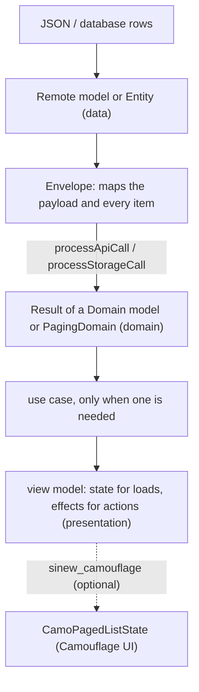

{/* Generated by docs/internal/scripts/sync_vault.py from the Sinew design notes. Edit the notes and re-run the script; changes made here are overwritten. */}

# Sinew

## Concept {#concept}

Sinews connect muscle to bone. **Sinew** connects an app's layers: data (API responses, local storage) → domain (plain models, paging rules) → presentation (view state). It's a layered app architecture, shipped as small libraries an app adds one by one, so new apps stop rewriting response mapping, paging, error types, the network client with token refresh, and secure storage.

**One sentence:** Sinew ships the **mechanism**; the app ships the **configuration**.

It pairs with Camouflage:
- Camouflage is the skin (UI); Sinew is what holds the app together underneath.
- The two never depend on each other (Camouflage ADR-27, ADR-29). Only the optional `sinew_camouflage` glue knows both.
- Sinew targets Flutter and Kotlin (Kotlin Multiplatform, usable from a plain Android app). Both get the same concepts, with names that follow each platform's tools.

### The layers



- **Envelopes that map themselves.** Each envelope names its remote model and its domain type. The compiler then knows every item has a `toDomain()`, so the envelope maps the payload, including every item of a list or page. No repository writes a mapper function.
- **Errors caught where they happen.** Each layer's guard turns failures into a typed `AppException` with a `module-layer-function-type` code (`ORD-R-GO-NIC`), and hands a `Result` upward. View models never `try`/`catch`.
- **Presentation: page, event, action, effect, state.**
  - A page sends **events**.
  - The view model maps each event to an **action** (`mapEventToAction`) and handles it (`onAction`).
  - It updates one immutable **state** (`setState`) and emits one-off **effects** (navigation, snackbars) through an `EffectEmitter`.
- **State-driven paging.** A `Pager<T>` owns the paging rules. A list page only says how to fetch one page.

### Packages

#### v1

| Package | Holds |
|---|---|
| `sinew_models` | `Domain`, `Remote`, `Entity`, `Envelope` and four abstract envelope bases, `PagingDomain`, `ViewState`; on Flutter also `Result` |
| `sinew_exception` | `AppException` and its codes, handler lists, the guards, `CrashReporter` |
| `sinew_paging` | `Pager<T>`, `PagingState<T>`, `LoadType`, four paging strategies |
| `sinew_presentation` | the Event → Action → State + Effect base class, `EffectEmitter` (framework-neutral) |
| `sinew_riverpod` / `sinew-viewmodel` | framework adapters (mixins and hooks / ViewModel bases) |
| `sinew_riverpod_providers` | ready Riverpod providers for every Sinew service |
| `sinew_network` | `processApiCall`, the auth layer (single-flight token refresh), timeout and redacting-log layers, network checker, retry and polling |
| `sinew_storage` | `SecureStore`, `KeyValueStore`, `processStorageCall`, the DAO paging helper |
| `sinew_security` | `FieldCipher` (Tink AEAD), `BiometricVault`. No hand-rolled cryptography. |
| `sinew_testing` | fakes, mock HTTP setup, test helpers for paging races |
| `sinew_camouflage` | `PagingState<T>.toCamo()` → `CamoPagedListState<T>` |
| `sinew_l10n` | English and Indonesian translations for every built-in local error key (Flutter `LocalizationsDelegate` + ARB, Kotlin Compose resources) |

#### 1.1: DevTools

| Package | Holds |
|---|---|
| `sinew_devtools` | the inspector contract, recorders, redaction, fault injection, host override (no UI) |
| `sinew_devtools_ui` | overlay button, dashboard and built-in inspectors on each platform's Material toolkit |
| `sinew-devtools-noop` (Kotlin) | the same API as empty stubs, for release builds |

#### Later

Permission, notification, extensions (`toMoney`, `toRelative`), devtools inspectors that need native code (EXIF, camera, map), router adapters, a Camouflage skin/theme inspector, and an external devtools companion.

**Naming:** pub packages are `sinew_*`. Maven coordinates are `com.srctool.sinew:sinew-*`, with a `sinew-bom`. Every package is published on its own and released in lockstep. There's no umbrella package.

### Mechanism vs. configuration

| Sinew ships | The app supplies |
|---|---|
| Abstract envelope bases that map payloads | DTOs, and its own envelopes (fields, JSON keys, page metadata) |
| Guards and handler lists | module and function codes |
| The HTTP client factory and its layers | base URLs, one client per backend, `SinewConfig` |
| The auth layer | `TokenSource` (where tokens live, how to refresh) |
| Store interfaces and implementations | typed named stores (`OrderPreferences`) |
| The `CrashReporter` contract (no-op default) | the real reporter |
| Adapters for Riverpod and ViewModel | its own DI wiring |

### Doc map

`base/` holds the platform-neutral contracts. `kotlin/` and `flutter/` mirror it **by path**: `kotlin/02 - Packages/03 - Paging` implements `base/02 - Packages/03 - Paging`.

**Foundations**
- [Architecture](/guide/foundations/architecture): layers, the dependency graph, mechanism vs. configuration, publishing.
- [Error Model](/guide/foundations/error-model): codes, layers, handler lists, cancellation, `CrashReporter`.

**Packages**
- [Models](/guide/packages/models)
- [Exception](/guide/packages/exception)
- [Paging](/guide/packages/paging)
- [Presentation](/guide/packages/presentation)
- [Adapters](/guide/packages/adapters)
- [Network](/guide/packages/network)
- [Security](/guide/packages/security)
- [Storage](/guide/packages/storage)
- [Testing](/guide/packages/testing)
- [Camouflage Glue](/guide/packages/camouflage-glue)
- [DevTools](/guide/packages/dev-tools)

**Later** (contract sketches)
- [Permission](/guide/later/permission)
- [Notification](/guide/later/notification)
- [Extensions](/guide/later/extensions)
- [Koin Adapter](/guide/later/koin-adapter)

**Project**
- [Roadmap](/guide/project/roadmap): milestones S0–S7.
- [Decisions](/guide/project/decisions): the ADR log.

**Platforms**
- Kotlin, Flutter.
- Each also has `05 - Delivery/` (project setup, publishing, testing and CI), which has no base counterpart.
- `03 - Later/` and `04 - Project/` have no platform counterparts.

**Reading order:**
1. Architecture, then Error Model.
2. The packages in number order. Each depends only on earlier ones.
3. DevTools last.

### Done when

- [ ] A sample app on each platform uses Sinew packages, and one list screen runs through `sinew_camouflage` into `CamoPagedList` (milestone S5).
- [ ] 1.0 is published in lockstep on pub.dev and Maven Central (S6). DevTools ships as 1.1 (S7).

### Edge cases

| Case | Decided behavior |
|---|---|
| An app uses Sinew without Camouflage | Supported: no Sinew package depends on Camouflage except the optional glue. |
| An app uses Camouflage without Sinew | Supported: `CamoPagedList` takes a plain state. Any source works through a small adapter. |
| An app wants only paging | Supported: it adds `sinew_paging`, which brings `sinew_models` and `sinew_exception`, and nothing else. |
| The backend wraps payloads differently | Expected: every app declares its own envelopes on Sinew's abstract bases. The guards accept any envelope. |

## Implementation {#implementation}

<KotlinOnly>

This folder turns the platform-neutral design in Sinew into **Kotlin Multiplatform** code. It mirrors `base/` **by path**: `kotlin/02 - Packages/03 - Paging` implements `base/02 - Packages/03 - Paging`. Every note keeps the base names and meaning, and adds only what Kotlin needs: real signatures, coroutines, `expect`/`actual` where a platform really differs, and Gradle.

### Toolchain (checked 2026-10-02; re-check at S0) {#kotlin-toolchain-checked-2026-10-02-re-check-at-s0}

| Tool | Version | Used for |
|---|---|---|
| Kotlin | 2.4.20 | the language and Gradle plugin (the same toolchain as Camouflage) |
| Android Gradle Plugin | 9.4.1 (Gradle 9.8.1 in the wrapper, JDK 17+) | `com.android.kotlin.multiplatform.library` for every library module |
| Compose Multiplatform | 1.12.1 (Material 3 is versioned separately: 1.9.0) | only in the modules that need UI or resources: `sinew-viewmodel` (`ObserveEffects`), `sinew-l10n`, `sinew-camouflage`, `sinew-devtools-ui` |
| kotlinx.coroutines | 1.11.0 | everywhere |
| kotlinx.serialization | 1.11.0 (stable; 1.12 is in RC) | the network module's JSON |
| Ktor | 3.6.0 | `sinew-network` |
| AndroidX Lifecycle (multiplatform, JetBrains build) | 2.11.0 | `ViewModel` in `sinew-viewmodel` |
| AndroidX DataStore | 1.2.1 | `KeyValueStore` and the secure store's ciphertext on Android, iOS and JVM |
| Tink | 1.23.0 | `FieldCipher` and the secure store on Android and the JVM |
| cryptography-kotlin | 0.6.0 | the candidate for AES-GCM on iOS and web (see Security) |
| AndroidX Biometric | 1.1.0 | `BiometricVault` on Android |
| kotlinx-datetime | 0.8.0 | timestamps in records and `retryAfter` dates |
| Turbine | 1.2.1 | `Flow` assertions in tests |
| Kover | 0.9.11 | coverage |
| vanniktech Maven publish | 0.37.0 | publishing through the Central Portal |

### Repository and modules {#kotlin-repository-and-modules}

The code lives in `sinew-kotlin`, the Kotlin submodule of the umbrella repo `srctool/sinew`.

```
sinew-kotlin/
├── build-logic/                 # the srctool convention plugins (shared with Camouflage)
├── gradle/*.versions.toml       # split version catalogs
├── sinew-models/  sinew-exception/  sinew-l10n/
├── sinew-paging/  sinew-presentation/  sinew-viewmodel/
├── sinew-network/  sinew-security/  sinew-storage/
├── sinew-testing/  sinew-camouflage/
├── sinew-devtools/  sinew-devtools-ui/  sinew-devtools-noop/
├── sinew-bom/
└── sample/
    ├── shared/                  # KMP: the sample list screen (commonMain) + desktop and web entry points
    ├── androidApp/
    └── iosApp/                  # Xcode project, a thin entry point
```

Package root: `com.srctool.sinew.<module>` (`com.srctool.sinew.paging`, `com.srctool.sinew.network`). Maven coordinates: `com.srctool.sinew:sinew-<module>`.

### Base → Kotlin map {#kotlin-base-kotlin-map}

| Base | Kotlin |
|---|---|
| [Architecture](/guide/foundations/architecture) | [Architecture](/guide/foundations/architecture#implementation) (`api` vs `implementation`, Koin wiring) |
| [Error Model](/guide/foundations/error-model) | [Error Model](/guide/foundations/error-model#implementation) (Sinew's `Result`, cancellation) |
| [Models](/guide/packages/models) | [Models](/guide/packages/models#implementation) |
| [Exception](/guide/packages/exception) | [Exception](/guide/packages/exception#implementation) (+ `sinew-l10n`) |
| [Paging](/guide/packages/paging) | [Paging](/guide/packages/paging#implementation) |
| [Presentation](/guide/packages/presentation) | [Presentation](/guide/packages/presentation#implementation) |
| [Adapters](/guide/packages/adapters) | [Adapters](/guide/packages/adapters#implementation) (`sinew-viewmodel`) |
| [Network](/guide/packages/network) | [Network](/guide/packages/network#implementation) |
| [Security](/guide/packages/security) | [Security](/guide/packages/security#implementation) |
| [Storage](/guide/packages/storage) | [Storage](/guide/packages/storage#implementation) |
| [Testing](/guide/packages/testing) | [Testing](/guide/packages/testing#implementation) |
| [Camouflage Glue](/guide/packages/camouflage-glue) | [Camouflage Glue](/guide/packages/camouflage-glue#implementation) |
| [DevTools](/guide/packages/dev-tools) | [DevTools](/guide/packages/dev-tools#implementation) |
| (none) | [Project Setup](/guide/delivery/project-setup), [Publishing](/guide/delivery/publishing), [Testing and CI](/guide/delivery/testing-and-ci) |

`base/03 - Later` and `base/04 - Project` have no Kotlin notes. `05 - Delivery` has no base note.

### Kotlin-wide conventions for Sinew {#kotlin-kotlin-wide-conventions-for-sinew}

1. **`explicitApi()`** in every library module: every public declaration says `public`, so the API surface is deliberate and the ABI dump readable.
2. **`commonMain` first.** `expect`/`actual` only where a platform really differs: the HTTP engine, secure storage, crypto keys, biometrics, the network checker, uncaught-error hooks.
3. **Suspend functions, not callbacks.** Repository-facing APIs are `suspend`. Streams are `Flow`. A long-running operation runs in the caller's scope.
4. **Sinew's own `Result`** everywhere (not `kotlin.Result`), built only by Sinew's guards. `runCatching` is never used around suspend calls, because it swallows `CancellationException`.
5. **Hand-written sealed types**, no code generation. `ViewState`, `PagingState`, `ErrorMessage` and the exception types are `sealed` classes or interfaces.
6. **No DI in libraries.** Constructors and factories only. Koin wiring is an app concern, shown in the Architecture note.
7. **Compose only where it's needed.** The four modules listed in the toolchain table. Everything else is plain Kotlin and works in a non-Compose app.

</KotlinOnly>

<DartOnly>

This folder turns the platform-neutral design in Sinew into **Dart and Flutter** packages. It mirrors `base/` **by path**: `flutter/02 - Packages/03 - Paging` implements `base/02 - Packages/03 - Paging`. The Kotlin notes were written first, and where a concept is shared, these notes keep the Kotlin decisions with Dart's own names and tools.

### Toolchain (checked 2026-10-02; re-check at S0) {#dart-toolchain-checked-2026-10-02-re-check-at-s0}

| Tool | Version | Used for |
|---|---|---|
| Flutter / Dart | 3.47.6 / 3.13.5 | Dart 3 `sealed` classes and pattern matching throughout |
| Melos + pub workspaces | 8.9.0 | the monorepo: one root workspace `pubspec.yaml`, Melos for scripts, versioning and publishing |
| Dio | 5.11.1 | `sinew_network` |
| Retrofit / retrofit_generator | 4.10.0 / 10.2.11 | the **app's** API clients (Sinew itself generates no code) |
| json_annotation / json_serializable | 4.12.0 / 6.14.1 | the **app's** DTOs and envelopes |
| Riverpod (`flutter_riverpod`, `hooks_riverpod`, `riverpod_annotation`) | 3.4.3 / 3.4.3 / 4.0.7 | `sinew_riverpod`, `sinew_riverpod_providers` |
| flutter_hooks | 0.21.3+1 | the hooks in `sinew_riverpod` |
| flutter_secure_storage | 11.2.0 | `SecureStore`, and the data key of `FieldCipher` |
| shared_preferences | 2.5.5 | `KeyValueStore` |
| webcrypto | 0.6.1 | AES-256-GCM in `FieldCipher` (BoringSSL on native, Web Crypto on web) |
| connectivity_plus | 7.3.2 | `NetworkChecker` |
| intl | 0.20.3 | `sinew_l10n` (ARB messages, plurals) |
| http_mock_adapter / fake_async / mocktail | 0.6.1 / 1.3.3 / 1.0.5 | tests (`mocktail` only in apps' own tests, never in Sinew's fakes) |

### Repository and packages {#dart-repository-and-packages}

The code lives in `sinew-dart`, the Dart submodule of the umbrella repo `srctool/sinew`.

```
sinew-dart/
├── pubspec.yaml                 # the pub workspace root + Melos config
├── packages/
│   ├── sinew_models/  sinew_exception/  sinew_l10n/
│   ├── sinew_paging/  sinew_presentation/  sinew_riverpod/  sinew_riverpod_providers/
│   ├── sinew_network/  sinew_security/  sinew_storage/
│   ├── sinew_testing/  sinew_camouflage/
│   └── sinew_devtools/  sinew_devtools_ui/
└── example/                     # the sample app: one list screen through CamoPagedList
```

Each package exposes one barrel, `lib/sinew_<name>.dart`, exporting only `lib/src/api/`. `lib/src/implementation/` is never imported from outside the package.

### Base → Flutter map {#dart-base-flutter-map}

| Base | Flutter |
|---|---|
| [Architecture](/guide/foundations/architecture) | [Architecture](/guide/foundations/architecture#implementation) (direct dependencies, GetIt and Riverpod wiring) |
| [Error Model](/guide/foundations/error-model) | [Error Model](/guide/foundations/error-model#implementation) (`Result`, `CancelException`) |
| [Models](/guide/packages/models) | [Models](/guide/packages/models#implementation) |
| [Exception](/guide/packages/exception) | [Exception](/guide/packages/exception#implementation) (+ `sinew_l10n`) |
| [Paging](/guide/packages/paging) | [Paging](/guide/packages/paging#implementation) |
| [Presentation](/guide/packages/presentation) | [Presentation](/guide/packages/presentation#implementation) |
| [Adapters](/guide/packages/adapters) | [Adapters](/guide/packages/adapters#implementation) (`sinew_riverpod`, `sinew_riverpod_providers`) |
| [Network](/guide/packages/network) | [Network](/guide/packages/network#implementation) |
| [Security](/guide/packages/security) | [Security](/guide/packages/security#implementation) |
| [Storage](/guide/packages/storage) | [Storage](/guide/packages/storage#implementation) |
| [Testing](/guide/packages/testing) | [Testing](/guide/packages/testing#implementation) |
| [Camouflage Glue](/guide/packages/camouflage-glue) | [Camouflage Glue](/guide/packages/camouflage-glue#implementation) |
| [DevTools](/guide/packages/dev-tools) | [DevTools](/guide/packages/dev-tools#implementation) |
| (none) | [Project Setup](/guide/delivery/project-setup), [Publishing](/guide/delivery/publishing), [Testing and CI](/guide/delivery/testing-and-ci) |

`base/03 - Later` and `base/04 - Project` have no Flutter notes. `05 - Delivery` has no base note.

### Dart-wide conventions for Sinew {#dart-dart-wide-conventions-for-sinew}

1. **Pure Dart where possible.** `sinew_models`, `sinew_exception`, `sinew_paging` and `sinew_presentation` don't import Flutter, so they run in any Dart program and test on the plain Dart VM. Packages that need Flutter (l10n, Riverpod hooks, security, storage, devtools UI, glue) say so in their Platforms row.
2. **Hand-written `sealed` classes**, with `final class` variants and `const` constructors. No `freezed`, no `build_runner` in any Sinew package.
3. **`Future` and `Stream`** for async. Every subscription, timer, `CancelToken` and emitter is released in a `dispose`.
4. **`Result<T>`** is Sinew's own, consumed with `when` / `fold`, never `switch` on its variants.
5. **No DI in packages.** Constructors and factories only. GetIt and Riverpod wiring is the app's, or `sinew_riverpod_providers`'.
6. **`analysis_options.yaml`** extends `flutter_lints` (or `lints` for pure-Dart packages) and adds `public_member_api_docs`, `prefer_const_constructors`, `prefer_final_fields`, `avoid_print`, `prefer_relative_imports`.

</DartOnly>
